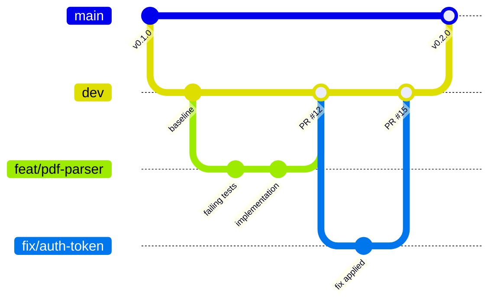

<div align="center">

<br>


&nbsp;&nbsp;&nbsp;


<br><br>

# UMTAS

**University Management & Timetabling Automation System**

_A strategic partnership between Tyto Insights and Team Vigil_

[](https://tyto.africa/)

<br>

[](https://cos301-se-2026.github.io/UMTAS/)
[](https://github.com/COS301-SE-2026/UMTAS/issues)
[](https://github.com/COS301-SE-2026/UMTAS/commits/dev)
[](https://pnpm.io/)
[](https://nodejs.org/)

<!-- Uncomment once GitHub Actions workflow names are confirmed
[](https://github.com/COS301-SE-2026/UMTAS/actions/workflows/ci.yml)
-->

<!-- Uncomment once Codecov / SonarCloud is connected
[](https://codecov.io/gh/COS301-SE-2026/UMTAS)
[](https://sonarcloud.io/dashboard?id=COS301-SE-2026_UMTAS)
-->

<!-- Uncomment once Uptime Robot / NodePing monitors are created
[](https://uptimerobot.com)
-->

<br>

[-View_Document-14532d?style=for-the-badge&logo=googledocs&logoColor=white>)](https://cos301-se-2026.github.io/UMTAS/requirements/Introduction/)
[](https://cos301-se-2026.github.io/UMTAS/)
[](https://github.com/orgs/COS301-SE-2026/projects/[ID])
[](https://github.com/COS301-SE-2026/UMTAS/issues)

<br>

</div>

<div align="center">

## Technology Stack

</div>

**Frontend & UI**


**Backend & Core**


**Solver & AI**


**Infrastructure & DevOps**


**Testing & QA**


**Monitoring**


---

<div align="center">

## Repository Structure

</div>

This is a **pnpm monorepo** managed by Turborepo. All applications, shared packages, and infrastructure live in one repository to enable atomic commits and shared tooling across every workstream.

```
UMTAS/
├── apps/
│   ├── web/          # Next.js frontend
│   └── api/          # NestJS core backend
├── packages/
│   ├── database/     # DrizzleORM schema & migrations
│   ├── types/        # Shared TypeScript types
│   └── config/       # Shared ESLint, TSConfig
├── solver/           # FastAPI + OR-Tools Python service
└── infra/            # Docker Compose, Traefik, Grafana provisioning
```

---

<div align="center">

## Branching Strategy

</div>

All development follows a **TDD Git Flow**. Feature work is done in short-lived branches and merged into `dev` via pull request. `main` only receives merges from `dev` at release points. Every pull request requires CI to pass and at least one peer review.

<div align="center">

[](https://cos301-se-2026.github.io/UMTAS/developer-guides/git-strategy-guide/)

</div>



---

<div align="center">

## Team

</div>

Team Vigil comprises five University of Pretoria Computer Science students with complementary profiles across full-stack development, system architecture, DevOps, data engineering, and machine learning.

<br>

<table>
  <tr>
    <td width="130" valign="top">
      
    </td>
    <td valign="top">
      <strong>Wilmar Smit</strong> &nbsp;—&nbsp; Team Lead &amp; Integration Lead<br><br>
      <details>
        <summary>About</summary>
        <br>
        Third-year CS student and primary coordinator between frontend and backend workstreams. Ensures architectural alignment across the full stack and manages the integration of diverse components into a cohesive system. Professional experience at Tyto Insights informs his approach to building scalable, production-ready systems.
      </details>
      <br>
      <a href="https://www.linkedin.com/in/wilmar-smit-3b11842a3/"></a>
      <a href="https://github.com/wilmar-smit"></a>
    </td>
  </tr>
</table>

---

<table>
  <tr>
    <td width="130" valign="top">
      
    </td>
    <td valign="top">
      <strong>Michael Tomlinson</strong> &nbsp;—&nbsp; Lead Developer &amp; System Architect<br><br>
      <details>
        <summary>About</summary>
        <br>
        Third-year CS student and Software Developer Intern at Tyto Insights, with prior experience migrating legacy systems at DCS Engineering. Serves as System Architect, responsible for the Core-and-Adapter pattern that keeps UMTAS university-agnostic. His Tuks PDF Calendar project provides the foundational domain expertise for the platform's PDF parsing challenges.
      </details>
      <br>
      <a href="https://www.linkedin.com/in/michaeltomlinson"></a>
      <a href="https://github.com/michaeltomlinsontuks"></a>
    </td>
  </tr>
</table>

---

<table>
  <tr>
    <td width="130" valign="top">
      
    </td>
    <td valign="top">
      <strong>Johan Coetzer</strong> &nbsp;—&nbsp; Frontend Lead &amp; Full-Stack Developer<br><br>
      <details>
        <summary>About</summary>
        <br>
        Third-year CS student and Software Developer Intern at Tyto Insights (Skunkworks). As Frontend Lead, manages the Next.js ecosystem with a focus on responsive component architecture and intuitive UX. Bridges complex system logic with the interface to ensure that the heavy data requirements of UMTAS are delivered through a high-performance, accessible dashboard.
      </details>
      <br>
      <a href="https://www.linkedin.com/in/johan-coetzer-01bb26401"></a>
      <a href="https://github.com/jcoet-gh"></a>
    </td>
  </tr>
</table>

---

<table>
  <tr>
    <td width="130" valign="top">
      
    </td>
    <td valign="top">
      <strong>Marcel Stoltz</strong> &nbsp;—&nbsp; DevOps Lead &amp; Backend Specialist<br><br>
      <details>
        <summary>About</summary>
        <br>
        Third-year CS student and Software Developer Intern at Tyto Insights (Skunkworks). Leads the DevOps and infrastructure workstream, specialising in Docker environments and automated deployment pipelines. Ensures the NestJS backend and PostgreSQL services are optimised for high-performance delivery. Previous work at Gendac provides backend versatility across the stack.
      </details>
      <br>
      <a href="https://www.linkedin.com/in/marcel-stoltz/"></a>
      <a href="https://github.com/marcelstoltz00"></a>
    </td>
  </tr>
</table>

---

<table>
  <tr>
    <td width="130" valign="top">
      
    </td>
    <td valign="top">
      <strong>Aidan Dawson</strong> &nbsp;—&nbsp; Backend Developer &amp; Integration<br><br>
      <details>
        <summary>About</summary>
        <br>
        Third-year CS student focused on backend development and contract-driven integration. Responsible for core backend functionality, strict adherence to API contracts across all system components, data integrity and PDF extraction accuracy, and automated testing to maintain reliable interactions between the frontend, backend, and external adapters.
      </details>
      <br>
      <a href="https://www.linkedin.com/in/aidan-dawson-3514692ba"></a>
      <a href="https://github.com/sdcreek240"></a>
    </td>
  </tr>
</table>

<br>

---

<div align="center">

## Getting Started

</div>

<div align="center">

[](https://cos301-se-2026.github.io/UMTAS/developer-guides/Repo-Setup-Guide/)

</div>

<details open>
<summary><strong>Bootstrap — First Time Setup</strong></summary>
<br>

```bash
pnpm run setup
```

Verifies tool versions, copies `.env.example` to `.env`, installs all workspace dependencies, and prepares the Python solver container.

</details>

<details>
<summary><strong>Local Development (Recommended)</strong></summary>
<br>

```bash
# Terminal 1 — infrastructure (Postgres, Redis, MinIO, Solver)
pnpm run dev:infra

# Terminal 2 — application (Next.js + NestJS via Turborepo)
pnpm run dev
```

Runs infrastructure in Docker and the application natively for the fastest hot-reload performance.

</details>

<details>
<summary><strong>Full Docker Stack</strong></summary>
<br>

```bash
pnpm run dev:docker
```

Boots the complete stack — frontend, backend, and all infrastructure — in containers. Use this to verify network flows and environment variables before a merge.

</details>

<details>
<summary><strong>With Monitoring (PLG Stack)</strong></summary>
<br>

```bash
pnpm run dev:monitor
```

Adds Grafana, Prometheus, and Loki to the stack for local observability testing.

</details>

---

<div align="center">

## Documentation

</div>

<div align="center">

[](https://cos301-se-2026.github.io/UMTAS/)

</div>

<br>

<details>
<summary><strong>Requirements & Architecture</strong> &nbsp;—&nbsp; 10 documents</summary>
<br>
<div align="center">

[](https://cos301-se-2026.github.io/UMTAS/requirements/Introduction/)
[](https://cos301-se-2026.github.io/UMTAS/requirements/Domain-Model/)
[](https://cos301-se-2026.github.io/UMTAS/requirements/User-Stories/)
[](https://cos301-se-2026.github.io/UMTAS/requirements/Use-Cases/)
[](https://cos301-se-2026.github.io/UMTAS/requirements/Functional-Requirements/)
[](https://cos301-se-2026.github.io/UMTAS/requirements/Quality-Requirements/)
[](https://cos301-se-2026.github.io/UMTAS/requirements/Architectural-Requirements/)
[](https://cos301-se-2026.github.io/UMTAS/requirements/Technology-Requirements/)
[](https://cos301-se-2026.github.io/UMTAS/requirements/Traceability-Matrix/)
[](https://cos301-se-2026.github.io/UMTAS/requirements/API-Service-Contracts/)

</div>
</details>

<details>
<summary><strong>Design & Diagrams</strong> &nbsp;—&nbsp; 3 documents</summary>
<br>
<div align="center">

[](https://cos301-se-2026.github.io/UMTAS/design/Brand-Style/)
[](https://cos301-se-2026.github.io/UMTAS/design/Wireframes/)
[](https://cos301-se-2026.github.io/UMTAS/diagrams/README/)

</div>
</details>

<details>
<summary><strong>Developer Guides</strong> &nbsp;—&nbsp; 10 guides</summary>
<br>
<div align="center">

[](https://cos301-se-2026.github.io/UMTAS/developer-guides/Repo-Setup-Guide/)
[](https://cos301-se-2026.github.io/UMTAS/developer-guides/git-strategy-guide/)
[](https://cos301-se-2026.github.io/UMTAS/developer-guides/master-development-guide/)
[](https://cos301-se-2026.github.io/UMTAS/developer-guides/backend-development-guide/)
[](https://cos301-se-2026.github.io/UMTAS/developer-guides/frontend-development-guide/)
[](https://cos301-se-2026.github.io/UMTAS/developer-guides/Server-Setup-Guide/)
[](https://cos301-se-2026.github.io/UMTAS/developer-guides/server-guide/)
[](https://cos301-se-2026.github.io/UMTAS/developer-guides/unit-testing-guide/)
[](https://cos301-se-2026.github.io/UMTAS/developer-guides/integration-testing-guide/)
[](https://cos301-se-2026.github.io/UMTAS/developer-guides/local-cicd-guide/)

</div>
</details>

<details>
<summary><strong>Reference</strong> &nbsp;—&nbsp; 2 documents</summary>
<br>
<div align="center">

[](https://cos301-se-2026.github.io/UMTAS/api/API-Reference/)
[](https://cos301-se-2026.github.io/UMTAS/management/Team-Profiles/)

</div>
</details>

---

<div align="center">
<sub>Built by Team Vigil in partnership with Tyto Insights &nbsp;·&nbsp; University of Pretoria &nbsp;·&nbsp; COS 301 Capstone 2026</sub>
</div>
