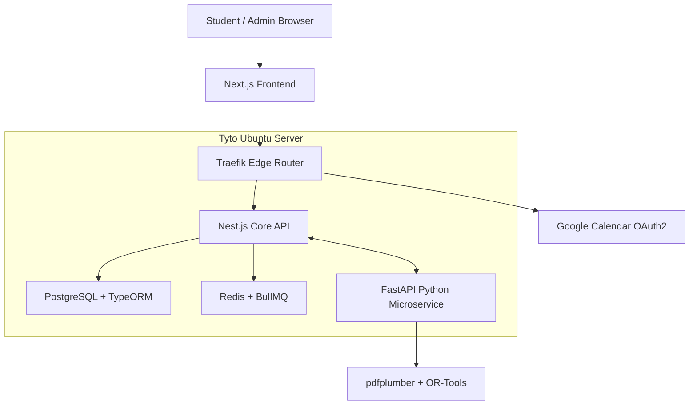
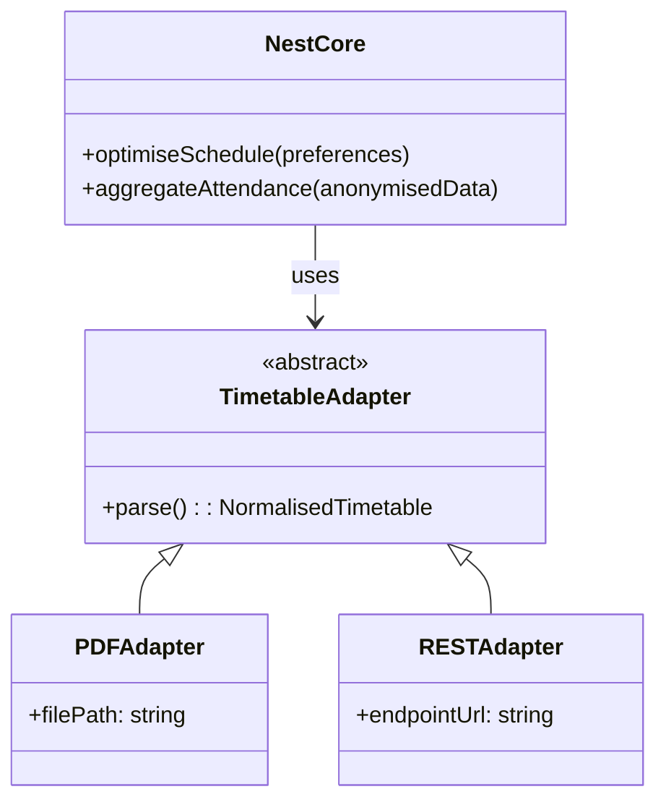
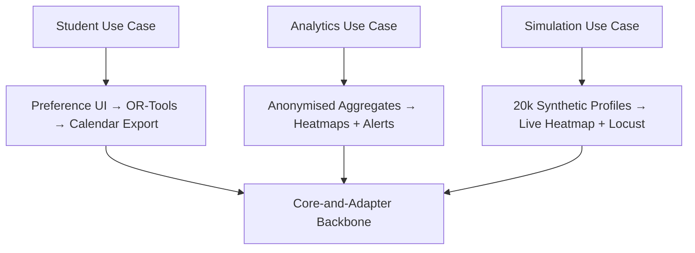

# UMTAS Onboarding Document – Team VIGIL

**Prepared for First Client Meeting (20 April 2026)**  
**Version:** 1.0 | **Team Contact:** vigil.cs2025@gmail.com

## TL;DR (30-second overview)

**UMTAS** = University-agnostic **Core-and-Adapter** platform that fixes three broken things at South African universities:

1. Students manually building timetables from PDFs (error-prone, no personalisation).
2. Zero preference-based optimisation.
3. Universities allocating venues on registration numbers instead of _planned attendance_ → overcrowding + waste.

**Solution in one sentence:** A modular backend core (Nest.js + FastAPI) + UP PDF adapter that delivers (a) preference-driven student schedules with Google Calendar sync, (b) anonymised real-time venue analytics dashboard, and (c) a reusable 20 000+ user simulation service for Tyto’s future clients.

**Key wins we are delivering:** 100 % PDF parsing accuracy, 0 % schedule overlaps, zero UUID leaks (POPIA), and proven scale before any real student logs in.  
**Tech DNA:** Next.js + Nest.js + FastAPI microservice + Docker + Traefik on Tyto Ubuntu server.  
**Delivery:** Core-first → Adapters → MVP → optional wow features using Agile Kanban.

---

## 1. Tech Stack Summary (as per Dev Decisions + Tender)

| Layer                   | Technology                                                       | Why we chose it                                           |
| ----------------------- | ---------------------------------------------------------------- | --------------------------------------------------------- |
| **Package Manager**     | pnpm                                                             | Fast monorepo workspaces + caching                        |
| **Bundler**             | Vite (Rollup under the hood)                                     | Blazing-fast CI/CD builds                                 |
| **Frontend**            | Next.js (React + TypeScript) + Tailwind CSS                      | SSR, shared DTOs, mobile-first PWA-ready                  |
| **Backend Core**        | Nest.js + TypeORM + PostgreSQL                                   | Modular, OpenAPI-first, strong DI                         |
| **Auth**                | BetterAuth (NextAuth + plugins)                                  | Full OAuth2 Google Calendar write scope                   |
| **Python Microservice** | FastAPI + pdfplumber + Google OR-Tools (CP-SAT)                  | High-performance PDF extraction + constraint optimisation |
| **Caching / Queue**     | Redis + BullMQ                                                   | Sessions + async optimisation jobs                        |
| **Dev DB / Access**     | WireGuard VPN + optional PGLite                                  | Secure team access                                        |
| **Infrastructure**      | Docker + Compose + Traefik + Watchtower                          | Zero-touch deployment on Tyto Ubuntu server               |
| **CI/CD**               | GitHub Actions + Husky + Prettier + ESLint + Vitest + Playwright | Every PR is tested & Docker image pushed                  |
| **Testing**             | Unit (Vitest) + Integration (Playwright) + Load (Locust)         | Regression suite for 100 % parse & 0 % overlap            |

**Architecture style:** Core-and-Adapter + separate Python intelligence microservice (see Mermaid below).

---

## 2. Functional Requirements (from Client Proposal + Our Tender)

### Core Requirements (MVP – must ship)

1. **Modular Adapter System** – University-specific adapters plug into generic core (new uni = new adapter only).
2. **Multi-Source Timetable Ingestion** – PDF parser (UP) + mock REST adapter; auto conflict flagging.
3. **Preference-Based Schedule Optimiser** – Time blocks, gap density, day consolidation → multiple ranked options (never single “best”).
4. **Calendar Sync & Export** – Google OAuth2 write + .ics fallback.
5. **University Analytics Dashboard** – Anonymised heatmaps, low-attendance flags, over-capacity warnings.
6. **Privacy-First Architecture** – UUID dissociation before analytics aggregation.

### Optional (post-MVP)

- PWA + push notifications
- Admin module management
- AI schedule suggestions (scikit-learn)
- Trend reporting (PDF export)
- LMS integration (Blackboard/Moodle)
- Group timetable sharing

### Wow Factors (stretch / Tyto showcase)

- Live Simulation Dashboard (20 000+ synthetic students in real time)
- Predictive Venue Failure Alert (ML model on aggregates)

---

## 3. Development Approach – Core-and-Adapter Setup

**Core-First Philosophy** (explicitly stated in our tender):

- Build and stabilise the **university-agnostic core** _before_ any adapter work.
- Core only knows the normalised internal schema (`Module`, `Venue`, `TimeSlot`, `ScheduledSession`, `Preference`, `AttendanceAggregate`).
- Adapters translate external sources into that schema.

**Operational Modes (Agile Kanban)**

- **Cruise Mode** (heavy academic weeks): 1 retro/week, mentor monthly.
- **Crunch Mode** (recess / lighter weeks): 3 stand-ups + 1 retro/week, mentor fortnightly.

**Quality Gates** – Every PR: Vitest + Playwright + OpenAPI validation + regression tests for 100 % parse accuracy and 0 % overlaps.

---

## 4. The Three Main Use Cases

### Use Case 1 – Student Scheduling Interface

1. Student logs in → selects modules.
2. Progressive disclosure preference UI (time blocks, gap density, campus consolidation).
3. FastAPI OR-Tools returns multiple ranked conflict-free options.
4. One-click Google Calendar write or .ics export.  
   **Success metric:** < 3 minutes from login to exported calendar.

### Use Case 2 – University Analytics Dashboard

1. Admin views live anonymised heatmaps & risk tables (WebSocket/SSE).
2. Only aggregate metrics (plannedCount, riskLevel).
3. Low-attendance modules flagged for consolidation/cancellation.  
   **POPIA guarantee:** No individual schedules visible; UUIDs dissociated before aggregation.

### Use Case 3 – Intelligent Mocking / Simulation Service (Tyto reusable)

1. Synthetic student load generator creates 20 000+ realistic profiles.
2. Runs full optimisation + analytics pipeline in parallel.
3. Live dashboard shows venue heatmap lighting up in real time.
4. Locust load tests prove horizontal scalability.  
   **Tyto value:** Reusable microservice for any large-scale client demo.

---

## 5. Key Non-Functional Requirements (heavily influence DB design)

- **POPIA / GDPR Compliance** → `AttendanceAggregate` table stores only dissociated counts. Cryptographic audit trail on every aggregation (no UUID ever leaves the anonymisation boundary).
- **Horizontal Scalability** → Stateless API + read replicas + Redis queue → 20 000+ concurrent requests.
- **Privacy-by-Design** → k-anonymity + UUID dissociation at aggregation layer.
- **Deployment** → Fully Dockerised, runs on Tyto Ubuntu server, Watchtower auto-updates.
- **Accessibility** → WCAG 2.1 AA for all student views.
- **Testing Data** → All synthetic; real telemetry may be mocked.

**Database impact:** Separate `users`, `preferences`, `schedules` (with UUIDs) from `attendance_aggregates` (no foreign keys back to individuals).

---

## 6. Suggested Sprint Breakdown (Aligned to Demo Dates)

**Project Start:** Monday 20 April 2026  
**Total Duration:** ~24 weeks (to Project Day 30 Oct 2026)  
**Philosophy:** Core-first development. We deliberately front-load the **university-agnostic Core**, **Optimisation Logic** (FastAPI + OR-Tools), and **Frontend** (Next.js student portal) so the earliest demos show real end-to-end value. Adapters (PDF, Mock REST API) are built _after_ the core is stable. Every sprint ends with a working, demo-able increment.

Sprints are **2 weeks** by default (Cruise or Crunch mode). We use GitHub Projects Kanban for visibility. Demo weeks are treated as **Crunch Mode** (extra stand-ups) to polish the exact features being shown to the client.

| Sprint      | Dates (2026)              | Focus Area                         | Key Deliverables                                                                                                                                                          | Demo Alignment & Success Criteria                                                                                       |
| ----------- | ------------------------- | ---------------------------------- | ------------------------------------------------------------------------------------------------------------------------------------------------------------------------- | ----------------------------------------------------------------------------------------------------------------------- |
| **0**       | 20 Apr – 3 May (2 weeks)  | Foundations & Monorepo             | pnpm monorepo, Docker Compose, Traefik, WireGuard VPN, GitHub Actions CI, basic auth (BetterAuth)                                                                         | Local stack runs end-to-end. CI green.                                                                                  |
| **1**       | 4 May – 17 May (2 weeks)  | Core API + Basic Optimisation      | Nest.js Core skeleton, TypeORM schema (User, Preference, Schedule entities), FastAPI microservice stub, simple OR-Tools constraint solver (conflict-free single schedule) | **Demo 1 Ready (22 May)** Basic student flow: select mock modules → set preferences → generate 1–3 ranked schedules. |
| **2**       | 18 May – 31 May (2 weeks) | Frontend Student Portal (MVP)      | Next.js progressive disclosure UI (module selection → preferences → schedule options), calendar export (.ics), Vitest + Playwright tests                                  | **Post-Demo 1 polish** Live student UI working with Core (mock data). Under 3 min end-to-end.                        |
| **3**       | 1 Jun – 14 Jun (2 weeks)  | Full Optimisation Logic            | OR-Tools multi-option ranking (time blocks, gap density, day consolidation), Redis + BullMQ async jobs, conflict detection edge cases                                     | Optimiser returns 3+ realistic options with zero overlaps (regression suite passes).                                    |
| **4**       | 15 Jun – 28 Jun (2 weeks) | Adapters – Phase 1                 | UP PDF Adapter (pdfplumber) + Mock REST Adapter. Core consumes both via normalised schema.                                                                                | Core + Optimiser now works with real UP PDF data. 100 % parsing accuracy on ground-truth set.                           |
| **5**       | 29 Jun – 12 Jul (2 weeks) | Analytics Layer + Admin Dashboard  | Anonymised AttendanceAggregate, k-anonymity + UUID dissociation, basic venue heatmaps (Recharts), real-time updates (SSE)                                                 | **Demo 2 Ready (31 Jul)** Admin can view live anonymised heatmaps + over-capacity warnings from real PDF data.       |
| **6**       | 13 Jul – 26 Jul (2 weeks) | Integration & Polish for Demo 2    | Google OAuth2 Calendar write, PWA foundations, full E2E tests, OpenAPI documentation                                                                                      | End-to-end student + admin flows stable. POPIA audit passes.                                                            |
| **7**       | 27 Jul – 9 Aug (2 weeks)  | Simulation Service (Core)          | Synthetic student generator (20k profiles), decoupled microservice, basic load simulation                                                                                 | Simulation runs locally at scale.                                                                                       |
| **8**       | 10 Aug – 23 Aug (2 weeks) | Simulation + Load Testing          | Locust integration, live simulation dashboard (real-time venue heatmap), stress testing                                                                                   | **Demo 3 Ready (4 Sep)** Live demo of 20k+ synthetic students + venue heatmap lighting up.                           |
| **9**       | 24 Aug – 6 Sep (2 weeks)  | Advanced Features & Wow Factors    | Predictive Venue Failure Alert (scikit-learn), admin module management, trend reporting stub                                                                              | Wow-factor elements functional for client showcase.                                                                     |
| **10**      | 7 Sep – 20 Sep (2 weeks)  | Full Adapter Extensibility + QA    | Final adapter polishing, LMS mock integration, comprehensive regression suite (100 % parse, 0 % overlap, 0 UUID leaks)                                                    | All success criteria met. System fully university-agnostic.                                                             |
| **11**      | 21 Sep – 4 Oct (2 weeks)  | Polish, Documentation & Deployment | Deployment runbook, WCAG accessibility, final CI/CD + Watchtower automation, optional features (group sharing, push notifications)                                        | **Demo 4 Ready (2 Oct)** Production-like system on Tyto server. Full handoff package complete.                       |
| **12**      | 5 Oct – 18 Oct (2 weeks)  | Final Testing & Buffer             | End-to-end load & security testing, bug bash, client feedback incorporation                                                                                               | Zero critical issues. All demos reproducible.                                                                           |
| **Handoff** | 19 Oct – 30 Oct           | Project Day Preparation            | Final presentation slides, live demo rehearsal, complete documentation & source handover                                                                                  | **Project Day (30 Oct)** UMTAS delivered, documented, and running on Tyto infrastructure.                            |

### Sprint Strategy Notes

- **Core + Optimisation + Frontend first** (Sprints 0–3): By Demo 1 the client sees a working student scheduling experience — the hardest and most visible part.
- **Adapters second** (Sprint 4+): Built only after the core is rock-solid, exactly as specified in the tender.
- **Demo optimisation**: Each demo has a dedicated “polish sprint” immediately before it so we always show the highest-value, stable features.
- **Cruise vs Crunch**: Sprints 1, 5, 8, and 11 are Crunch Mode (extra stand-ups) to guarantee demo readiness.
- **Success Gates**: Every sprint ends with automated regression tests covering the four official success criteria (100 % PDF accuracy, 0 % overlaps, 0 UUID leaks, 20k+ simulation scale).

This breakdown maximises client-visible progress at every demo while staying true to the **Core-and-Adapter** architecture and our tender commitments.

---

## Glossary

**Agile Kanban**  
Lightweight agile framework used by Team Vigil. Tasks move across a visual board (GitHub Projects) without fixed sprints; work-in-progress limits prevent overload. Cruise Mode and Crunch Mode adjust meeting cadence based on academic load.

**BetterAuth**  
Modern authentication library (successor/combination of NextAuth/Auth.js). Handles session management, OAuth2 (including scoped Google Calendar write access), and plugin-based features. Chosen for full framework integration with Next.js.

**BullMQ**  
Redis-based job queue for Node.js. Used in UMTAS to manage asynchronous optimisation jobs (preference-based scheduling) between the Nest.js core and FastAPI microservice, ensuring reliable background processing at scale.

**Core-and-Adapter Pattern**  
Architectural pattern at the heart of UMTAS. A university-agnostic **Core** (Nest.js + FastAPI) consumes a normalised internal schema. University-specific **Adapters** (PDF or REST) translate external data sources into that schema. Adding a new university requires only a new adapter — zero core changes.

**Docker Compose**  
Tool for defining and running multi-container Docker applications with a single `docker-compose.yml` file. In UMTAS it orchestrates the entire stack (Next.js, Nest.js, FastAPI, PostgreSQL, Redis, Traefik) for local development and production parity.

**Docker Registry (DockerHub)**  
Central repository where built Docker images are stored and versioned. GitHub Actions pushes images here on every successful PR; Watchtower on the Tyto Ubuntu server automatically pulls the latest images for zero-downtime deployments.

**FastAPI**  
High-performance Python web framework (ASGI) used for the Intelligence Microservice. Handles computationally heavy tasks: pdfplumber extraction and Google OR-Tools constraint solving. Chosen for async speed and automatic OpenAPI documentation.

**Heatmaps (Venue Utilisation)**  
Real-time visual dashboard element in the admin analytics layer. Colour-coded grid showing planned attendance density per venue/time-slot, enabling quick identification of overcrowding or under-utilisation.

**Husky**  
Lightweight Git hooks manager. Runs Prettier, ESLint, and Vitest checks automatically before every commit/push, enforcing code quality across the monorepo.

**k-anonymity**  
Privacy protection technique (used in UMTAS analytics). Ensures that any released data (e.g., attendance aggregates) cannot be distinguished from at least _k_-1 other records. Combined with UUID dissociation to achieve POPIA/GDPR compliance.

**Locust**  
Open-source load-testing tool (Python). Used in the Simulation Service to generate and stress-test 20 000+ synthetic student profiles simultaneously, proving horizontal scalability before real users log in.

**Monorepo**  
Single Git repository containing multiple packages (frontend, backend, shared types, etc.). Managed with pnpm workspaces; enables shared TypeScript types, faster CI, and atomic changes across the entire UMTAS stack.

**Nest.js**  
Progressive Node.js framework for building efficient, scalable server-side applications. Powers the UMTAS Core API with modular architecture, dependency injection, and native OpenAPI 3.0 documentation.

**Next.js**  
Full-stack React framework used for the unified student + admin portal. Provides SSR, file-based routing, and built-in support for Turbopack or Vite. Mobile-responsive and PWA-ready out of the box.

**OR-Tools (CP-SAT Solver)**  
Google’s open-source constraint programming solver. Core engine inside the FastAPI microservice that generates multiple conflict-free schedule options while optimising for student preferences (time blocks, gap density, day consolidation).

**pdfplumber**  
Python library for extracting tables and text from PDFs. Powers the University of Pretoria PDF Adapter; extracts module codes, venues, times, and groups with near-100 % accuracy against ground-truth datasets.

**Playwright**  
End-to-end browser automation and integration testing framework. Used alongside Vitest to test full user flows (module selection → preference UI → schedule export → calendar sync).

**POPIA / GDPR**  
South African Protection of Personal Information Act and EU General Data Protection Regulation. UMTAS is built privacy-by-design: individual student UUIDs are dissociated before any data reaches the analytics aggregator; cryptographic audit trails prove compliance.

**Progressive Disclosure UI**  
Design pattern used in the student scheduling interface. Information and options are revealed step-by-step (select modules → set preferences → choose from generated options) to reduce cognitive load. Target: under 3 minutes from login to exported calendar.

**pnpm**  
Fast, disk-efficient package manager. Used for the monorepo because of excellent workspace support and content-addressable storage (dramatically reduces CI download times).

**PWA (Progressive Web App)**  
Installable web application that works offline and sends push notifications. Optional MVP+ feature for UMTAS student portal (venue/time change alerts).

**Simulation Service / Mocking Engine**  
Standalone microservice that generates 20 000+ synthetic student profiles and runs full optimisation + analytics pipelines in parallel. Serves as both a load-testing tool (Locust) and a live Tyto showcase dashboard.

**Traefik**  
Modern edge router and load balancer. Automatically discovers Docker services, handles SSL termination, and routes traffic to the Next.js frontend, Nest.js API, and FastAPI microservice.

**Turbopack**  
Next.js’s new Rust-based incremental bundler (default in Next.js 16+ as of 2026). Used for ultra-fast `next dev` and `next build`. Completely independent of Vitest (which always runs on Vite).

**TypeORM**  
TypeScript ORM for PostgreSQL. Enables entity-based schema definition (instead of a single massive schema file), reducing merge conflicts in the monorepo while supporting versioned migrations.

**UUID Dissociation**  
Privacy technique where individual student UUIDs are stripped or replaced with temporary tokens before data enters the analytics layer. Ensures admin dashboards see only aggregate metrics with zero re-identification risk.

**Vite**  
Next-generation frontend build tool (used by Vitest). Extremely fast due to native ES modules and Rollup bundling under the hood. Powers all unit/integration tests in the UMTAS monorepo.

**Vitest**  
Vite-native unit and component testing framework. Blazing-fast alternative to Jest; configured to run with React Testing Library and jsdom. Works seamlessly alongside Turbopack in Next.js.

**Watchtower**  
Lightweight Docker container that automatically updates other running containers when new images appear in the Docker Registry. Enables zero-touch, zero-downtime deployments on the Tyto Ubuntu server.

**WireGuard**  
Modern, high-performance VPN tunnel. Provides encrypted, secure access for the entire team to the development and management interfaces on the Tyto Ubuntu server.

**Wow Factors**  
Stretch features beyond core MVP scope designed to impress judges and Tyto clients: Live Simulation Dashboard (real-time 20k synthetic users) and Predictive Venue Failure Alert (scikit-learn ML model).
