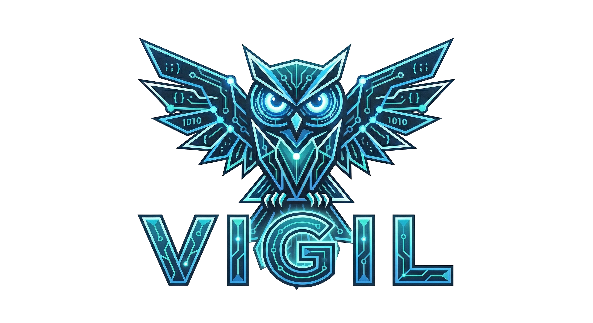

# Brand Style

!!! abstract "Section Brief"
    This is the authoritative UMTAS brand and design specification. Every token, rule, and component standard defined here must be followed exactly. Any deviation requires a deliberate decision documented in a PR.

    **Version:** 2.0 · **Date:** 11 May 2026 · **Owner:** Tyto Insights · **Built by:** Team Vigil

---

## :material-account-badge: 1. Brand Identity

**Product name:** UMTAS (University Modular Timetable & Analytics System)
**Owner:** Tyto Insights · **Built by:** Team Vigil

**Personality:** Professional, precise, and uncluttered. UMTAS is a tool for students and administrators at South African universities. The visual language must communicate trust, clarity, and competence — not playfulness or decoration.

**Design philosophy:** Monochrome charcoal. The system uses no hue-based accent colour. All visual hierarchy is achieved through tone, weight, spacing, and subtle shadow. The result is a UI that feels institutional-grade without being cold.

### 1.1 Logo & Iconography

**UMTAS logo:** A calendar icon paired with the "UMTAS" wordmark in DM Sans SemiBold. Wherever a logo appears in any generated asset or page, render a styled placeholder that matches this description (calendar icon left, wordmark right) until the real asset is provided. Label the placeholder `[INSERT UMTAS LOGO HERE]` in comments.

#### Team Vigil




#### Partners & Affiliations


**Icon library:** Lucide Icons (`lucide-react`) — latest stable. Install: `pnpm add lucide-react`. See [Section 8](#8-icons) for full usage rules.

### 1.2 Voice & Tone

**Voice (constant personality):** Helpful guide — clear and supportive, never cold. UMTAS speaks like a knowledgeable colleague who anticipates what the user needs and explains it simply. It is never terse to the point of being unhelpful, and never chatty to the point of wasting time.

**Tone (situational adjustment):**

| Situation                       | Tone                                         |
| ------------------------------- | -------------------------------------------- |
| Onboarding / empty states       | Warm, encouraging, action-oriented           |
| Informational labels / tooltips | Neutral, precise, no filler words            |
| Error messages                  | Honest, calm, tells the user what to do next |
| Success feedback                | Brief, affirmative, not over-celebratory     |
| Security / destructive actions  | Sober, direct, no softening language         |

**Rules:**

- Write in plain English. No jargon unless domain-specific (e.g. "module", "venue", "timetable slot").
- Error messages always explain the cause and the fix. Never just "Something went wrong."
- Placeholder text is descriptive, not decorative. `e.g. COS301` not `Enter something here`.
- Labels are nouns or short noun phrases. Buttons are verbs or verb phrases.

---

## :material-palette: 2. Colour System

UMTAS supports both **light mode** and **dark mode**. The palette is strictly monochrome — no hue-based accent colours are used anywhere in the system.

### 2.1 Dark Mode Palette

| Token              | Name                | Hex                | Usage                             |
| ------------------ | ------------------- | ------------------ | --------------------------------- |
| `--bg-base`        | Charcoal Base       | `#18181b`          | Page background (zinc-900)        |
| `--bg-surface`     | Charcoal Surface    | `#27272a`          | Cards, panels, modals (zinc-800)  |
| `--bg-elevated`    | Charcoal Elevated   | `#3f3f46`          | Hover states, dividers (zinc-700) |
| `--text-primary`   | Off-White Primary   | `#e8e8e8`          | All primary body and heading text |
| `--text-secondary` | Off-White Secondary | `#9a9a9a`          | Muted labels, captions, metadata  |
| `--text-disabled`  | Disabled            | `#555555`          | Placeholder text, disabled states |
| `--border`         | Subtle Border       | `#3f3f46`          | 1px card and input borders        |
| `--ring`           | Focus Ring          | `#e8e8e8`          | Keyboard focus indicators         |
| `--shadow`         | Card Shadow         | `rgba(0,0,0,0.35)` | Subtle elevation on cards         |

**Interactive states (dark mode):**

- Default button background: `#27272a`
- Button hover: `#3f3f46`
- Button active/pressed: `#52525b`
- Destructive action: `#7f1d1d` background, `#fca5a5` text

### 2.2 Light Mode Palette

| Token              | Name                | Hex                | Usage                             |
| ------------------ | ------------------- | ------------------ | --------------------------------- |
| `--bg-base`        | White Base          | `#ffffff`          | Page background                   |
| `--bg-surface`     | Off-White Surface   | `#f4f4f5`          | Cards, panels, modals (zinc-100)  |
| `--bg-elevated`    | Light Elevated      | `#e4e4e7`          | Hover states, dividers (zinc-200) |
| `--text-primary`   | Near-Black Primary  | `#09090b`          | All primary body and heading text |
| `--text-secondary` | Dark Grey Secondary | `#52525b`          | Muted labels, captions, metadata  |
| `--text-disabled`  | Disabled            | `#a1a1aa`          | Placeholder text, disabled states |
| `--border`         | Subtle Border       | `#e4e4e7`          | 1px card and input borders        |
| `--ring`           | Focus Ring          | `#18181b`          | Keyboard focus indicators         |
| `--shadow`         | Card Shadow         | `rgba(0,0,0,0.08)` | Subtle elevation on cards         |

**Interactive states (light mode):**

- Default button background: `#18181b`
- Button text: `#ffffff`
- Button hover: `#27272a`
- Destructive action: `#fee2e2` background, `#991b1b` text

### 2.3 Status Colours

Status colours are the **only permitted hue exceptions** and must be muted — never vivid.

| Status  | Dark Mode                     | Light Mode                    |
| ------- | ----------------------------- | ----------------------------- |
| Error   | `#7f1d1d` bg / `#fca5a5` text | `#fee2e2` bg / `#991b1b` text |
| Success | `#14532d` bg / `#86efac` text | `#dcfce7` bg / `#15803d` text |
| Warning | `#78350f` bg / `#fcd34d` text | `#fef3c7` bg / `#b45309` text |

### 2.4 Colour Rules

!!! warning "Strict"
    - **No hue-based accent colours** anywhere in the system — no blue, green, purple, or orange outside of status use.
    - All interactive feedback (hover, focus, active) uses tonal shifts within the charcoal scale only.
    - Never use colour as the sole indicator of state — always pair with text or iconography (WCAG requirement).
    - Never use `--text-secondary` for body copy — only for metadata, captions, and labels where reduced contrast is acceptable for supplementary content.

---

## :material-format-size: 3. Typography

**Font family:** DM Sans (Google Fonts)

- Import via Next.js `next/font/google`: `import { DM_Sans } from 'next/font/google'`
- Weights used: 400 (Regular), 500 (Medium), 600 (SemiBold)
- No italic variants in the UI — avoid entirely.

DM Sans was chosen for its soft, slightly rounded geometry that keeps the interface professional without feeling sterile. It is highly legible at small sizes, important for compact, data-dense schedule views.

### 3.1 Type Scale

| Role      | Size             | Weight       | Line Height | Letter Spacing | Usage                       |
| --------- | ---------------- | ------------ | ----------- | -------------- | --------------------------- |
| Display   | 32px / 2rem      | 600 SemiBold | 1.2         | 0em            | Page titles, hero headings  |
| Heading 1 | 24px / 1.5rem    | 600 SemiBold | 1.3         | 0em            | Section headings            |
| Heading 2 | 18px / 1.125rem  | 600 SemiBold | 1.4         | 0em            | Card headings, sub-sections |
| Heading 3 | 15px / 0.9375rem | 500 Medium   | 1.4         | 0em            | Small headings, labels      |
| Body      | 14px / 0.875rem  | 400 Regular  | 1.6         | 0em            | Default body text           |
| Small     | 12px / 0.75rem   | 400 Regular  | 1.5         | 0em            | Captions, metadata, badges  |
| Micro     | 11px / 0.6875rem | 500 Medium   | 1.4         | 0.04em         | Table headers, tag labels   |

### 3.2 Typography Rules

- Use weight and size to create hierarchy — never colour alone.
- Headings use SemiBold (600) only. No Bold (700) or heavier.
- Body copy is always Regular (400). Never SemiBold in running text.
- Micro labels only: `text-transform: uppercase` and `letter-spacing: 0.04em`.
- No decorative text transforms on any other role.

---

## :material-border-radius: 4. Border Radius

**Strategy:** shadcn/ui default radius system — `var(--radius)` = `0.5rem` (8px) globally.

| Element           | Radius           |
| ----------------- | ---------------- |
| Cards             | `0.5rem` (8px)   |
| Buttons           | `0.5rem` (8px)   |
| Inputs            | `0.5rem` (8px)   |
| Modals / Dialogs  | `0.75rem` (12px) |
| Badges / Tags     | `9999px` (pill)  |
| Tooltips          | `0.375rem` (6px) |
| Weekly grid cells | `0.25rem` (4px)  |

---

## :material-ruler: 5. Spacing & Density

**Design intent:** Compact and dense. UMTAS displays scheduling data — modules, time slots, days, venues. The layout must pack information efficiently without sacrificing legibility.

**Base unit:** 4px · **Grid:** 12-column, 24px gutters, max-width 1280px, centered.

| Token      | Value | Usage                                  |
| ---------- | ----- | -------------------------------------- |
| `space-1`  | 4px   | Micro gaps, icon-to-label spacing      |
| `space-2`  | 8px   | Internal padding in badges, small gaps |
| `space-3`  | 12px  | Input internal padding                 |
| `space-4`  | 16px  | Card internal padding, row heights     |
| `space-6`  | 24px  | Card-to-card gap, section sub-spacing  |
| `space-8`  | 32px  | Section spacing on page                |
| `space-12` | 48px  | Major section dividers                 |

**Table/schedule row height:** 40px default. Never exceed 48px for dense data views.

---

## :material-layers: 6. Shadow & Elevation

**Strategy:** Subtle — cards feel slightly lifted off the surface, but shadows never overpower.

| Level  | CSS Value                                                   | Usage                   |
| ------ | ----------------------------------------------------------- | ----------------------- |
| None   | `none`                                                      | Flat surfaces, dividers |
| Low    | `0 1px 3px rgba(0,0,0,0.12), 0 1px 2px rgba(0,0,0,0.08)`   | Default cards           |
| Medium | `0 4px 6px rgba(0,0,0,0.15), 0 2px 4px rgba(0,0,0,0.10)`   | Modals, dropdowns       |
| High   | `0 10px 15px rgba(0,0,0,0.20), 0 4px 6px rgba(0,0,0,0.12)` | Floating overlays       |

In **dark mode**, multiply shadow alpha values by approximately 2× for visibility (e.g. Low becomes `rgba(0,0,0,0.35)`).

---

## :material-motion-play: 7. Motion Tokens

All transitions in UMTAS use consistent duration and easing tokens so state changes feel deliberate, not arbitrary.

### 7.1 Duration Tokens

| Token               | Value   | Usage                                    |
| ------------------- | ------- | ---------------------------------------- |
| `--duration-fast`   | `150ms` | Hover states, icon swaps, small feedback |
| `--duration-normal` | `250ms` | Panel opens, tab switches, mode toggle   |
| `--duration-slow`   | `400ms` | Page-level transitions, modals entering  |

### 7.2 Easing

**All transitions use `ease-in-out`** for consistency. Do not use `linear`, `ease-in`, or `ease-out` except where a specific entrance/exit feel is explicitly approved.

```css
--easing-default: cubic-bezier(0.4, 0, 0.2, 1); /* ease-in-out equivalent */
```

### 7.3 Motion Rules

- Hover feedback always uses `--duration-fast`.
- Mode (light/dark) toggle uses `--duration-normal` on background and text colour transitions.
- Never animate layout-affecting properties (width, height, padding) — animate `opacity` and `transform` only.
- Respect `prefers-reduced-motion`: all transitions must be suppressed when this media query is active.

```css
@media (prefers-reduced-motion: reduce) {
  *,
  *::before,
  *::after {
    transition-duration: 0.01ms !important;
    animation-duration: 0.01ms !important;
  }
}
```

---

## :material-vector-square: 8. Icons

**Library:** Lucide Icons (`lucide-react`) — latest stable. Install: `pnpm add lucide-react`

**Usage rules:**

- Default size: `16px` in body / table contexts, `20px` in headings and nav items.
- Stroke width: `1.5` (Lucide default) — do not change.
- Icons are always the same colour as the text they accompany. Never independently coloured.
- Never use filled icon variants. Lucide is outline-only.
- Icon + label spacing: always `space-1` (4px) gap.

---

## :material-view-dashboard: 9. Component Standards

### 9.1 Buttons

| Variant     | Dark Mode                                          | Light Mode                                      |
| ----------- | -------------------------------------------------- | ----------------------------------------------- |
| Primary     | `bg-zinc-100 text-zinc-900`                        | `bg-zinc-900 text-zinc-100`                     |
| Secondary   | `bg-zinc-800 text-zinc-100 border border-zinc-700` | `bg-white text-zinc-900 border border-zinc-300` |
| Ghost       | `text-zinc-400 hover:bg-zinc-800`                  | `text-zinc-600 hover:bg-zinc-100`               |
| Destructive | `bg-red-950 text-red-300`                          | `bg-red-50 text-red-700 border border-red-200`  |

All buttons: `0.5rem` radius, `height: 36px` (compact), `padding: 0 16px`, DM Sans Medium 14px. Hover transition: `--duration-fast` ease-in-out.

### 9.2 Cards

- Background: `--bg-surface`
- Border: `1px solid --border`
- Shadow: Low elevation
- Padding: `16px`
- Radius: `0.5rem`

### 9.3 Inputs

- Background: `--bg-base` (slightly recessed from surface)
- Border: `1px solid --border`
- Focus: `ring-2 ring-offset-2 ring-[--ring]`
- Height: `36px` (compact)
- Padding: `0 12px`

### 9.4 Badges / Tags

- Pill shape (`border-radius: 9999px`)
- Padding: `2px 8px`
- Font: DM Sans Micro (11px, Medium, tracked)
- Dark: `bg-zinc-700 text-zinc-200`
- Light: `bg-zinc-200 text-zinc-700`

### 9.5 Weekly Schedule Grid

The grid is a core UMTAS component.

- Column headers: day names, Micro typography, `--text-secondary`
- Row headers: time labels, Micro typography, `--text-secondary`
- Cell background: `--bg-surface` with `1px` border in `--border`
- Session block: `--bg-elevated`, radius `0.25rem`, 12px DM Sans Medium text
- Occupied cells: slightly brighter than empty cells
- Empty cells: flat `--bg-base`

---

## :material-brightness-6: 10. Mode Switching

- **Light mode is the default** for all new sessions.
- Mode preference is persisted in `localStorage` under the key `umtas-theme`.
- Implement via `[data-theme="dark"]` on the `<html>` element, with `:root` holding light mode tokens by default.
- The mode toggle lives in the top navigation bar.
- On initial load, read `localStorage` before first paint to avoid flash of incorrect theme.

```css
:root {
  --bg-base: #ffffff;
  --bg-surface: #f4f4f5;
  --bg-elevated: #e4e4e7;
  --text-primary: #09090b;
  --text-secondary: #52525b;
  --text-disabled: #a1a1aa;
  --border: #e4e4e7;
  --ring: #18181b;
  --shadow: rgba(0, 0, 0, 0.08);
}

[data-theme="dark"] {
  --bg-base: #18181b;
  --bg-surface: #27272a;
  --bg-elevated: #3f3f46;
  --text-primary: #e8e8e8;
  --text-secondary: #9a9a9a;
  --text-disabled: #555555;
  --border: #3f3f46;
  --ring: #e8e8e8;
  --shadow: rgba(0, 0, 0, 0.35);
}
```

---

## :material-shield-check: 11. Accessibility

Accessibility is a system property — baked into every token, every component, every guideline. Target: **WCAG 2.2 AA**.

### 11.1 Colour Contrast

- Body text minimum: **4.5:1** contrast ratio against its background.
- Large text (Display, H1, H2) minimum: **3:1**.
- The monochrome charcoal palette has been selected to meet AA at both primary text weights in both modes.
- Never use `--text-secondary` for body copy — only for metadata, captions, and labels where reduced contrast is acceptable for supplementary content.

### 11.2 Keyboard Navigation

- Every interactive element must be reachable by `Tab` key.
- Focus ring: `ring-2 ring-offset-2 ring-[--ring]` — always visible, never hidden with `outline: none` without a custom replacement.
- No keyboard traps anywhere in the interface.

### 11.3 Semantics

- Use semantic HTML elements: `<nav>`, `<main>`, `<section>`, `<button>`, `<label>`.
- All icon-only buttons must have an `aria-label`.
- Form inputs must have associated `<label>` elements. Placeholder text is not a label.
- The mode toggle button must announce its state: `aria-label="Switch to dark mode"` / `aria-label="Switch to light mode"`.

### 11.4 Motion

All CSS transitions must be suppressed under `prefers-reduced-motion: reduce` (see [Section 7.3](#73-motion-rules)).

---

## :material-monitor-cellphone: 12. Responsive Breakpoints

UMTAS is a desktop-primary tool, but all screens must reflow correctly at tablet and mobile widths.

| Breakpoint | Width            | Layout behaviour                                                                    |
| ---------- | ---------------- | ----------------------------------------------------------------------------------- |
| Mobile     | `< 640px`        | Single column. Nav collapses to a hamburger menu. Cards stack full-width.           |
| Tablet     | `640px – 1024px` | 2-column card grid. Sticky nav remains visible. Schedule grid scrolls horizontally. |
| Desktop    | `> 1024px`       | Full 12-column grid. Max-width 1280px centered. Default design target.              |

Use Tailwind CSS breakpoint prefixes: `sm:` (640px), `md:` (768px), `lg:` (1024px), `xl:` (1280px).
