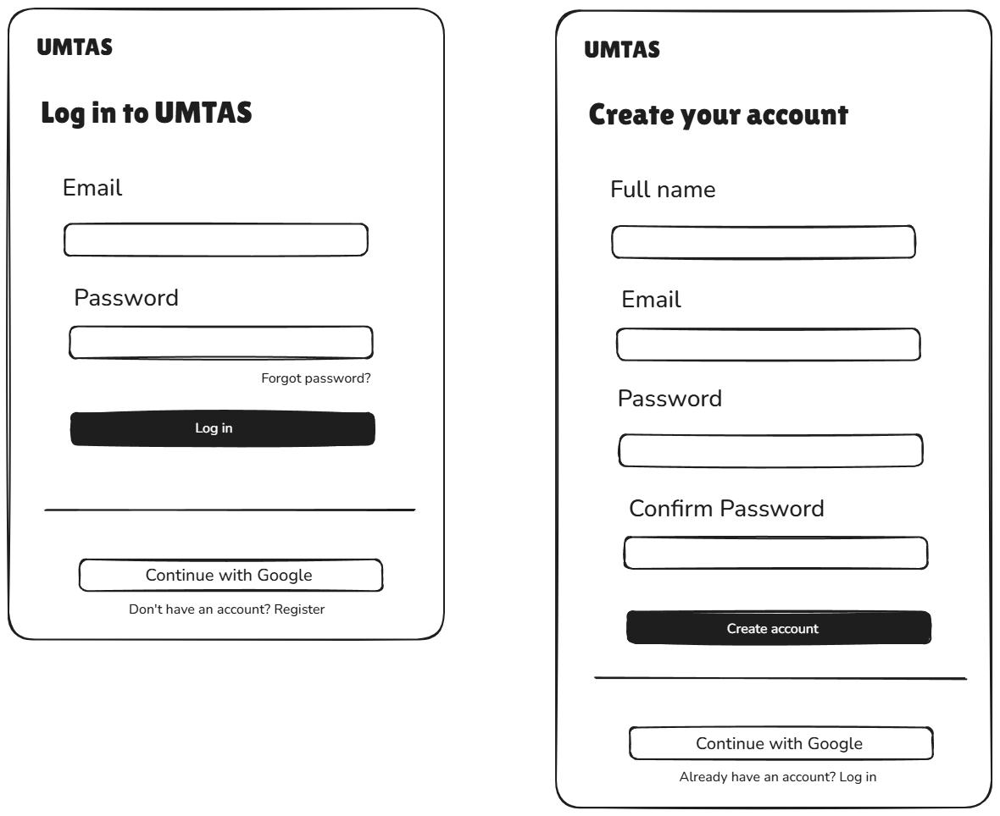
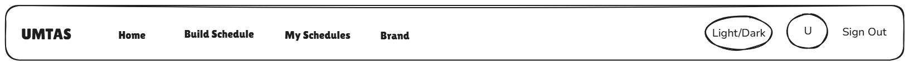
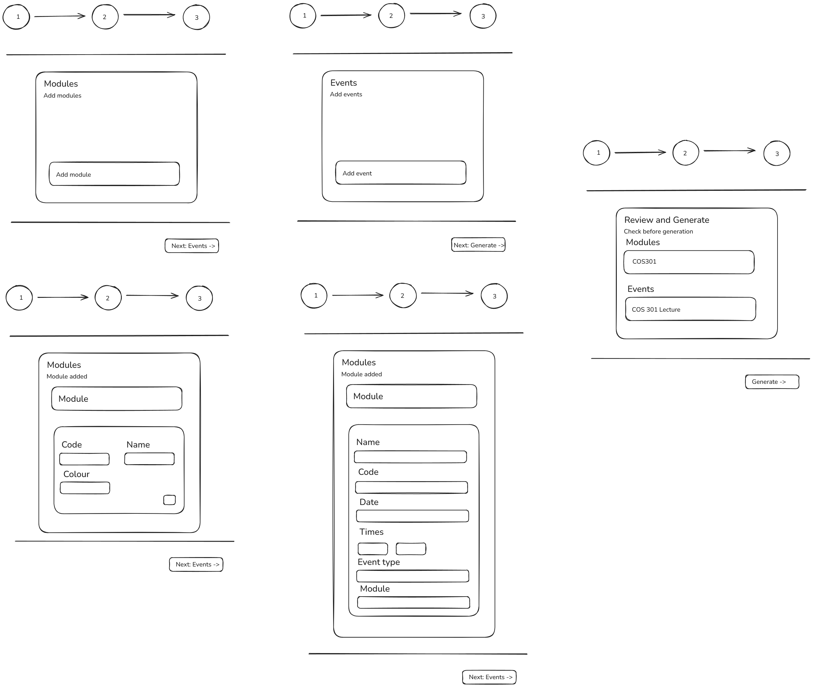
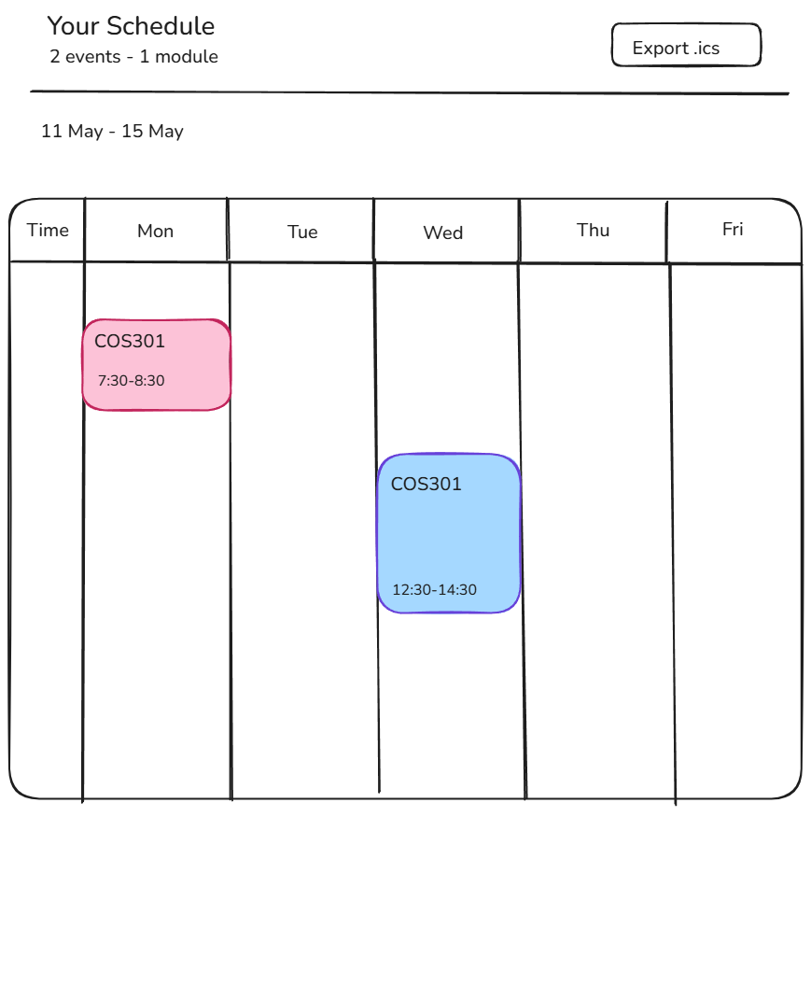

# 4.2.2 Wireframes

Wireframes provide a visual representation of the system's user interface structure. They focus on layout and functionality rather than detailed visual design, serving as a guide for both developers and stakeholders.

Key elements include:

- **Screen Layouts:** Low- to mid-fidelity representations of key system screens such as login pages, dashboards, and feature-specific views.
- **Navigation Flow:** Illustrations of how users move between different screens, often represented using arrows or flow diagrams.
- **Component Placement:** The positioning of interface elements such as menus, buttons, forms, and data displays on each screen.
- **User Interaction Points:** Indications of where users input data, trigger actions, or receive system feedback.
- **Annotations:** Brief notes explaining the purpose and behaviour of specific elements or interactions to clarify design intent.

---

## Authentication

The login screen allows returning users to sign in with their email and password or via Google OAuth. New users are directed to the registration screen, which collects full name, email, password, and password confirmation.

---

## Navigation

The top navigation bar is persistent across all authenticated views. It provides access to Home, Build Schedule, My Schedules, and Brand, along with a light/dark mode toggle, a user avatar, and a sign-out action.

---

## Build Schedule Flow

Schedule generation follows a three-step wizard. In Step 1 the user adds modules (providing a module code, name, and colour). In Step 2 the user adds events linked to those modules (providing a name, code, date, start/end times, event type, and associated module). Step 3 presents a review of all entered modules and events before the user triggers generation.

---

## Schedule View

Once generated, the schedule is displayed as a weekly calendar grid (Monday–Friday). Each event block is colour-coded by module. The header shows a summary of total events and modules, a date-range label, and an **Export .ics** button for importing the schedule into external calendar applications.

