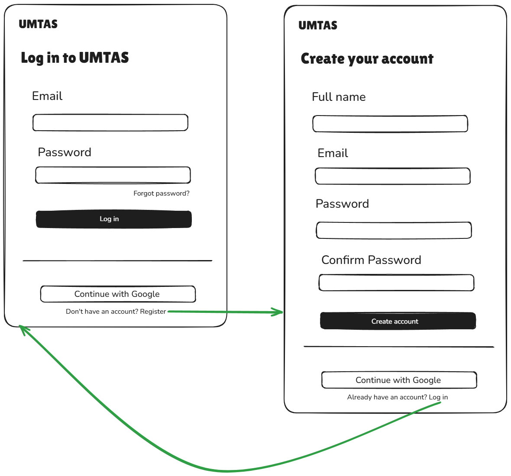
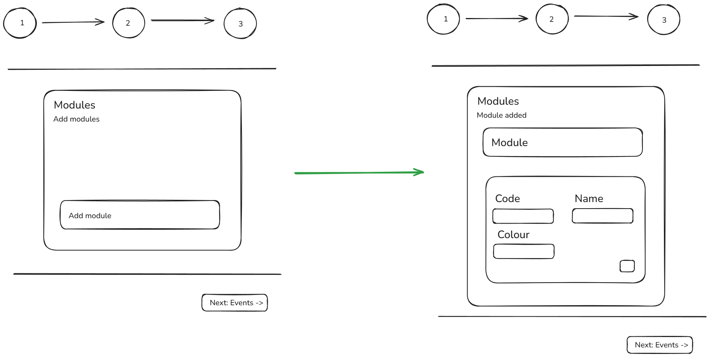
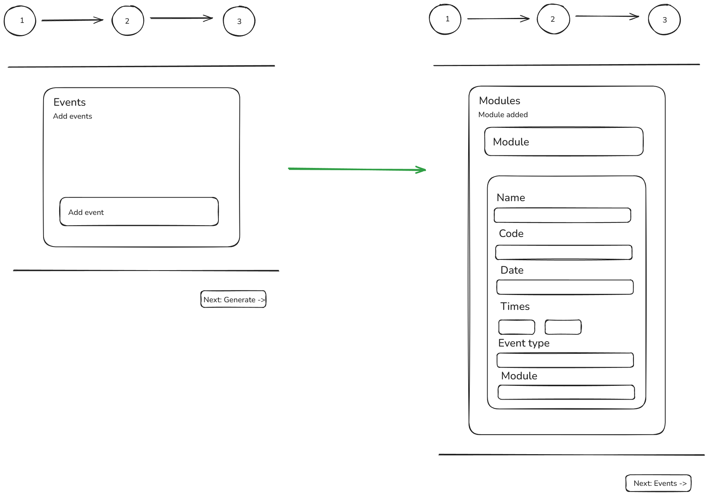
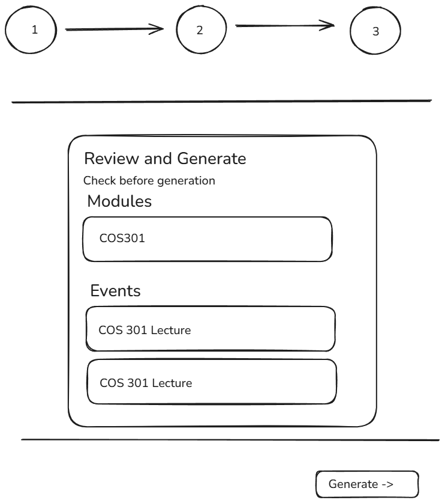

# 4.2.2 Wireframes

Wireframes provide a visual representation of the system's user interface structure. They focus on layout and functionality rather than detailed visual design, serving as a guide for both developers and the client.

Key elements include:

- **Screen Layouts:** Low- to mid-fidelity representations of key system screens such as login pages, dashboards, and feature-specific views.
- **Navigation Flow:** Illustrations of how users move between different screens, often represented using arrows or flow diagrams.
- **Component Placement:** The positioning of interface elements such as menus, buttons, forms, and data displays on each screen.
- **User Interaction Points:** Indications of where users input data, trigger actions, or receive system feedback.
- **Annotations:** Brief notes explaining the purpose and behaviour of specific elements or interactions to clarify design intent.

---

## Authentication

The login screen allows returning users to sign in with their email and password or via Google OAuth. New users are directed to the registration screen, which collects full name, email, password and password confirmation.

---

## Navigation

The top navigation bar is persistent across all authenticated views. It provides access to Home, Builder and Schedules along with a light/dark mode toggle, a user avatar and a sign-out action.

---

## Build Schedule Flow

Schedule generation follows a three-step wizard.

The **first step** is module loading and module creation. If the user has created modules in the past, the modules will appear on the page. Users can edit, add and remove modules on this component. Each module is identified by name and code and is assigned a colour.

The **second step** is event creation. Users can edit, add or remove events. Event information includes name, code, date, times, event type (which would only be Lecture for Demo 1) and module. Module is assigned from the user's list of created modules (step 1).

The **last step** is reviewing modules and events. The user's modules and events from step 1 and step 2 will appear on the card. Clicking on generate will generate the basic schedule.

---

## Schedule View

Once generated, the schedule is displayed as a weekly calendar grid (Monday–Friday). Each event block is colour-coded by module. The header shows a summary of total events and modules, a date-range label and an **Export .ics** button for exporting the schedule into an .ics format.