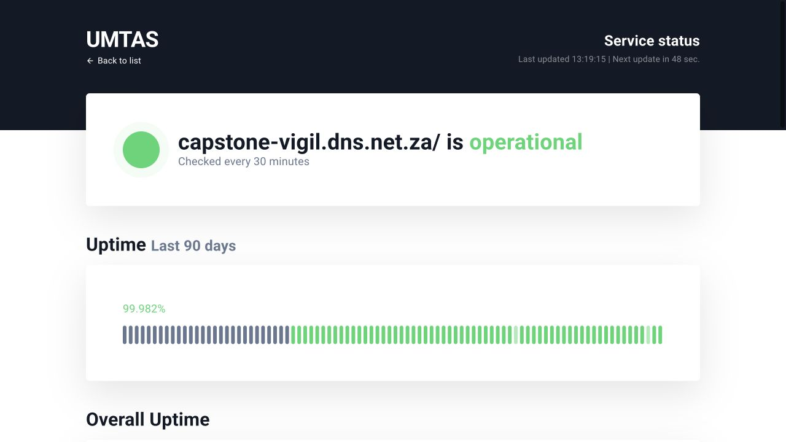
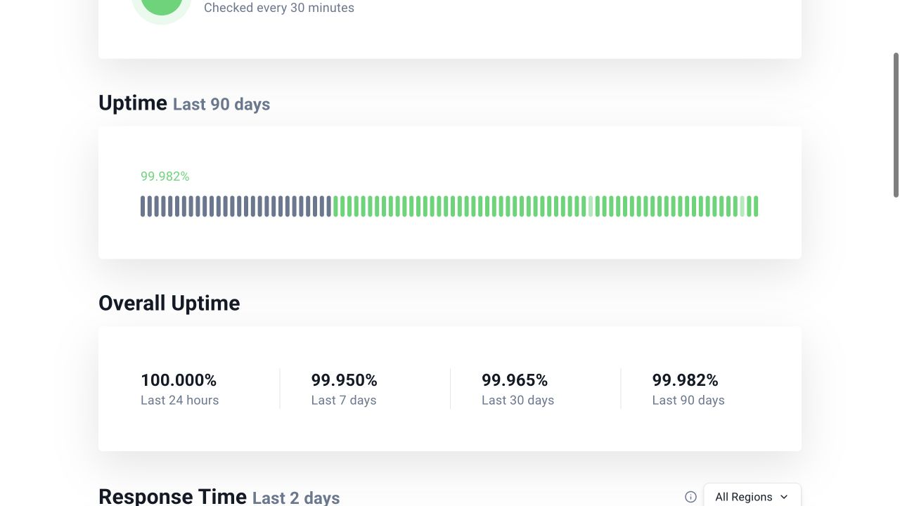

# Public Availability Monitor

The [public UptimeRobot status page](https://stats.uptimerobot.com/EfNarUH73Q/803621896)
monitors `https://capstone-vigil.dns.net.za/` every 30 minutes. These screenshots were captured
on **28 September 2026 at approximately 13:19 SAST** from the public status page.

At capture time, the page showed **99.965% for the last 30 days** and **99.982% for the last 90
days**. The rolling 30-day value exceeds the NFR-Avail-1 threshold of 99.5%. The public page does
not show the exact start and end timestamps of that rolling window or identify which application
revision was deployed during it. Therefore, these screenshots support the observed rolling figure
but do not yet prove availability for the assessed Demo 4 release. Retain a dated monitor export
with the exact window and deployment revision before marking the requirement as met.
