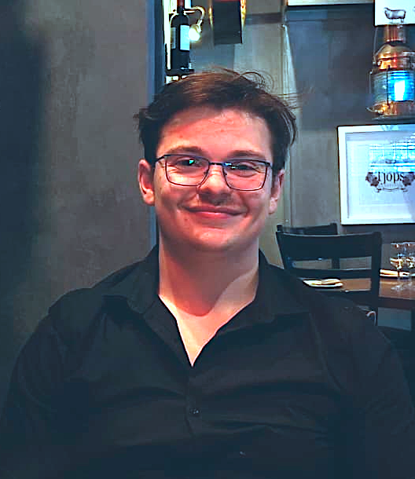
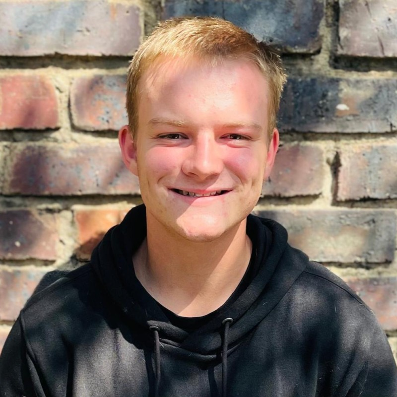
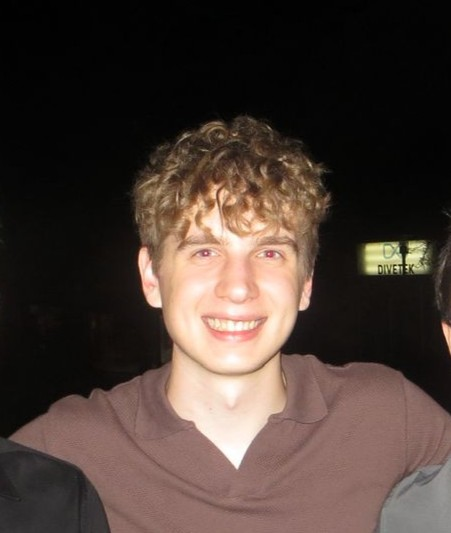
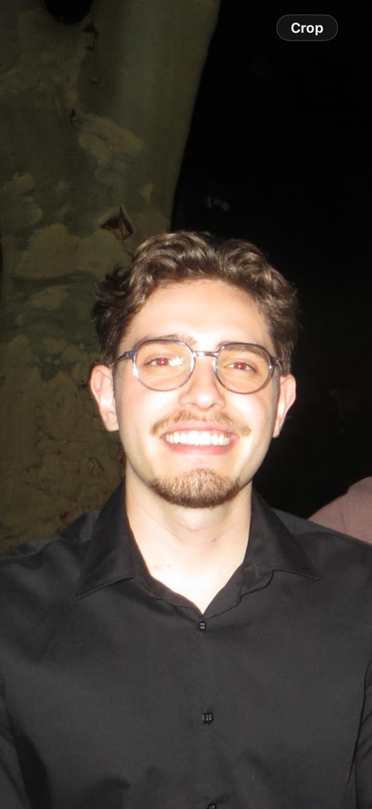

# Team Profiles

Team Vigil comprises five University of Pretoria Computer Science students with complementary profiles across full-stack development, system architecture, DevOps, data engineering, and machine learning. While the team maintains specialised leads, a cross-functional approach is adopted, with all members (excluding the System Architect) contributing across the full stack to ensure high velocity and internal redundancy.

---

## 👥 Members

<table style="border: none; border-collapse: collapse; width: 100%;">
<tr style="border: none;">
<td style="border: none; width: 140px; vertical-align: top; padding-right: 24px;">
  
</td>
<td style="border: none; vertical-align: top;">

### Wilmar Smit

- **Role:** Team Lead & Integration Lead
- **Student Number:** u24584216
- **LinkedIn:** [Wilmar Smit](https://www.linkedin.com/in/wilmar-smit-3b11842a3/)
- **GitHub:** [wilmar-smit](https://github.com/wilmar-smit)
- **Bio:** Third-year Computer Science student. Serving as the Team Lead, Wilmar acts as the primary coordinator between frontend and backend workstreams. He ensures architectural alignment across the stack and manages the integration of diverse components into a cohesive system. His professional experience at Tyto Insights informs his approach to building scalable, production-ready systems. Wilmar focuses on technical "peace-keeping," facilitating communication between architects to ensure that changes in frontend state management or backend API contracts remain synchronised.

</td>
</tr>
</table>

---

<table style="border: none; border-collapse: collapse; width: 100%;">
<tr style="border: none;">
<td style="border: none; width: 140px; vertical-align: top; padding-right: 24px;">
  
</td>
<td style="border: none; vertical-align: top;">

### Michael Tomlinson

- **Role:** Lead Developer & System Architect
- **Student Number:** u24569705
- **LinkedIn:** [Michael Tomlinson](https://www.linkedin.com/in/michaeltomlinson)
- **GitHub:** [michaeltomlinsontuks](https://github.com/michaeltomlinsontuks)
- **Bio:** Third-year Computer Science student. Currently a Software Developer Intern at Tyto Insights, with prior experience migrating legacy systems to modern stacks at DCS Engineering. Michael serves as the System Architect, specialising in the UMTAS core stack: PostgreSQL, TypeORM, Nest.js, and Next.js. He is responsible for the Core-and-Adapter pattern implementation, ensuring the system remains university-agnostic. His Tuks PDF Calendar project provides the foundational domain expertise required for the project's complex PDF parsing challenges.

</td>
</tr>
</table>

---

<table style="border: none; border-collapse: collapse; width: 100%;">
<tr style="border: none;">
<td style="border: none; width: 140px; vertical-align: top; padding-right: 24px;">
  
</td>
<td style="border: none; vertical-align: top;">

### Johan Coetzer

- **Role:** Frontend Lead & Full-Stack Developer
- **Student Number:** u24564584
- **LinkedIn:** [Johan Coetzer](https://www.linkedin.com/in/johan-coetzer-01bb26401)
- **GitHub:** [jcoet-gh](https://github.com/jcoet-gh)
- **Bio:** Third-year Computer Science student and Software Developer Intern at Tyto Insights (Skunkworks division). As Frontend Lead, Johan manages the Next.js ecosystem, focusing on responsive component architecture and intuitive user experience. His background in full-stack development allows him to bridge complex system logic with the interface, ensuring that the heavy data requirements of the UMTAS platform are presented through a high-performance, accessible dashboard.

</td>
</tr>
</table>

---

<table style="border: none; border-collapse: collapse; width: 100%;">
<tr style="border: none;">
<td style="border: none; width: 140px; vertical-align: top; padding-right: 24px;">
  
</td>
<td style="border: none; vertical-align: top;">

### Marcel Stoltz

- **Role:** DevOps Lead & Backend Specialist
- **Student Number:** u24566552
- **LinkedIn:** [Marcel Stoltz](https://www.linkedin.com/in/marcel-stoltz/)
- **Bio:** Third-year Computer Science student and Software Developer Intern at Tyto Insights (Skunkworks division). Marcel leads the DevOps and Infrastructure workstream, specialising in Docker environments and automated deployment pipelines. With a technical focus on system availability and CI/CD execution, he ensures the Nest.js backend and PostgreSQL services are optimised for high-performance delivery. His previous work at Gendac provides the backend versatility necessary to support the project.

</td>
</tr>
</table>

---

<table style="border: none; border-collapse: collapse; width: 100%;">
<tr style="border: none;">
<td style="border: none; width: 140px; vertical-align: top; padding-right: 24px;">
  
</td>
<td style="border: none; vertical-align: top;">

### Aidan Dawson

- **Role:** Backend Developer & Integration
- **Student Number:** u24593542
- **LinkedIn:** [Aidan Dawson](https://www.linkedin.com/in/aidan-dawson-3514692ba)
- **GitHub:** [sdcreek240](https://github.com/sdcreek240)
- **Bio:** Third-year Computer Science student focused on backend development and contract-driven integration. Aidan is responsible for implementing core backend functionality while ensuring strict adherence to API contracts across all system components, validating data integrity and PDF extraction accuracy, and supporting automated testing to maintain reliable, consistent interactions between the frontend, backend, and external adapters within the UMTAS platform.

</td>
</tr>
</table>

---

## 🔗 Quick Links

- [GitHub Project Board](https://github.com/orgs/COS301-SE-2026/projects/[ID])
