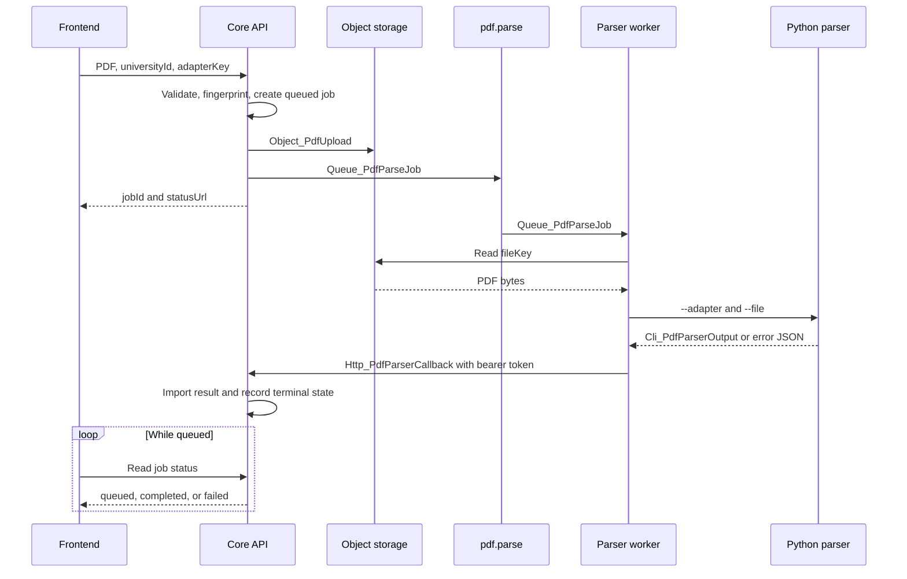
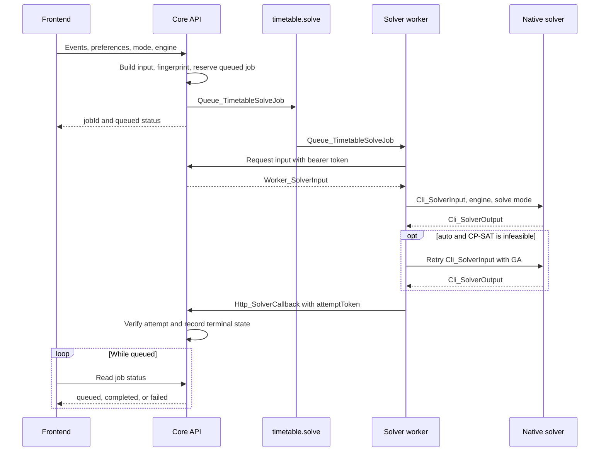
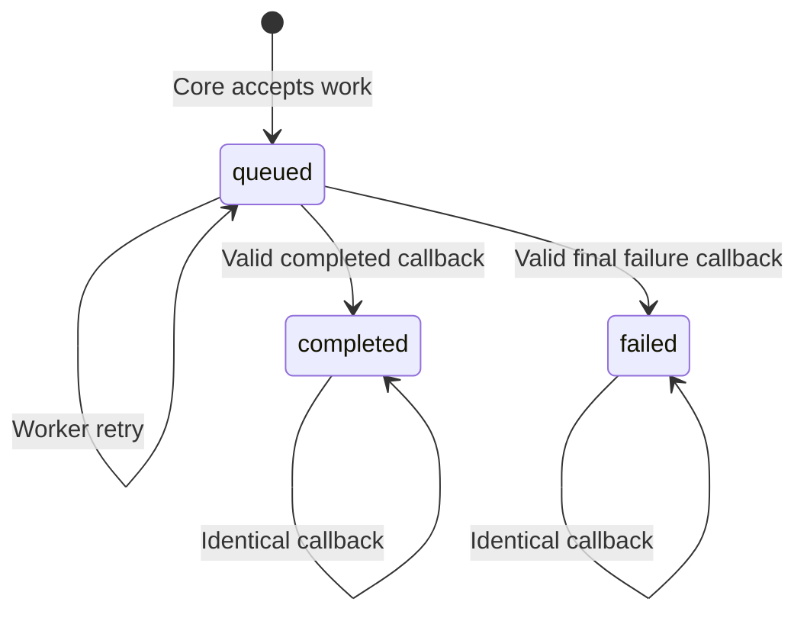
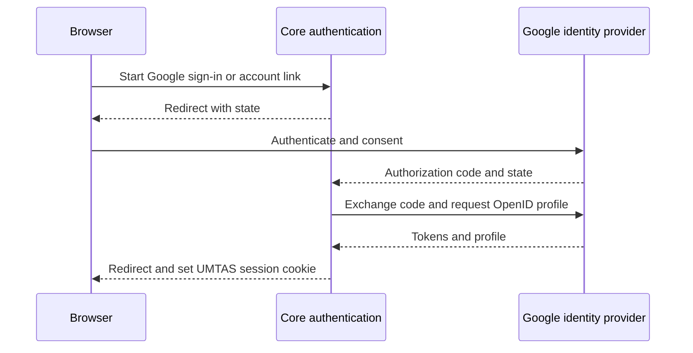

# Service Contracts

<swagger-ui src="https://capstone-vigil.dns.net.za/api/docs-json" />

## PDF parsing



### `Object_PdfUpload`

The Core writes the PDF to S3-compatible object storage. The queue carries its
key instead of the file bytes.

```text
uploads/pdf-parser/{jobId}/{sanitised-file-name}
```

- Maximum upload size: 25 MiB.
- The Core checks the PDF signature and accepts a PDF MIME type or `.pdf` name.
- The Core recomputes the PDF-stream fingerprint. A client hash is diagnostic
  only.
- A storage failure marks the job `failed`; the queue message is not sent.
- The parser worker downloads the object using service credentials.

**Implementation:** `pdf-parse-submission.ts`, `object-storage.service.ts`, and
`apps/pdf_parser/worker/src/storage.ts`.

### `Queue_PdfParseJob`

The Core assigns a stored document to the parser worker through `pdf.parse`.

```json
{
  "jobId": "pdf-parse-550e8400-e29b-41d4-a716-446655440000",
  "fileKey": "uploads/pdf-parser/pdf-parse-550e8400-e29b-41d4-a716-446655440000/input.pdf",
  "adapterKey": "up"
}
```

- All three fields are required and must be non-empty strings.
- `fileKey` must identify the object stored before the message is published.
- The worker validates the message with `PdfParseJobDataSchema`.
- The default queue policy allows three attempts with exponential backoff.
- A message may be processed more than once. The callback contract therefore
  provides the terminal idempotency boundary.
- Only the final failed queue attempt sends a failure callback.

**Producer:** `PdfParseSubmission` through `QueueProducerService`.
**Consumer:** `PdfParseProcessor`.
**Runtime schema:** `packages/shared-types/src/parser.ts`.

### `Cli_PdfParserOutput`

The worker invokes the Python parser with `--adapter <key> --file <path>`. A
successful process writes one JSON result to stdout.

```json
{
  "modules": [
    {
      "code": "COS301",
      "name": "Software Engineering",
      "metadata": {},
      "warnings": []
    }
  ],
  "events": [
    {
      "moduleCode": "COS301",
      "activityType": "lecture",
      "activityCode": "L1",
      "title": "COS301 Lecture",
      "startTime": "08:30",
      "endTime": "10:20",
      "venues": ["IT 4-5"],
      "metadata": {},
      "warnings": [],
      "day": "monday",
      "date": null,
      "isRecurring": true
    }
  ],
  "warnings": []
}
```

- An event is either recurring (`day` set and `date: null`) or dated (`date`
  set and `day: null`).
- `startTime` must be earlier than `endTime`.
- Only the `up` adapter is currently accepted by the upload contract.
- Exit code `0` means stdout contains a parser result. Parser failures return a
  structured error with a non-zero exit code.
- A timeout, invalid JSON, or schema violation becomes a failed worker attempt.
- The default parser-worker timeout is 60 seconds.

**Producer:** `apps/pdf_parser/parser_cli.py`.
**Consumer:** `CliParserExecutor` followed by `PdfParserResultSchema`.

### `Http_PdfParserCallback`

The worker sends exactly one of these shapes for a terminal outcome:

```json
{
  "status": "completed",
  "result": {
    "modules": [],
    "events": [],
    "warnings": []
  }
}
```

```json
{
  "status": "failed",
  "error": {
    "code": "PARSER_PROTOCOL_ERROR",
    "message": "PDF parser stdout was not valid JSON.",
    "details": {}
  }
}
```

- The callback requires the configured worker bearer token.
- The worker retries callback delivery three times, starting at 500 ms and
  backing off to at most 5 seconds.
- An identical repeated callback is accepted without importing the result
  twice.
- A different callback for an already terminal job is rejected as a conflict.
- A successful callback imports the parsed modules and events before setting
  the job to `completed`.

**Producer:** `HttpCallbackClient` in `bullmq-worker-core`.
**Consumer:** `PdfParserController` and `PdfParserJobStoreService`.
**Runtime schema:** `PdfParserCallbackPayloadSchema`.

## Timetable solving



### `Queue_TimetableSolveJob`

The Core assigns a persisted scheduling problem to the solver worker through
`timetable.solve`.

```json
{
  "jobId": "solve-550e8400-e29b-41d4-a716-446655440000",
  "attemptToken": "6ba7b810-9dad-41d1-80b4-00c04fd430c8",
  "solveMode": "optimization",
  "engine": "auto"
}
```

- `solveMode` is `feasibility` or `optimization`.
- `engine` is `auto`, `cp-sat`, or `ga`; omitted values default to `auto`.
- `attemptToken` is a UUID and is also the BullMQ job identifier.
- The queue does not carry the scheduling problem. The worker fetches the
  persisted input after receiving the job.
- The default queue policy allows two attempts with exponential backoff.
- Retrying a confirmed failed solve creates a new attempt token.

**Producer:** `SolverSubmissionService` through `QueueProducerService`.
**Consumer:** `SolverProcessor`.
**Runtime schema:** `TimetableSolveJobDataSchema`.

### `Worker_SolverInput`

The worker fetches the problem associated with `jobId` from the Core.

```json
{
  "schedulingProblem": {
    "events": [
      {
        "eventId": "event-1",
        "moduleCode": "COS301",
        "activityType": "lecture",
        "activityCode": "L1",
        "requiredSelections": 1,
        "dayOfWeek": "monday",
        "startTime": "08:30",
        "endTime": "10:20",
        "venues": [{ "id": "venue-1", "name": "IT 4-5" }]
      }
    ]
  },
  "preferences": {
    "heuristics": [
      {
        "key": "day-skip",
        "parameters": { "day-to-skip": "friday" }
      }
    ]
  }
}
```

- Every event contains exactly one of `date` or `dayOfWeek`.
- `startTime` must be earlier than `endTime`.
- `requiredSelections` is a positive integer and defaults to `1`.
- The input operation requires the worker bearer token.
- The worker parses the response as JSON and validates it with
  `SolverInputSchema` before starting the native solver.

**Producer:** `SolverInputBuilderService` and `SolverController`.
**Consumer:** `HttpSolverInputClient`.

### `Cli_SolverInput` and `Cli_SolverOutput`

The worker writes `Worker_SolverInput` to a temporary JSON file and invokes:

```text
solver-cli --input <path> --output <path> --engine <cp-sat|ga> \
  --solve-mode <feasibility|optimization>
```

A feasible native result has this shape:

```json
{
  "status": "feasible",
  "outcome": "conflict-free",
  "timetableSolution": {
    "selectedEventIds": ["event-1"]
  },
  "heuristicScores": [],
  "metadata": {
    "conflictCount": 0,
    "conflicts": [],
    "solveMode": "optimization"
  }
}
```

An infeasible result is exactly:

```json
{ "status": "infeasible" }
```

- `conflictCount` must equal the number of entries in `conflicts`.
- `outcome` must be `conflict-free` when that count is zero and `best-effort`
  otherwise.
- With `engine: auto`, the worker runs CP-SAT first and runs GA only if CP-SAT
  returns `infeasible`.
- With an explicit engine, `infeasible` becomes `SOLVER_INFEASIBLE` without a
  fallback.
- A non-zero exit, timeout, unreadable output, invalid JSON, or schema violation
  fails the attempt.
- The default solver-worker timeout is 300 seconds.

**Producer:** the native solver in `apps/preference-solver`.
**Consumer:** `CliSolverExecutor`, validated by `SolverCliOutputSchema`.

### `Http_SolverCallback`

A completed callback adds the engine selected by the worker:

```json
{
  "status": "completed",
  "result": {
    "engine": "cp-sat",
    "outcome": "conflict-free",
    "timetableSolution": {
      "selectedEventIds": ["event-1"]
    },
    "heuristicScores": [],
    "metadata": {
      "conflictCount": 0,
      "conflicts": [],
      "solveMode": "optimization"
    }
  }
}
```

A failure uses the same error envelope as the parser callback:

```json
{
  "status": "failed",
  "error": {
    "code": "SOLVER_INFEASIBLE",
    "message": "Neither solver found a valid timetable.",
    "details": { "engines": ["cp-sat", "ga"] }
  }
}
```

- The callback requires the worker bearer token and the attempt token supplied
  with the queue message.
- A callback whose attempt token is no longer active is rejected.
- Callback delivery uses the same three-attempt backoff policy as parsing.
- An identical repeated callback is accepted; a different terminal callback is
  rejected as a conflict.

**Producer:** `SolverProcessor` through `HttpCallbackClient`.
**Consumer:** `SolverController` and `SolverJobStoreService`.
**Runtime schema:** `SolverCallbackPayloadSchema`.

## Asynchronous job state



- The Core owns the job record, input, result, and terminal state.
- Workers keep only temporary files. They remove them after acknowledged work
  and may retain failed files only when diagnostics are explicitly enabled.
- Queue retries do not create another Core job.
- Completed and failed states are terminal. A conflicting later callback is
  rejected.
- The frontend reads status from the Core; it does not contact queues, workers,
  storage, or native processes.

## Google authentication



- Requested scopes are `openid`, `email`, and `profile`.
- OAuth state is stored in a cookie and checked on callback.
- Provider tokens stored by UMTAS are encrypted.
- Account linking requires a fresh UMTAS session.
- Accounts are linked only when the Google email matches a verified credential
  account.
- Missing configuration returns `404`; an invalid or expired code returns
  `400`; an email already owned by another account returns `422`.

**Implementation:** `apps/backend/src/auth/auth.controller.ts` and
`apps/backend/src/auth/auth.ts`. HTTP operations are grouped under **Auth
Google** in Swagger.

## Contract sources

- HTTP operations and DTOs: NestJS controllers and Swagger decorators.
- Queue, callback, parser-result, and solver schemas:
  `packages/shared-types`.
- Non-HTTP OpenAPI catalogue:
  `apps/backend/src/system-contract-catalog.json`.
- Committed OpenAPI document: `apps/backend/docs/openapi.json`.
- Generated frontend types: `apps/frontend/src/lib/api.ts`.
