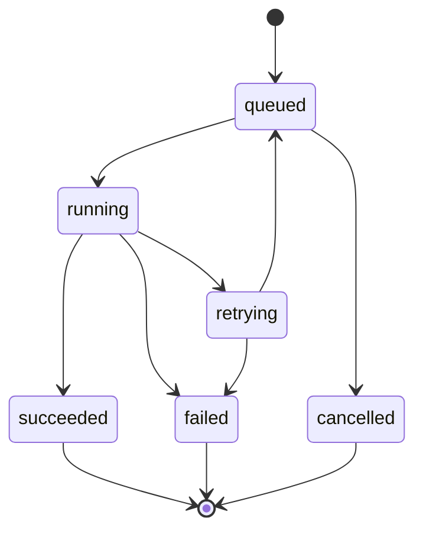

# API Contracts

## Purpose and Policy

This page defines Demo 2 interface boundaries for ownership, transport, lifecycle, errors, retry,
and compatibility. Checked-in OpenAPI or JSON Schema files should provide the machine-readable
version of these contracts.

Contract changes are backward compatible within Demo 2 unless a new major API version is
introduced. Producers ignore unknown optional fields, consumers tolerate additive fields, and
required fields are not removed or retyped without a version change.

## Boundary Inventory

| Boundary | Owner | Consumer | Transport | Authentication | Schema Authority |
|---|---|---|---|---|---|
| Browser <-> Core API | Core API | Browser app | HTTPS JSON | Better Auth session and RBAC | Core OpenAPI |
| Core API -> job channel | Core orchestration | Core-owned workers | Redis-backed queue | Internal network and queue credentials | Shared TypeScript job schema |
| Parse worker <-> parser | Parser service | Parse worker | Internal HTTP JSON | Service credential or private network | Parser OpenAPI |
| Solve worker <-> solver | Solver service | Solve worker | Internal HTTP JSON | Service credential or private network | Solver OpenAPI |
| Core API <-> university adapter | Adapter implementation | Core domain service | In-process or HTTPS JSON | Provider credential | Adapter interface and provider schema |
| Core API <-> Google Calendar | Google Calendar API | Calendar integration service | HTTPS JSON | OAuth 2.0 delegated token | Google API plus internal adapter |
| Browser <-> authentication | Better Auth | Browser and protected routes | HTTPS | Session cookie / OAuth flow | Better Auth route config |
| Browser -> job status | Core API | Browser app | HTTPS JSON polling | Owning user session and workspace authorization | Core OpenAPI |

## Common Conventions

- External endpoints use HTTPS and JSON, except PDF uploads, which may use multipart form data.
- Identifiers are opaque strings.
- Timestamps use UTC ISO 8601.
- Mutating requests validate workspace membership and role.
- Errors use `code`, safe `message`, optional `details`, and `correlationId`.
- Correlation IDs are accepted or generated at ingress and propagated to queues and compute calls.
- Logs and errors must not expose passwords, session tokens, OAuth refresh tokens, or PDF contents.

```json
{
  "code": "VALIDATION_ERROR",
  "message": "The request could not be processed.",
  "details": { "field": "moduleCodes" },
  "correlationId": "opaque-id"
}
```

## Browser and Core API

| Concern | Contract |
|---|---|
| Request validation | Return `400` or `422` for malformed or semantically invalid input |
| Authentication | Return `401` when no valid session exists |
| Authorization | Return `403` for insufficient global or workspace permission |
| Missing resource | Return `404` without leaking another tenant's resource existence |
| Conflict | Return `409` for duplicate or incompatible state transitions |
| Server failure | Return `500` with a correlation ID and no stack trace |
| Idempotency | Import/generation creation accepts an idempotency key or rejects duplicate active work |
| Timeout | Synchronous endpoints fail within ingress timeout; long work returns `202 Accepted` |

Convenience Swagger source:

<swagger-ui src="https://api.capstone-vigil.dns.net.za/api/docs-json" />

The remote document does not replace a checked-in OpenAPI snapshot.

## Asynchronous Job Contract

The Core creates a job record before enqueueing work. Queue payloads contain references and
normalized input, not session credentials or arbitrary callback URLs.

```json
{
  "contractVersion": 1,
  "jobId": "opaque-id",
  "jobType": "parse_timetable",
  "workspaceId": "opaque-id",
  "requestedBy": "opaque-id",
  "input": {
    "objectKey": "opaque-storage-reference",
    "universityCode": "UP"
  },
  "correlationId": "opaque-id",
  "createdAt": "2026-06-22T00:00:00Z"
}
```

Allowed `jobType` values are `parse_timetable` and `solve_timetable`. Workers reject unsupported
`contractVersion` or `jobType` values.



`succeeded`, `failed`, and `cancelled` are terminal. Redelivered jobs may run only when stored
state is non-terminal. Result persistence and transition to `succeeded` must be atomic or safely
repeatable.

## Parser and Solver Contracts

| Service | Endpoint | Input | Success Output | Errors | Retry / Idempotency |
|---|---|---|---|---|---|
| Parser | `POST /v1/parse` | Object reference or multipart PDF, university code, parse options, correlation ID | Normalized modules/events, warnings, parser version | `UNSUPPORTED_FORMAT`, `INVALID_PDF`, `PARSE_FAILED`, `TIMEOUT` | Retry transient transport/service failures only; same file hash, university code, and parser version must produce equivalent output. |
| Solver | `POST /v1/solve` | Event options, hard constraints, preferences, timeout, correlation ID | Selected event IDs, score, solve status, elapsed time, diagnostics | `INVALID_CONSTRAINTS`, `SOLVER_FAILURE`, `TIMEOUT` | Retry transport failures only; deterministic infeasibility must not retry; equivalent input and solver version must produce a semantically valid equivalent result. |

Solver status values are `feasible`, `optimal`, `infeasible`, `timeout_with_solution`, and
`timeout_without_solution`. Demo 2 solving selects one option from fixed event choices; it does
not perform institutional master scheduling or arbitrary room/time placement.

## Integration Contracts

| Integration | Contract |
|---|---|
| University adapters | Authenticate with provider credentials, fetch or receive provider data, normalize to UMTAS course/module/event/venue/calendar structures, and return provider-safe errors. Each adapter declares provider, schema/version support, timeout, retry policy, and capabilities. |
| Authentication and session | Better Auth owns sign-in, sign-out, sessions, and OAuth callbacks. Core combines identity, global role, and workspace membership before authorizing domain operations. Production cookies are `Secure`, `HttpOnly`, and use an appropriate `SameSite` policy. |
| Google Calendar | Uses delegated OAuth 2.0 and an internal adapter. Re-export updates mapped remote events rather than creating duplicates. Expired tokens refresh where possible; revoked consent requires reauthorization. Only required timetable fields are sent. |

Bidirectional calendar reconciliation is deferred until conflict and deletion semantics are
approved. Mock adapters do not count as fully integrated Demo 2 features.

## Job Status Polling

The browser polls `GET /v1/jobs/{jobId}` using the owning authenticated session. The endpoint
returns only jobs visible in the active workspace.

```json
{
  "jobId": "opaque-id",
  "type": "solve_timetable",
  "state": "running",
  "progress": 40,
  "attempt": 1,
  "resultRef": null,
  "error": null,
  "updatedAt": "2026-06-22T00:00:05Z"
}
```

Clients stop polling on terminal state, honor `Retry-After`, and use bounded backoff.

## Contract Evidence Status

| Evidence | Status |
|---|---|
| Live Core Swagger | Available at the documented URL; availability must be reverified |
| Checked-in Core OpenAPI | Not present in this workspace |
| Parser and solver OpenAPI | Not present in this workspace |
| Shared queue JSON Schema / TypeScript package | Not present in this workspace |
| Contract tests | Required, but results are not present in this workspace |
