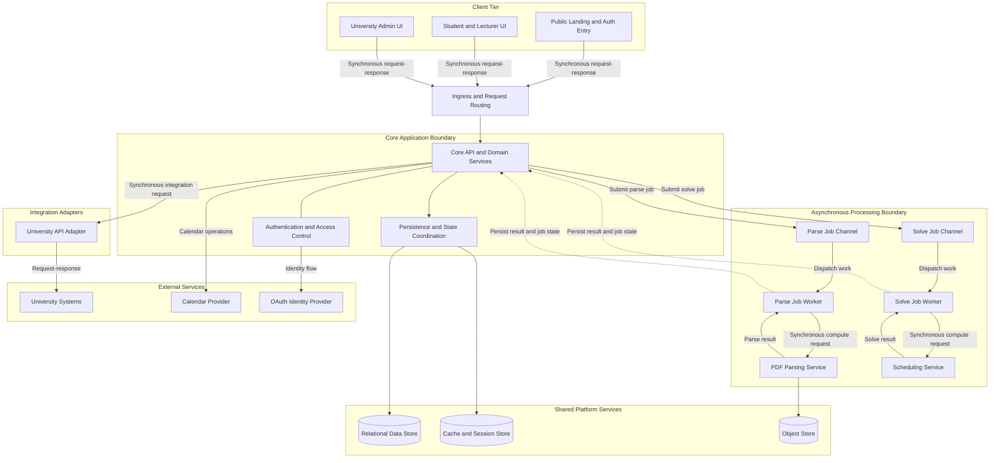

# Architectural Diagram

## Scope

This technology-neutral logical view shows responsibilities, boundaries, and communication
direction without naming products or deployment platforms.

*Figure 1. Technology-neutral logical architecture for UMTAS.*

## Legend

- Solid arrows: synchronous request-response
- Dashed arrows: asynchronous completion or state update
- Cylinders: shared stateful platform services
- Boxes: logical components or boundaries

## Component Breakdown

| Component | Responsibility | Depends On |
|---|---|---|
| Clients | Present user workflows for students, lecturers, admins, and public entry points | Ingress, Core API |
| Ingress and Request Routing | Accept external requests and direct them to the Core | Core Application |
| Core API and Domain Services | Enforce business rules, orchestrate jobs, expose the main system contract | Auth, Repo, Adapters, Async services |
| Authentication and Access Control | Validate identity, sessions, and role-based access | Identity provider, Core API |
| Persistence and State Coordination | Own access to persistent entities, caches, and storage references | Shared platform services |
| Parse and Solve Job Channels | Buffer long-running work and decouple client latency from compute time | Core API, queue workers |
| Parse and Solve Job Workers | Consume jobs, invoke compute services, and record results | Job channels, parser, solver, Core persistence |
| PDF Parsing Service | Convert uploaded university timetable PDFs into normalized payloads | Parse worker, object store |
| Scheduling Service | Choose clash-free timetable options from fixed event sets | Solve worker |
| University API Adapter | Normalize data from external university systems | External university APIs, Core API |
| Shared Platform Services | Store authoritative records, cached solutions, sessions, and uploaded PDFs | Core API, workers |
| External Services | Provide OAuth, calendar export, and university-system integration | Auth or adapters |

## Data Flow

1. A client sends a request through the ingress boundary to the Core API.
2. The Core authenticates the caller where required and applies domain rules.
3. Synchronous work is handled through the persistence boundary and returned.
4. Parse or solve work is submitted asynchronously and acknowledged with job state.
5. A Core-owned worker consumes the job and calls the corresponding compute service over HTTP.
6. The compute service returns a normalized result or structured error.
7. The worker persists the result and terminal job state through the Core boundary.
8. The browser polls the Core API for status and retrieves the completed result.

## Accuracy Note

Demo 2 uses one path: Core-owned queue orchestration plus synchronous parser and solver compute
contracts. Contract details and evidence gaps are in [API Contracts](./API_CONTRACTS.md).
