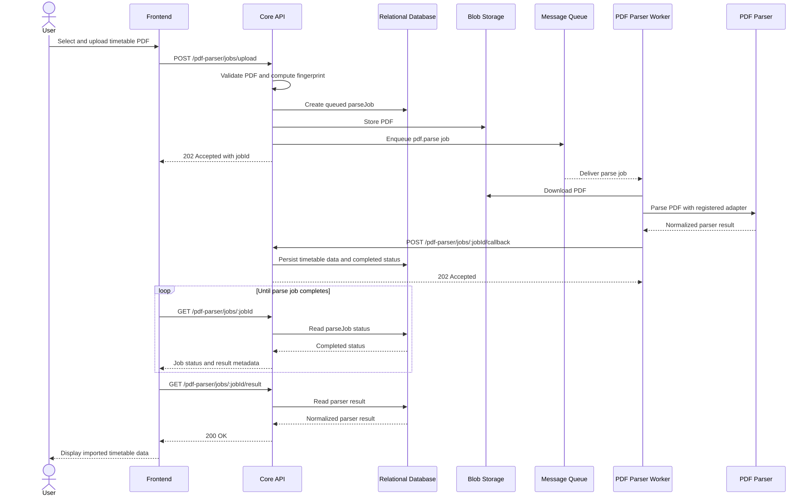
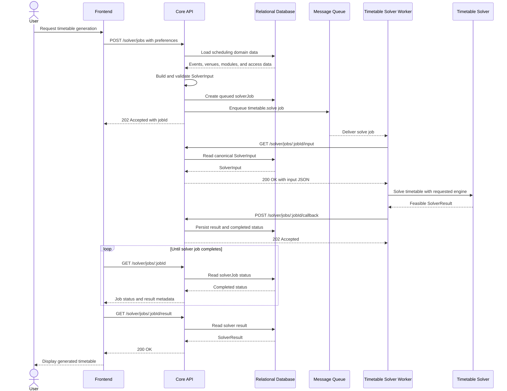

# Architectural Diagram

## Interaction Sequences

### PDF parsing

### Timetable solving

## Component Responsibilities

| Component | Responsibility | State |
|---|---|---|
| Browser Client | Submit work and poll status | None |
| Core API | Enforce policy, persist jobs, enqueue work, and accept callbacks | Authoritative application state |
| Relational Database | Store domain records, job inputs, and results | Persistent relational state |
| Blob Storage | Store uploaded documents | Persistent object state |
| Message Queue | Buffer parse and solve jobs | Operational queue state |
| PDF Parser Worker | Download input, invoke the PDF Parser, validate output, and send a callback | Temporary files only |
| Timetable Solver Worker | Fetch input, invoke the Timetable Solver, validate output, and send a callback | Temporary files only |

## Data Flow

1. The browser submits parse or solve work to the Core.
2. The Core validates the request, persists a job, and publishes a small job message.
3. A worker creates temporary storage and obtains its input from blob storage or the Core.
4. The worker invokes its compute engine and validates the result.
5. The worker sends an authenticated terminal callback. Solver callbacks identify the active attempt.
6. The Core persists completed or failed status; the browser polls for status and results.
