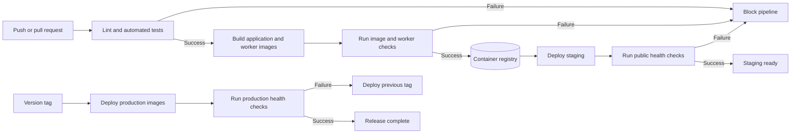

# CI/CD Pipeline Diagram

| **Stage** | **Tool or artefact** |
|---|---|
| Trigger | GitHub push, pull request, version tag, or manual workflow dispatch. |
| Validation | GitHub Actions, Turbo, Jest, worker tests, and Docker configuration checks. |
| Build | Docker Buildx application and worker images. |
| Storage | Published container images in the configured registry. |
| Staging | Staging Docker Compose deployment followed by health checks. |
| Production | Tagged production Docker Compose deployment followed by health checks. |
| Failure | Job failure blocks later stages; production recovery uses the previous image tag. |

The repository contains separate CI, documentation, and production deployment workflows. Approval gates and current environment protection rules require confirmation.
