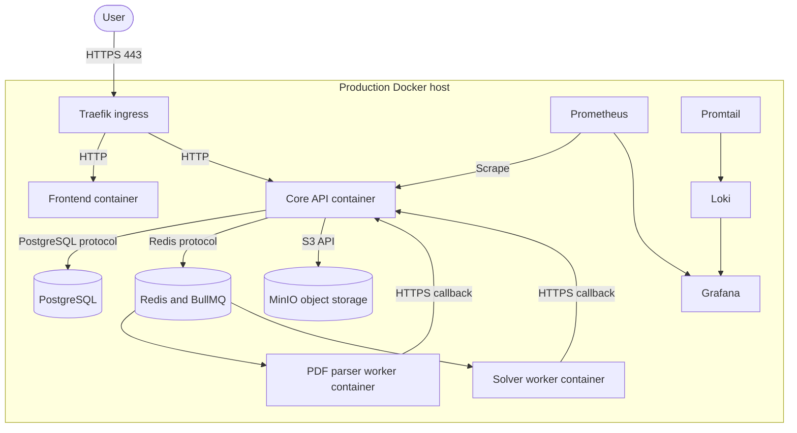

# Deployment Diagram

| **Path** | **Protocol** | **Purpose** |
|---|---|---|
| User to ingress | HTTPS 443 | Browser and API traffic. |
| Core API to PostgreSQL | PostgreSQL wire protocol | Persistent application and job state. |
| Core API and workers to Redis | Redis protocol | Job queues and operational state. |
| Core API and parser worker to MinIO | S3-compatible API | Uploaded PDF storage. |
| Workers to Core API | HTTPS | Authenticated terminal callbacks. |

The diagram reflects the repository's production Compose topology. Active host placement and public reachability require operational confirmation.
