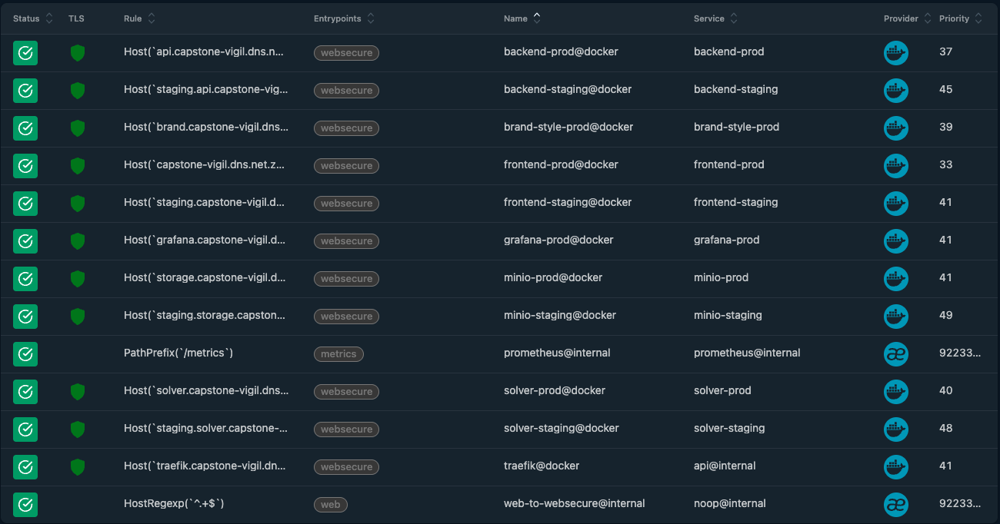

# Live, Accessible System

## Overview

Distributing the system across subdomains routed by a single reverse proxy enables clean, decoupled access to our production and staging environments.We are restricted to a single server, hence we are using a single ingress controller for routing any traffic to prod/staging.

!!! success "Demo 2 - Implemented"
    The system is live and reachable via public URLs. Let's Encrypt SSL certificates are automatically provisioned by Traefik.

### Service Access Matrix

| Environment | Service | Subdomain / URL Structure | Target Port (via Traefik) |
| :--- | :--- | :--- | :--- |
| **Production** | Frontend | `https://capstone-vigil.dns.net.za` | 80/443 -> 3001 |
| **Production** | API Backend | `https://capstone-vigil.dns.net.za/api` | 80/443 -> 8000 |
| **Production** | Storage (MinIO) | `https://storage.capstone-vigil.dns.net.za` | 80/443 -> 9001 |
| **Production** | Grafana | `https://grafana.capstone-vigil.dns.net.za` | 80/443 -> 3000 |
| **Production** | Brand Style | `https://brand.capstone-vigil.dns.net.za` | 80/443 -> 6767 |
| **Infrastructure** | Traefik Dashboard | `https://traefik.capstone-vigil.dns.net.za` | 80/443 -> `api@internal` |
| **Staging** | Frontend | `https://staging.capstone-vigil.dns.net.za` | 80/443 -> 3003 |
| **Staging** | API Backend | `https://staging.capstone-vigil.dns.net.za/api` | 80/443 -> 8008 |
| **Staging** | Storage (MinIO) | `https://staging.storage.capstone-vigil.dns.net.za` | 80/443 -> 9001 |

---

### Traefik Dashboard Routes 

<figure markdown="span">
  
  <figcaption>Fig 1. Live routing configuration via the Traefik Ingress Controller</figcaption>
</figure>
