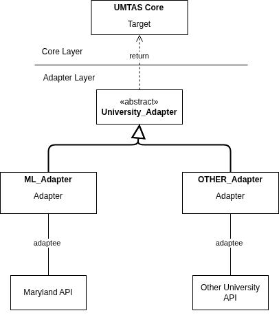

# University API Adapter - Architectural Case Study

## 1. Overview

This case study examines how UMTAS handles integration with external university APIs, with specific attention to **modifiability**.

University APIs vary across endpoints, authentication, response structures, naming, pagination, and error handling. Allowing these differences to propagate into the core application would increase coupling and make future changes costly.

---

## 2. Context

### 2.1 UMTAS and External University APIs

UMTAS needs course, module, and event data from external university systems. These APIs rarely match UMTAS internal representations. For example, an external API might return:

```
course_id
name
```

while UMTAS expects:

```
CourseID
CourseName
```

### 2.2 The Core Problem

> How can UMTAS integrate external university APIs without leaking university-specific details into the core application?

---

## 3. Solution Approach

### 3.1 Architecture Overview

UMTAS uses a University Adapter layer to isolate API communication and data transformation. The architecture includes:

- an abstract `University_Adapter` defining the expected interface;
- concrete adapters for each university's specific implementation;
- an `AdapterRegistry` to select the correct adapter at runtime;
- UMTAS services that depend only on the abstraction.

The existing Maryland implementation is `ML_Adapter`.

### 3.2 Adapter Contract

The abstract adapter defines what UMTAS requires from any university integration:

```typescript
abstract authenticate(): Promise<void>;

abstract getCourses(
    page: number,
    limit: number
): Promise<CreateCourseDto[]>;

abstract getModules(
    course: CourseDto
): Promise<CreateModuleDto[]>;

abstract getEvents(
    module: ModulesDto
): Promise<CreateEventDtoV2[]>;
```

This contract separates UMTAS's internal DTOs from external API representations.

### 3.3 Adapter Responsibilities

Concrete adapters handle all university-specific logic: endpoint URLs, authentication, request formatting, response parsing, and error translation. This knowledge stays inside the adapter boundary.

---

## 4. Quality Attribute Focus

**Modifiability** is the primary concern-specifically, whether adding a new university requires changes outside the adapter layer.

University APIs are volatile dependencies. Different universities may use different:
- data structures and field names;
- endpoint designs;
- authentication schemes;
- pagination methods;
- date/time formats.

These vary independently of UMTAS core logic.

---

## 5. Non-Functional Requirement

### 5.1 NFR-Mod-1

> Adding support for a new university API shall not require modification of existing production components outside the University API Adapter layer.

This allows changes within the adapter boundary-creating a new adapter and registering it-but prohibits changes propagating elsewhere.

### 5.2 Measure and Target

**Measure:** Count of existing production components outside the adapter layer that must be modified when adding a new university.

**Target:** 0 components outside the adapter layer.

---

## 6. Tactics

### 6.1 Isolate Volatile Behaviour

University-specific integration code is contained within concrete adapters. Changes to an external API affect only its corresponding adapter.



### 6.2 Depend on Abstractions

UMTAS core code references `University_Adapter` rather than concrete implementations. This decouples the core from external systems.

---

## 7. Trade-offs

### 7.1 Benefits

- University-specific logic is contained;
- External API changes have limited impact;
- Authentication varies per adapter;
- Data mapping stays out of business services;
- New universities can be added against a stable contract;
- Core application loosely couples to external systems.

### 7.2 Costs

The architecture adds complexity:

- additional classes and an extra layer
- ongoing contract maintenance
- registry/factory logic
- more implementation effort per university

This trades simplicity for modifiability.

---

## 8. Change Boundary

When adding a new university, the expected changes are contained:

| Component | Expected Change | Required? |
|---|---|---|
| New concrete adapter | Add | Yes |
| AdapterRegistry | Modify | Yes |
| University_Adapter | Modify | Ideally no |
| CourseService | Modify | No |
| ModuleService | Modify | No |
| EventService | Modify | No |
| Database layer | Modify | No |
| Controllers | Modify | No |

The registry is part of the adapter layer, so modifying it does not violate NFR-Mod-1.

---

## 9. Verification

### 9.1 Approach

Verification involves adding a second university API with different characteristics:

1. Record baseline codebase state.
2. Implement a new concrete adapter.
3. Register it with `AdapterRegistry`.
4. Connect to the target API.
5. Verify all contract operations work.
6. Review the change set.
7. Count modified components outside the adapter layer.

### 9.2 Pass Condition

The NFR passes when:

```
Number of existing non-adapter components modified = 0
```

Expected outcome:

```
Changed:    AdapterRegistry (1 line)
Added:      New_Adapter
Unchanged:  CourseService, ModuleService, EventService, Controllers, Database layer
```

The new adapter contains all university-specific code-requests, authentication, mapping, error handling-without touching existing services.

---

## 10. Findings

The adapter architecture successfully controls the impact of external system changes. University-specific behaviour sits behind a stable internal contract, so core UMTAS components remain unaware of individual API details.

The architecture supports the modifiability NFR. However, new integrations still require new code-the benefit is confinement of that code to the adapter layer rather than spread across the application.

A key consideration is the abstraction contract: it must remain general enough to accommodate multiple universities without accumulating provider-specific features.

---

## 11. Conclusion

This case study demonstrates how the University API Adapter addresses external API variability through a common abstraction and concrete implementations.

The NFR requires zero modifications to existing non-adapter components when adding a new university. The architecture achieves this through:

- isolating volatile behaviour inside adapters;
- depending on abstractions rather than concretions;
- establishing an explicit boundary contract.

The Adapter pattern provides the mechanism, supported by dependency inversion and registry-based selection.

The trade-off: additional abstraction and indirection for reduced change propagation-is appropriate given that external university APIs are a known source of architectural volatility.

The design traces clearly from a quality attribute through NFR, tactics, patterns, implementation, and measurable verification.

---