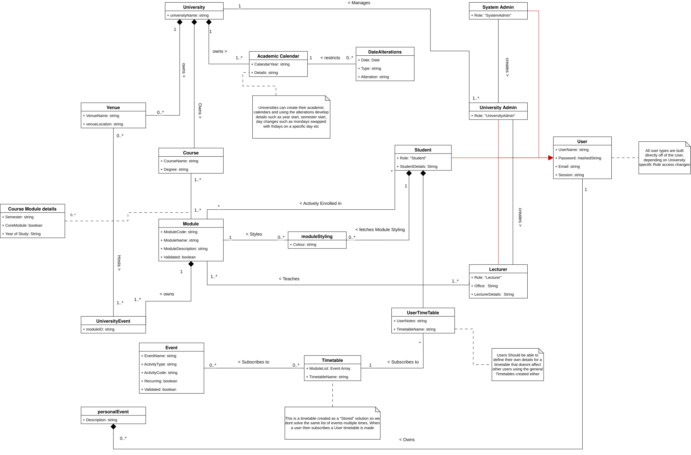

# Domain Model

## Diagram 

<figure markdown="span">
  
</figure>

## Domain descriptions
## Domains

### University
| Attribute | Type | Description |
| :--- | :--- | :--- |
| UniversityName | string | The display name of the university |

---

### Venue
| Attribute | Type | Description |
| :--- | :--- | :--- |
| VenueName | string | The name of the venue |
| VenueLocation | string | Location details such as co-ordinates and campus details |

---

### Academic Calendar
| Attribute | Type | Description |
| :--- | :--- | :--- |
| CalendarYear | string | The year the calendar is intended to be used for |
| Details | string | Further inference data or notes to be included such as changes that were made |

---

### DateAlterations
| Attribute | Type | Description |
| :--- | :--- | :--- |
| Date | Date | The date the changes need to occur |
| Type | string | What type of change needs to occur |
| Alteration | string | based on the type the change value that will be made |

---

### Course
| Attribute | Type | Description |
| :--- | :--- | :--- |
| CourseName | string | The name of the course |
| Degree | string | The degree this course belongs to |

---

### Course Module details
| Attribute | Type | Description |
| :--- | :--- | :--- |
| Semester | string | The semester the module takes place in |
| CoreModule | boolean | Is this module core to this course |
| Year of Study | String | the year this module is expected to be done in, in this course |

---

### Module
| Attribute | Type | Description |
| :--- | :--- | :--- |
| ModuleCode | string | The code of the module |
| ModuleName | string | The name of the module |
| ModuleDescription | string | A description of the module |
| Validated | boolean | Is this module validated and can be displayed to users |

---

### moduleStyling
| Attribute | Type | Description |
| :--- | :--- | :--- |
| Colour | string | A user specific colour for a module to display |

---

### User
| Attribute | Type | Description |
| :--- | :--- | :--- |
| UserName | string | The name of the user |
| Password | HashedString | A securely hashed string of the users password |
| Email | string | The users Email |
| Session | string | Session information about a currently active user |

---

### System Admin
| Attribute | Type | Description |
| :--- | :--- | :--- |
| Role | "SystemAdmin" | The role of the user providing them system wide access |

---

### University Admin
| Attribute | Type | Description |
| :--- | :--- | :--- |
| Role | "UniversityAdmin" | The role of a user for a specific university providing them access to that universities information and permissions to alter details |

---

### Student
| Attribute | Type | Description |
| :--- | :--- | :--- |
| Role | "Student" | The role of a student for a specific university allowing them to access information regarding courses and allowing them to make schedules |
| StudentDetails | String | Details such as a students student number that a student may want to display |

---

### Lecturer
| Attribute | Type | Description |
| :--- | :--- | :--- |
| Role | "Lecturer" | The role of a user allowing them acces to the system in accordance to what the lecturer should be able to access and alter such as their specific module and events |
| Office | String | Optionally their office they could be found in |
| LecturerDetails | String | Details the lecturer may want to display such as phone number or email |

---

### UserTimeTable
| Attribute | Type | Description |
| :--- | :--- | :--- |
| UserNotes | string | Notes a user wants to attach as to the purpose of this timetable |
| TimetableName | string | An altered name a user wants to use when using their subscribed timetable |

---

### Timetable
| Attribute | Type | Description |
| :--- | :--- | :--- |
| EventList | Event Array | An array of all the events listed in a timetable |
| TimetableName | string | The name of the timetable visible to subscribing users |

---

### Event
| Attribute | Type | Description |
| :--- | :--- | :--- |
| EventName | string | The name of an event |
| ActivityType | string | The type of event such as "Lecture" or "Lab" etc |
| ActivityCode | string | The code of the event as an identifier such as L1 or P1 |
| Recurring | boolean | A flag stating if an event is recurring weekly or once off |
| Validated | boolean | A flag stating that an event is verified and can be showed to users |
| Start Time | String | The start time of the event |
| End Time | String | The End time of the event |
| Date | String | The date of a once off event |
| Day of week | String | The weekday the event takes place |
---

### UniversityEvent
| Attribute | Type | Description |
| :--- | :--- | :--- |
| module | string | The module the event is directly correlated with |

---

### personalEvent
| Attribute | Type | Description |
| :--- | :--- | :--- |
| Description | string | The purpose of the event |