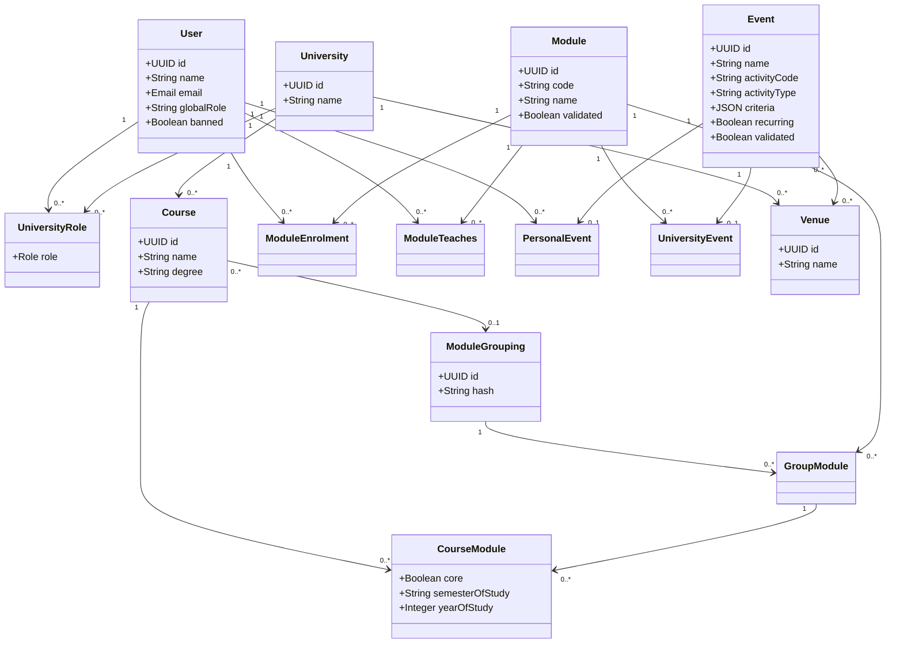
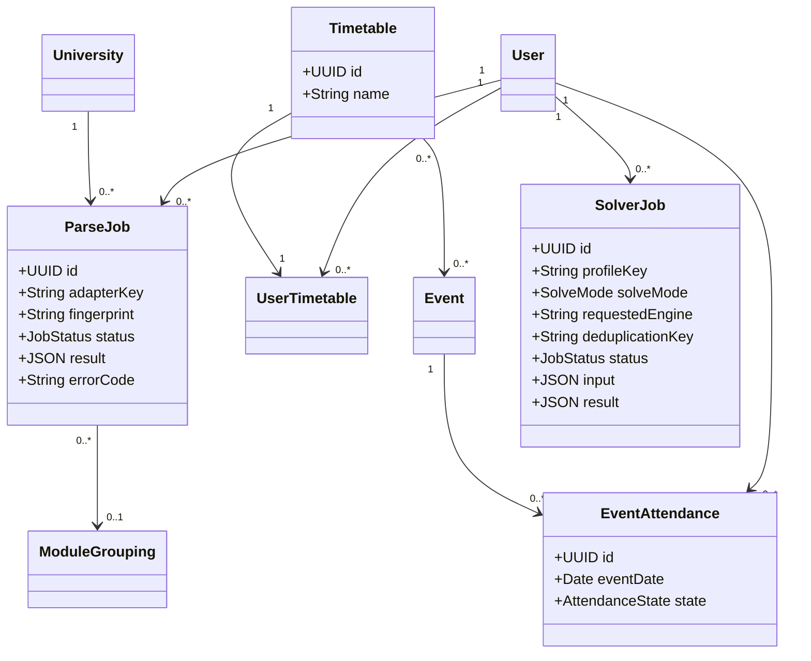
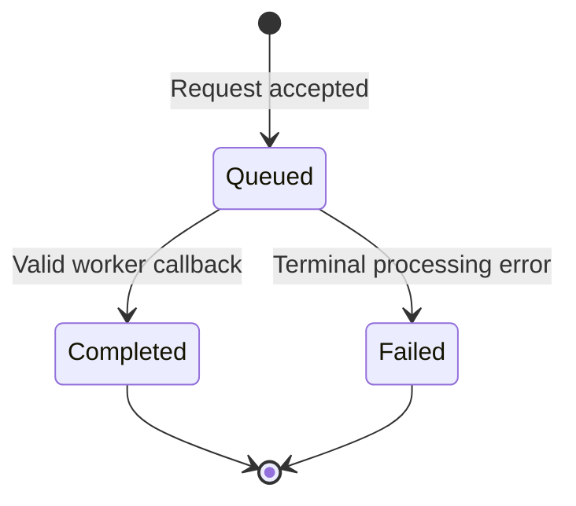

# Domain Model

<!-- cspell:words Enrollment -->

## Core Domain

**Figure SRS-DM-1:** Implemented identity, academic, and event relationships.

## Timetable and Processing Domain

**Figure SRS-DM-2:** Implemented timetable, attendance, parsing, and solving relationships.

## Entity Definitions

| **Entity** | **Responsibility** |
|---|---|
| User | Authenticated identity with account status and a global platform role. |
| University | Named institutional context. The current entity does not distinguish supported and student-owned universities. |
| UniversityRole | User membership and role within one university. |
| Course | University-owned degree or curriculum record. |
| ModuleGrouping | Reusable group of modules identified by an optional hash. |
| Module | Taught subject with a code, name, description, and validation state. |
| CourseModule | Course metadata for a grouped module, including core status and year or semester of study. |
| Module enrolment | Association between a user and a module they take. It is stored as `ModuleEnrollment` in the backend. |
| ModuleTeaches | Association between a user and a module they teach. |
| Event | Scheduled activity whose detailed time and recurrence rules are stored in criteria JSON. |
| PersonalEvent | Association identifying an event as user-owned. |
| UniversityEvent | Association linking an event to a module. |
| Venue | University-owned event location. The current entity stores only a name and university. |
| Timetable | Named collection of events. User ownership is stored through `UserTimetable`. |
| EventAttendance | A user's attendance state for an event on a date. |
| ParseJob | User and university-scoped asynchronous PDF parsing record. |
| SolverJob | User-scoped asynchronous solver request, input, result, and failure record. |
| AcademicCalendar | University-linked calendar container present in the data model. |
| RestrictedDates | Calendar-linked JSON date restriction present in the data model. |

## Roles

| **Role value** | **Meaning** |
|---|---|
| `STUDENT` | Approved student membership. |
| `STUDENT_OWNED` | Student-owned university role, pending a clear ownership policy. |
| `LECTURER` | Approved lecturer membership. |
| `UNIVERSITY_ADMIN` | Approved university administrator membership. |
| `LECTURER_PENDING` | Pending lecturer application. |
| `UNIVERSITY_ADMIN_PENDING` | Pending administrator application. |
| `SYSTEM_ADMIN` | System administrator role represented in the university role enum. |
| `REJECTED` | Rejected university role application. |

## Job Lifecycle

Both parse and solver jobs persist **queued**, **completed**, or **failed**. No separate running state is stored.

## Domain Rules

- A university role shall be unique for each user and university pair.
- A module code shall be unique in the current data model.
- A course may reference one module grouping.
- A module grouping may contain many modules.
- A timetable shall belong to a user through `UserTimetable`.
- A timetable may contain many events, and an event may appear in many timetables.
- A personal event shall reference one user and one event.
- A university event shall reference one module and one event.
- A parse job shall belong to one user and one university.
- A solver job shall belong to one user.
- Job results shall be readable only by their requesting user.

## Important Boundaries

### Timetable Scope

The implemented timetable stores an identifier, optional name, owner association, and event associations. It does not store a university, semester, active state, occurrence override, or generated-solution reference.

### Solver Scope

The solver selects from supplied event data. Constraint programming targets feasibility, while genetic search may return a best-effort result containing conflicts.

### Import Scope

A successful parser callback imports structurally valid output immediately. Newly created modules and events remain unvalidated until an administrator updates their validation state.

### Calendar Scope

Academic calendar and restricted-date tables exist, but no backend route exposes their management or materialises timetable occurrences. Calendar subscription and external export entities are not present.
