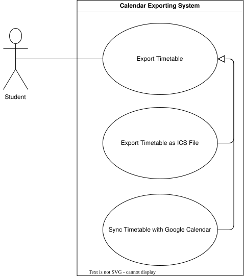
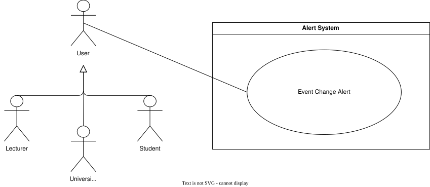

???+ info "Overview"

    <div align="center">

    ### Authentication
    | **ID** | **Use Case** | **Group** | **Actor** | **Status** |
    |:---:|:---:|:---:|:---:|:---:|
    | **UC-AU-01** | Register Account | [Authentication](#auth-use-cases) | User |<span class="status-implemented">Implemented</span>|
    | **UC-AU-02** | Login Account | [Authentication](#auth-use-cases) | User |<span class="status-implemented">Implemented</span>|
    | **UC-AU-03** | Reset Password | [Authentication](#auth-use-cases) | User |<span class="status-implemented">Implemented</span>|
    | **UC-AU-04** | Logout Account | [Authentication](#auth-use-cases) | User |<span class="status-implemented">Implemented</span>|
    | **UC-AU-05** | Delete Account | [Authentication](#auth-use-cases) | User |<span class="status-not-implemented">In Progress</span>|

    ### Landing Page
    | **ID** | **Use Case** | **Group** | **Actor** | **Status** |
    |:---:|:---:|:---:|:---:|:---:|
    | **UC-LP-01** | Visit Landing Page | [Landing Page](#landing-page-use-cases) | Visitor |<span class="status-implemented">Implemented</span>|
    | **UC-LP-02** | View Adapter Capabilities | [Landing Page](#landing-page-use-cases) | Visitor |<span class="status-not-implemented">In Progress</span>|
    | **UC-LP-03** | View Role Capabilities | [Landing Page](#landing-page-use-cases) | Visitor |<span class="status-not-implemented">In Progress</span>|

    ### Timetable Creation
    | **ID** | **Use Case** | **Group** | **Actor** | **Status** |
    |:---:|:---:|:---:|:---:|:---:|
    | **UC-TC-01** | Create Modules | [Timetable Creation](#timetable-creation-id) | User |<span class="status-implemented">Implemented</span>|
    | **UC-TC-02** | Create Events | [Timetable Creation](#timetable-creation-id) | User |<span class="status-implemented">Implemented</span>|
    | **UC-TC-03** | Create Timetable | [Timetable Creation](#timetable-creation-id) | User |<span class="status-implemented">Implemented</span>|

    ### Timetable Management
    | **ID** | **Use Case** | **Group** | **Actor** | **Status** |
    |:---:|:---:|:---:|:---:|:---:|
    | **UC-TM-01** | View Timetable | [Timetable Management](#timetable-management-id) | User |<span class="status-implemented">Implemented</span>|
    | **UC-TM-02** | Edit Timetable | [Timetable Management](#timetable-management-id) | User |<span class="status-implemented">Implemented</span>|
    | **UC-TM-03** | Delete Timetable | [Timetable Management](#timetable-management-id) | User |<span class="status-implemented">Implemented</span>|

    ### PDF Import
    | **ID** | **Use Case** | **Group** | **Actor** | **Status** |
    |:---:|:---:|:---:|:---:|:---:|
    | **UC-PDF-01** | Import Timetable from PDF | [PDF Import](#pdf-system) | User |<span class="status-implemented">Implemented</span>|
    | **UC-PDF-02** | Review Imported Timetable Data | [PDF Import](#pdf-system) | User |<span class="status-implemented">Implemented</span>|

    ### API Import
    | **ID** | **Use Case** | **Group** | **Actor** | **Status** |
    |:---:|:---:|:---:|:---:|:---:|
    | **UC-API-01** | Import Timetable from API | [API Import](#api-system) | User |<span class="status-not-implemented">In Progress</span>|
    | **UC-API-02** | Review API Retrieved Data | [API Import](#api-system) | User |<span class="status-not-implemented">In Progress</span>|

    ### Calendar Export
    | **ID** | **Use Case** | **Group** | **Actor** | **Status** |
    |:---:|:---:|:---:|:---:|:---:|
    | **UC-EX-01** | Export Timetable as ICS File | [Calendar Export](#calendar-exporting-id) | Student |<span class="status-implemented">Implemented</span>|
    | **UC-EX-02** | Sync Timetable with Google Calendar | [Calendar Export](#calendar-exporting-id) | Student |<span class="status-not-implemented">In Progress</span>|

    ### Analytics Dashboard
    | **ID** | **Use Case** | **Group** | **Actor** | **Status** |
    |:---:|:---:|:---:|:---:|:---:|
    | **UC-AN-01** | View Attendance Analytics Dashboard | [Analytics Dashboard](#analytics-dashboard-id) | Admin, Lecturer |<span class="status-not-implemented">In Progress</span>|
    | **UC-AN-02** | Explore Venue and Booking Analytics | [Analytics Dashboard](#analytics-dashboard-id) | Admin, Lecturer |<span class="status-not-implemented">In Progress</span>|
    | **UC-AN-03** | View Lecturer Analytics | [Analytics Dashboard](#analytics-dashboard-id) | Admin, Lecturer |<span class="status-not-implemented">In Progress</span>|

    ### Attendance Recording
    | **ID** | **Use Case** | **Group** | **Actor** | **Status** |
    |:---:|:---:|:---:|:---:|:---:|
    | **UC-AR-01** | Indicate Attendance Intent for Event | [Attendance Recording](#attendance-recording-id) | Student |<span class="status-implemented">Implemented</span>|
    | **UC-AR-02** | Unrecord Attendance for Event | [Attendance Recording](#attendance-recording-id) | Student |<span class="status-implemented">Implemented</span>|

    ### Lecturer Adjustment
    | **ID** | **Use Case** | **Group** | **Actor** | **Status** |
    |:---:|:---:|:---:|:---:|:---:|
    | **UC-LA-01** | Manage Event Details | [Lecturer Adjustment](#lecturer-adjustment-id) | Lecturer, Admin |<span class="status-implemented">Implemented</span>|
    | **UC-LA-01** | Manage Module Details | [Lecturer Adjustment](#lecturer-adjustment-id) | Lecturer, Admin |<span class="status-implemented">Implemented</span>|
    | **UC-LA-02** | Assign Lecturers to Events/Modules | [Lecturer Adjustment](#lecturer-adjustment-id) | Lecturer, Admin |<span class="status-not-implemented">In Progress</span>|

    ### Alert System
    | **ID** | **Use Case** | **Group** | **Actor** | **Status** |
    |:---:|:---:|:---:|:---:|:---:|
    | **UC-AL-01** | Event Change Alerts | [Alert System](#alert-system-id) | User |<span class="status-not-implemented">In Progress</span>|

    </div>
---

??? "**Authentication Use Cases**"
    <a id="auth-use-cases"></a>

    <div align="center">

    ## **Use Case Table**
    | **ID** | **Use case** | **Actor** |
    |:---:|:---:|:---:|
    | **UC-AU-01** | [Register Account](#uc-au-01) | User |
    | **UC-AU-02** | [Login](#uc-au-02) | User |
    | **UC-AU-03** | [Reset Password](#uc-au-03) | User |
    | **UC-AU-04** | [Logout](#uc-au-04) | User |
    | **UC-AU-05** | [Delete Account](#uc-au-05) | User |

    </div>

    ??? tip "**Use Case Diagram**"
        

    ---
    ??? "UC-AU-01: Register Account"
        <a id="uc-au-01"></a>
        ##### High Level
        ```
        Register Account (Actor: User, System: Authentication)
        TUCBW the user selects "Register" from the landing page and chooses to sign up via OAuth or with an in-house email and password.
        TUCEW the user's account is created, verified, and activated.
        ```
        ##### Expanded
        | Field | Detail |
        | :--- | :--- |
        | **Actor** | User |
        | **Precondition** | User does not have an existing account |
        | **Trigger** | User selects "Register" from the landing page |
        | **Basic Flow** | 1. User initiates account registration.<br>2. User chooses a registration method.<br>3. System collects the required registration information.<br>4. System validates the submitted information.<br>5. System creates the user account.<br>6. System confirms successful registration.<br>7. User gains access to the system. |
        | **Alternate Flow** | **A1: OAuth Registration**<br>User selects an OAuth provider and successfully authenticates with the provider. The system retrieves the required account information and creates the account.<br><br>**A2: In-House Registration**<br>User provides an email address and password. The system validates the submitted credentials and creates the account.<br><br>**A3: Account Already Exists**<br>System informs the user that an account already exists and suggests logging in or resetting their password. |
        | **Postcondition** | User account has been created and is available for authentication. |
        | **Requirements Covered** | R1.2.2 \| R1.2.2.1 \| R1.2.2.2 |

    ---
    ??? "UC-AU-02: Login Account"
        <a id="uc-au-02"></a>
        ##### High Level
        ```
        Login Account (Actor: User, System: Authentication)
        TUCBW the user submits in-house credentials or selects an OAuth provider.
        TUCEW the user is authenticated and redirected to the dashboard.
        ```
        ##### Expanded
        | Field | Detail |
        | :--- | :--- |
        | **Actor** | User |
        | **Precondition** | User has a registered account |
        | **Trigger** | User submits credentials or selects an OAuth provider |
        | **Basic Flow** | 1. User initiates the login process.<br>2. User chooses an authentication method.<br>3. System validates the user's identity.<br>4. System authenticates the user.<br>5. System creates a user session.<br>6. User is redirected to the dashboard. |
        | **Alternate Flow** | **A1: OAuth Login**<br>User selects an OAuth provider and successfully authenticates through the provider. The system authenticates the user and creates a session.<br><br>**A2: In-House Login**<br>User provides an email address and password. The system validates the credentials and authenticates the user.<br><br>**A3: Invalid Credentials**<br>System displays an authentication error and prompts the user to try again.<br><br>**A4: Account Not Found**<br>System informs the user that no account exists and suggests registration. |
        | **Postcondition** | User is authenticated and an active session exists. |
        | **Requirements Covered** | R1.2.1 \| R1.2.1.1 \| R1.2.1.2 \| R1.2.3 |

    ---
    ??? "UC-AU-03: Reset Password"
        <a id="uc-au-03"></a>
        ##### High Level
        ```
        Reset Password (Actor: User, System: Authentication)
        TUCBW the user selects "Forgot Password" on the login screen.
        TUCEW the user's password is updated.
        ```
        ##### Expanded
        | Field | Detail |
        | :--- | :--- |
        | **Actor** | User |
        | **Precondition** | User has a registered account |
        | **Trigger** | User selects "Forgot Password" on the login screen |
        | **Basic Flow** | 1. User requests password reset.<br>2. User provides registered email or identifier.<br>3. System validates request and generates a password reset token.<br>4. System sends a password reset link or OTP to the user’s email.<br>5. User accesses the reset link or enters the OTP.<br>6. User submits a new password.<br>7. System validates password policy rules.<br>8. System updates the password and confirms success.<br>9. User is redirected to the login screen. |
        | **Alternate Flow** | **A1: Email Not Found**<br>System returns a neutral response and does not reveal whether the account exists.<br><br>**A2: Expired or Invalid Token**<br>System rejects the reset attempt and prompts the user to request a new reset link.<br><br>**A3: Password Policy Violation**<br>System rejects the new password and prompts the user to meet complexity requirements.<br><br>**A4: Multiple Reset Attempts**<br>System throttles requests and temporarily blocks further reset attempts for security. |
        | **Postcondition** | User password is updated and reset token is invalidated |
        | **Requirements Covered** | R1.2.4.2 |

    ---
    ??? "UC-AU-04: Logout Account"
        <a id="uc-au-04"></a>
        ##### High Level
        ```
        Logout Account (Actor: User, System: Authentication)
        TUCBW the user selects "Sign Out".
        TUCEW the user's session is invalidated and they are returned to the landing page.
        ```
        ##### Expanded
        | Field | Detail |
        | :--- | :--- |
        | **Actor** | User |
        | **Precondition** | User is currently authenticated and has an active session |
        | **Trigger** | User selects "Sign Out" |
        | **Basic Flow** | 1. User initiates logout request.<br>2. System receives logout action.<br>3. System invalidates the user’s session token.<br>4. System clears authentication/session cookies and local session state.<br>5. System terminates any server-side session records.<br>6. User is redirected to the landing or login page. |
        | **Alternate Flow** | **A1: Session Already Expired**<br>System detects expired session and simply redirects user to landing/login page.<br><br>**A2: Partial Session Cleanup Failure**<br>System attempts retry of session invalidation and forces client-side session cleanup.<br><br>**A3: Multiple Active Sessions**<br>System invalidates only the current session.<br><br>**A4: Network Failure During Logout**<br>Client clears local session state and redirects user, while server-side session is marked for cleanup on next valid request. |
        | **Postcondition** | User session is fully invalidated and user is no longer authenticated |
        | **Requirements Covered** | R1.2.4.1 \| R1.2.3 |

    ---
    ??? "UC-AU-05: Delete Account"
        <a id="uc-au-05"></a>
        ##### High Level
        ```
        Delete Account (Actor: User, System: Authentication)
        TUCBW the user selects "Delete Account" from their account settings.
        TUCEW the user's account and associated data are permanently removed.
        ```
        ##### Expanded
        | Field | Detail |
        | :--- | :--- |
        | **Actor** | User |
        | **Precondition** | User is currently authenticated |
        | **Trigger** | User selects "Delete Account" from account settings |
        | **Basic Flow** | 1. User initiates account deletion request.<br>2. System prompts user for confirmation and re-authentication (OAuth or password-based).<br>3. User confirms identity and proceeds with deletion.<br>4. System validates authentication and authorization.<br>5. System removes or anonymises user data from primary storage.<br>6. System revokes all active sessions and tokens.<br>7. System deletes or flags related account records across dependent services.<br>8. System confirms permanent deletion to the user.<br>9. User is logged out and redirected to the landing page. |
        | **Alternate Flow** | **A1: Re-authentication Fails**<br>System denies deletion request and returns user to account settings.<br><br>**A2: Active Sessions Exist Elsewhere**<br>System invalidates all sessions except the current one, then completes deletion.<br><br>**A3: Scheduled Deletion (Grace Period)**<br>System schedules account deletion and notifies user via email, allowing cancellation within retention window.<br><br>**A4: Partial Deletion Failure**<br>System retries deletion of dependent data; if unresolved, account is marked for manual cleanup.<br><br>**A5: OAuth User Deletion Constraints**<br>System deletes local account data and revokes sessions; external identity provider account remains unaffected. |
        | **Postcondition** | User account is permanently removed or scheduled for deletion, and no active session remains |
        | **Requirements Covered** | R1.2.4.3 \| R1.2.3 |

---
??? "**Landing Page Use Cases**"
    <a id="landing-page-use-cases"></a>

    <div align="center">

    ### **Use Case Table**
    | **ID** | **Use case** | **Actor** |
    |:---:|:---:|:---:|
    | **UC-LP-01** | [Visit Landing Page](#uc-lp-01) | Visitor |
    | **UC-LP-02** | [View Adapter Capabilities](#uc-lp-02) | Visitor |
    | **UC-LP-03** | [View Role Capabilities](#uc-lp-03) | Visitor |

    </div>

    ??? tip "**Use Case Diagram**"
        

    ---
    ??? "UC-LP-01: Visit Landing Page"
        <a id="uc-lp-01"></a>
        ##### High Level
        ```
        Visit Landing Page (Actor: Visitor, System: Public Website)
            TUCBW an unauthenticated visitor navigates to the Umtas website.
            TUCEW the visitor is shown the landing page and can navigate to the main site, login, or registration.
        ```
        ##### Expanded
        | Field | Detail |
        | :--- | :--- |
        | **Actor** | Visitor |
        | **Precondition** | Visitor is not authenticated |
        | **Trigger** | Visitor navigates to the Umtas root URL |
        | **Basic Flow** | 1. Visitor navigates to the site.<br>2. System displays the landing page.<br>3. System presents navigation options to the main site, login, and registration.<br>4. Visitor selects an option or continues browsing the landing page. |
        | **Alternate Flow** | **A1: Visitor is already authenticated**<br>System redirects the visitor to their dashboard instead of the landing page. |
        | **Postcondition** | Visitor has access to the landing page and its navigation options |
        | **Requirements Covered** | R1.1.1 \| R1.1.1.1 |

    ---
    ??? "UC-LP-02: View Adapter Capabilities"
        <a id="uc-lp-02"></a>
        ##### High Level
        ```
        View Adapter Capabilities (Actor: Visitor, System: Public Website)
            TUCBW the visitor views the section of the landing page describing timetable creation methods.
            TUCEW the visitor understands the purpose of the Builder, PDF upload, and University API adapters.
        ```
        ##### Expanded
        | Field | Detail |
        | :--- | :--- |
        | **Actor** | Visitor |
        | **Precondition** | Visitor is on the landing page |
        | **Trigger** | Visitor views or scrolls to the adapters section |
        | **Basic Flow** | 1. System displays the three adapter options (Builder, PDF Upload, University API).<br>2. System explains the functionality of each adapter.<br>3. Visitor reviews the descriptions. |
        | **Alternate Flow** | **A1: Visitor selects an adapter for more detail**<br>System expands or links to further information about the selected adapter. |
        | **Postcondition** | Visitor understands the available timetable creation adapters |
        | **Requirements Covered** | R1.1.2.1 \| R1.1.2.1.1 \| R1.1.2.1.2 \| R1.1.2.1.3 |

    ---
    ??? "UC-LP-03: View Role Capabilities"
        <a id="uc-lp-03"></a>
        ##### High Level
        ```
        View Role Capabilities (Actor: Visitor, System: Public Website)
            TUCBW the visitor views the section of the landing page describing what each user role can do.
            TUCEW the visitor understands the functionality extended to Students, Admins, Lecturers, and Tyto simulation admins.
        ```
        ##### Expanded
        | Field | Detail |
        | :--- | :--- |
        | **Actor** | Visitor |
        | **Precondition** | Visitor is on the landing page |
        | **Trigger** | Visitor views or scrolls to the roles section |
        | **Basic Flow** | 1. System displays the four supported roles.<br>2. System explains the functionality extended to each role.<br>3. Visitor reviews the descriptions. |
        | **Alternate Flow** | **A1: Visitor selects a role for more detail**<br>System expands or links to further information about the selected role. |
        | **Postcondition** | Visitor understands the functionality available to each role |
        | **Requirements Covered** | R1.1.2 \| R1.1.2.2 \| R1.1.2.2.1 \| R1.1.2.2.2 \| R1.1.2.2.3 \| R1.1.2.2.4 |

---

??? "**Timetable Creation Use Cases**"
    <a id="timetable-creation-id"></a>

    <div align="center">

    ### **Use Case Table**
    | **Use Case ID** | **Use Case Name** | **Actor** |
    | :---: | :---: | :---: |
    | **UC-TC-01** | [Create Modules](#uc-tc-01) | User |
    | **UC-TC-02** | [Create Events](#uc-tc-02) | User |
    | **UC-TC-03** | [Create Timetable](#uc-tc-03) | User |

    </div>

    ??? tip "**Use Case Diagram**"
        

    ---
    ??? "UC-TC-01: Create Modules"
        <a id="uc-tc-01"></a>
        ##### High Level
        ```
        Create Modules (Actor: User, System: Timetable Builder or Internal Module Management)  
        TUCBW the actor selects "Create Module".  
        TUCEW the system creates and stores the module, linked either to the student’s personalized course or the institution’s official course catalog.

        ```
        ##### Expanded
        | Field | Detail |
        | :--- | :--- |
        | **Actor** | User |
        | **Precondition** | User is authenticated: for students, a personalized timetable is open; for lecturers/admin, access to internal module management is granted |
        | **Trigger** | User selects “Create Module” |
        | **Basic Flow (Student)** | 1. System opens module creation form.<br>2. Student enters module name and module code.<br>3. System validates uniqueness of module details within the student’s personalized course.<br>4. System confirms module creation.<br>5. Module is linked to the student’s personalized course. |
        | **Basic Flow (Lecturer/Admin)** | 1. System opens institutional module creation form.<br>2. User enters module details (name, code, description, credits, etc.).<br>3. System validates details against institutional rules.<br>4. User selects the appropriate course to link the module.<br>5. System confirms module creation.<br>6. Module is linked to the official course catalog.|
        | **Alternate Flow** | **A1: Duplicate Module Code (Student)**<br>System warns student and prevents duplicate entry.<br><br>**A2: Duplicate Module Code (Lecturer/Admin)**<br>System enforces institutional uniqueness and prevents duplicate entry.<br><br>**A3: Missing Required Fields**<br>System highlights incomplete module data.|
        | **Postcondition** | Module is created and linked either to the student’s personalized course or the institution’s official course catalog. |
        | **Requirements Covered** | R2.2.1.1 |

    ---
    ??? "UC-TC-02: Create Events"
        <a id="uc-tc-02"></a>
        ##### High Level
        ```
        Create Events (Actor: User, System: Timetable Builder)  
        TUCBW the user adds an event linked to a module and provides event details.  
        TUCEW the system creates and stores the event within the timetable under the relevant module.
        ```
        ##### Expanded
        | Field | Detail |
        | :--- | :--- |
        | **Actor** | User |
        | **Precondition** | User is authenticated, a module is selected |
        | **Trigger** | User selects "Create Event” |
        | **Basic Flow** | 1. System opens event creation form.<br>2. User selects module for event.<br>3. User enters event details (day, time, venue).<br>4. System validates event against existing schedule.<br>5. System attaches event to module within timetable.<br>6. System confirms event creation. |
        | **Alternate Flow** | **A1: Time conflict detected**<br>System warns user of overlap and requests adjustment.<br><br>**A2: Missing event details**<br>System prevents save until required fields are completed. |
        | **Postcondition** | Event is created and stored within selected module |
        | **Requirements Covered** | R2.2.1.2 |

    ---
    ??? "UC-TC-03: Create Timetable"
        <a id="uc-tc-03"></a>
        ##### High Level
        ```
        Create Timetable (Actor: User, System: Timetable Builder)  
        TUCBW the user starts a new timetable creation process and selects or defines required components.  
        TUCEW the system creates a new timetable containing the selected modules and events and stores it under the user’s account.
        ```
        ##### Expanded
        | Field | Detail |
        | :--- | :--- |
        | **Actor** | User |
        | **Precondition** | User is authenticated |
        | **Trigger** | User selects “Create Timetable” |
        | **Basic Flow** | 1. System opens timetable builder interface.<br>2. User initiates new timetable creation.<br>3. User adds modules and/or events (or leaves empty initially).<br>4. System validates structure of timetable.<br>5. User assigns a timetable name.<br>6. System creates and stores the timetable under the user account.<br>7. System confirms creation and opens the new timetable. |
        | **Alternate Flow** | **A1: Missing required timetable name**<br>System prompts user to enter a valid name before saving.<br><br>**A2: No modules/events added**<br>System allows creation but marks timetable as empty draft.<br><br>**A3: Save failure**<br>System notifies user and retains unsaved draft. |
        | **Postcondition** | New timetable is created and stored |
        | **Requirements Covered** | R2.2.1 \| R2.2.1.3 |

---
??? "**Timetable Management Use Cases**"
    <a id="timetable-management-id"></a>
    <div align="center">

    ### **Use Case Table**
    | **Use Case ID** | **Use Case Name** | **Actor** |
    | :---: | :---: | :---: |
    | **UC-TM-01** | [View Timetable](#uc-tm-01) | User |
    | **UC-TM-02** | [Edit Timetable](#uc-tm-02) | User |
    | **UC-TM-03** | [Delete Timetable](#uc-tm-03) | User |

    </div>

    ??? tip "**Use Case Diagram**"
        

    ---
    ??? "UC-TM-01: View Timetable"
        <a id="uc-tm-01"></a>
        ##### High Level
        ```
        View Timetable (Actor: User, System: Timetable Management)
        TUCBW the user opens the timetable section and selects a saved timetable.
        TUCEW the system displays the selected timetable, including modules and events, and supports calendar, weekly, and summary views.
        ```
        ##### Expanded
        | Field | Detail |
        | :--- | :--- |
        | **Actor** | User |
        | **Precondition** | User is authenticated and has at least one saved timetable |
        | **Trigger** | User opens the timetable section and selects a timetable |
        | **Basic Flow** | 1. User navigates to timetable section.<br>2. System displays list of saved timetables.<br>3. User selects a timetable.<br>4. System retrieves timetable data.<br>5. System displays timetable with modules and events.<br>6. User switches between calendar / weekly / summary views as needed. |
        | **Alternate Flow** | **A1: No Timetables Exist**<br>System informs user and prompts creation or generation of a timetable.<br><br>**A2: Retrieval Failure**<br>System displays an error message and allows retry. |
        | **Postcondition** | Selected timetable is displayed |
        | **Requirements Covered** | R2.1.1 \| R2.1.1.1 \| R2.1.1.2 \| R2.1.1.2.1 \| R2.1.1.2.2 \| R2.1.1.3 |

    ---
    ??? "UC-TM-02: Edit Timetable"
        <a id="uc-tm-02"></a>
        ##### High Level
        ```
        Edit Timetable (Actor: User, System: Timetable Management)
        TUCBW the user selects a timetable and enters edit mode.
        TUCEW the system allows modification of modules and events, including names, codes, times, venues, and days, and saves the updated timetable.
        ```
        ##### Expanded
        | Field | Detail |
        | :--- | :--- |
        | **Actor** | User |
        | **Precondition** | User is authenticated and a timetable exists |
        | **Trigger** | User selects “Edit Timetable” |
        | **Basic Flow** | 1. System loads selected timetable into edit mode.<br>2. User modifies module or event details.<br>3. System validates changes in real time.<br>4. User saves changes.<br>5. System persists updated timetable. |
        | **Alternate Flow** | **A1: Invalid or conflicting update**<br>System highlights conflict and prevents save until resolved.<br><br>**A2: Save failure**<br>System notifies user and retains unsaved changes.<br><br>**A3: Insufficient permissions**<br>System does not allow user to modify component directly rather to let them create their own unique copy of the timetable/module/event |
        | **Postcondition** | Timetable is updated and stored |
        | **Requirements Covered** | R2.1.2 \| R2.1.2.1 \| R2.1.2.1.1 \| R2.1.2.1.2 \| R2.1.2.2 \| R2.1.2.2.1 \| R2.1.2.2.2 \| R2.1.2.2.3 \| R2.2.2

    ---
    ??? "UC-TM-03: Delete Timetable"
        <a id="uc-tm-03"></a>
        ##### High Level
        ```
        Delete Timetable (Actor: User, System: Timetable Management)
        TUCBW the user selects a timetable and confirms deletion.
        TUCEW the system removes the timetable without affecting related modules or events.
        ```
        ##### Expanded
        | Field | Detail |
        | :--- | :--- |
        | **Actor** | User |
        | **Precondition** | User is authenticated and a timetable exists |
        | **Trigger** | User selects “Delete Timetable” |
        | **Basic Flow** | 1. System prompts user for confirmation.<br>2. User confirms deletion.<br>3. System removes timetable from storage.<br>4. System confirms deletion to user. |
        | **Alternate Flow** | **A1: Deletion cancelled**<br>No changes are made.<br><br>**A2: Deletion failure**<br>System shows error and retains timetable.<br><br>**A3: Insufficient Permissions**<br>User will not have the option to delete the timetable. |
        | **Postcondition** | Timetable is removed from system |
        | **Requirements Covered** | R2.1.3 |

---
??? "**Timetable Creation (PDF System) Use Cases**"
    <a id="pdf-system"></a>
    <div align="center">

    ### **Use Case Table**
    | **Use Case ID** | **Use Case Name** | **Actor** |
    | :---: | :---: | :---: |
    | **UC-PDF-01** | [Import Timetable from PDF](#uc-pdf-01) | User |
    | **UC-PDF-02** | [Review Imported Timetable Data](#uc-pdf-02) | User |

    </div>

    ??? tip "**Use Case Diagram**"
        

    ---
    ??? "UC-PDF-01: Import Timetable from PDF"
        <a id="uc-pdf-01"></a>
        ##### High Level
        ```
        Import Timetable from PDF (Actor: User, System: PDF Parser)  
        TUCBW the user uploads a university-provided timetable PDF into the system.  
        TUCEW the system parses the PDF, identifies modules and events, and maps them to existing records or creates new ones where required.
        ```
        ##### Expanded
        | Field | Detail |
        | :--- | :--- |
        | **Actor** | User |
        | **Precondition** | User is authenticated |
        | **Trigger** | User selects “Import Timetable” and uploads a PDF |
        | **Basic Flow** | 1. User uploads a university timetable PDF.<br>2. System validates file format.<br>3. System parses PDF content.<br>4. System extracts module and event data.<br>5. System performs lookup against existing modules/events.<br>6. System maps existing entities or prepares new entries.<br>7. System generates an import preview structure.<br>8. System forwards data to review step. |
        | **Alternate Flow** | **A1: Invalid file format**<br>System rejects upload and prompts correct format.<br><br>**A2: Parsing failure**<br>System notifies user and aborts import process.<br><br>**A3: Partial extraction**<br>System imports what is possible and flags missing data for review. |
        | **Postcondition** | Parsed timetable data is staged for review |
        | **Requirements Covered** | R2.3.1 \| R2.3.1.1 \| R2.3.1.2 \| R2.3.1.3 \| R2.3.1.4 |

    ---
    ??? "UC-PDF-02: Review Imported Timetable Data"
        <a id="uc-pdf-02"></a>
        ##### High Level
        ```
        Review Imported Timetable Data (Actor: User, System: Timetable Import)  
        TUCBW the user reviews the extracted timetable data generated from the PDF.  
        TUCEW the system presents the parsed modules and events for selection and confirmation.
        ```
        ##### Expanded
        | Field | Detail |
        | :--- | :--- |
        | **Actor** | User |
        | **Precondition** | A successful PDF import has been completed |
        | **Trigger** | System displays imported timetable preview |
        | **Basic Flow** | 1. System displays extracted modules and events.<br>2. User reviews imported data.<br>3. User selects which modules/events to include.<br>4. System validates selections.<br>5. User confirms import.<br>6. System creates timetable from selected data.<br>7. System stores timetable under user account.<br>8. System confirms successful creation. |
        | **Alternate Flow** | **A1: User deselects all items**<br>System prevents empty timetable creation and prompts selection.<br><br>**A2: Conflicting event data detected**<br>System highlights conflicts for user decision.<br><br>**A3: User cancels import**<br>System discards staged data without saving. |
        | **Postcondition** | Modules/Events and timetable is created and stored in system |
        | **Requirements Covered** | R2.3.1.5 \| R2.3.2 \| R2.3.2.1 \| R2.3.2.2 |

---
??? "**Timetable Creation (API System) Use Cases**"
    <a id="api-system"></a>
    <div align="center">
    ### **Use Case Table**
    | **Use Case ID** | **Use Case Name** | **Actor** |
    | :---: | :---: | :---: |
    | **UC-API-01** | [Import Timetable from API](#uc-api-01) | User |
    | **UC-API-02** | [Review API Retrieved Data](#uc-api-02) | User |

    </div>

    ??? tip "**Use Case Diagram**"
        

    ---
    ??? "UC-API-01: Import Timetable from API"
        <a id="uc-api-01"></a>
        ##### High Level
        ```
        Import Timetable from API (Actor: User, System: API Integration Layer)  
        TUCBW the user triggers timetable import from a university-provided API.  
        TUCEW the system retrieves module and event data from the API, performs lookup against existing records, and prepares a structured dataset for timetable creation.
        ```
        ##### Expanded
        | Field | Detail |
        | :--- | :--- |
        | **Actor** | User |
        | **Precondition** | User is authenticated and API access is available |
        | **Trigger** | User selects “Import from API” |
        | **Basic Flow** | 1. User initiates API import.<br>2. System authenticates with university API (if required).<br>3. System requests timetable data from API.<br>4. System receives module and event data.<br>5. System performs module lookup against existing records.<br>6. System performs event lookup against existing records.<br>7. System maps existing entities or prepares new ones.<br>8. System constructs structured import dataset.<br>9. System forwards dataset to review stage. |
        | **Alternate Flow** | **A1: API authentication failure**<br>System aborts import and notifies user.<br><br>**A2: API unavailable or timeout**<br>System retries request and then fails gracefully with error message.<br><br>**A3: Partial API response**<br>System imports available data and flags missing entries. |
        | **Postcondition** | API data is retrieved and staged for review |
        | **Requirements Covered** | R2.4.1 \| R2.4.1.1 \| R2.4.1.2 \| R2.4.1.3 \| R2.4.1.4 |

    ---
    ??? "UC-API-02: Review API Retrieved Data"
        <a id="uc-api-02"></a>
        ##### High Level
        ```
        Review API Retrieved Data (Actor: User, System: Timetable Builder)  
        TUCBW the user reviews the timetable data retrieved from the API.  
        TUCEW the system presents modules and events for selection and confirmation, allowing the user to finalise timetable creation.
        ```
        ##### Expanded
        | Field | Detail |
        | :--- | :--- |
        | **Actor** | User |
        | **Precondition** | API data has been successfully retrieved and staged |
        | **Trigger** | System displays imported API timetable data |
        | **Basic Flow** | 1. System displays retrieved modules and events.<br>2. User reviews imported data.<br>3. User selects modules/events to include in timetable.<br>4. System validates selections.<br>5. System creates timetable from selected data.<br>6. System stores timetable under user profile.<br>7. System confirms successful creation. |
        | **Alternate Flow** | **A1: No items selected**<br>System prevents timetable creation and requests selection.<br><br>**A2: Data inconsistency detected**<br>System highlights conflicting or missing fields.<br><br>**A3: User cancels import**<br>System discards staged dataset without saving. |
        | **Postcondition** | Timetable is created and stored in system |
        | **Requirements Covered** | R2.4.1.5 | R2.4.1.6

---
??? "**Calendar Exporting Use Cases**"
    <a id="calendar-exporting-id"></a>
    <div align="center">

    ### **Use Case Table**
    | **Use Case ID** | **Use Case Name** | **Actor** |
    | :---: | :---: | :---: |
    | **UC-EX-01** | [Export Timetable as ICS File](#uc-ex-01) | Student |
    | **UC-EX-02** | [Sync Timetable with Google Calendar](#uc-ex-02) | Student |

    </div>

    ??? tip "**Use Case Diagram**"
        

    ---  
    ??? "UC-EX-01: Export Timetable as ICS File"
        <a id="uc-ex-01">
        ##### High Level
        ```
        Export Timetable as ICS File (Actor: Student, System: Calendar Exporter)  
        TUCBW the student selects the option to export a timetable as an .ics file.  
        TUCEW the system generates an .ics file from the selected timetable, including events with metadata such as name, description, location, time, status, and unique identifiers, and downloads it to the user’s device.
        ```
        ##### Expanded
        | Field | Detail |
        | :--- | :--- |
        | **Actor** | Student |
        | **Precondition** | Student is authenticated and a timetable exists |
        | **Trigger** | Student selects “Export as .ics file” |
        | **Basic Flow** | 1. Student selects timetable to export.<br>2. System retrieves timetable data.<br>3. System prompts user for optional .ics configuration (name, description, status, etc.).<br>4. System generates event entries including metadata (start time, end time, location, status).<br>5. System assigns unique identifiers (UUID) to events to prevent duplication.<br>6. System builds .ics file structure.<br>7. System downloads file to user device. |
        | **Alternate Flow** | **A1: Missing timetable data**<br>System prevents export and notifies user.<br><br>**A2: Invalid event data**<br>System excludes invalid entries and flags them.<br><br>**A3: File generation failure**<br>System displays error and allows retry. |
        | **Postcondition** | Valid .ics file is generated and downloaded |
        | **Requirements Covered** | R2.5.1 \| R2.5.1.1 \| R2.5.1.2 \| R2.5.1.3 \| R2.5.1.4 \| R2.5.1.5 \| R2.5.1.6 |

    ---
    ??? "UC-EX-02: Sync Timetable with Google Calendar"
        <a id="uc-ex-02">
        ##### High Level
        ```
        Sync Timetable with Google Calendar (Actor: Student, System: Google Calendar Integration)  
        TUCBW the student selects Google Calendar sync and authorises access if required.  
        TUCEW the system creates or updates a Google Calendar instance and synchronises timetable events with the user’s calendar.
        ```
        ##### Expanded
        | Field | Detail |
        | :--- | :--- |
        | **Actor** | Student |
        | **Precondition** | Student is authenticated and a timetable exists |
        | **Trigger** | Student selects “Sync with Google Calendar” |
        | **Basic Flow** | 1. Student initiates Google Calendar sync.<br>2. System requests Google OAuth authentication (if not already authorised).<br>3. Student grants calendar permissions.<br>4. System retrieves timetable events.<br>5. System creates or selects Google Calendar instance.<br>6. System maps timetable events to Google Calendar format.<br>7. System pushes events to Google Calendar API.<br>8. System confirms successful sync. |
        | **Alternate Flow** | **A1: OAuth not authorised**<br>System prompts user to authenticate before proceeding.<br><br>**A2: API failure**<br>System retries sync and then reports failure.<br><br>**A3: Partial sync failure**<br>System reports which events failed and which succeeded.<br><br>**A4: Duplicate event detection (UUID conflict)**<br>System updates existing events instead of duplicating them. |
        | **Postcondition** | Timetable events are synchronised with Google Calendar |
        | **Requirements Covered** | R2.5.2 \| R2.5.2.1 |

---
??? "**Analytics Dashboard Use Cases**"
    <a id="analytics-dashboard-id"></a>
    <div align="center">

    ### **Use Case Table**
    | **Use Case ID** | **Use Case Name** | **Actor** |
    |:---:|:---:|:---:|
    | **UC-AN-01** | [View Attendance Analytics Dashboard](#uc-an-01) | Admin / Lecturer |
    | **UC-AN-02** | [Explore Venue and Booking Analytics](#uc-an-02) | Admin / Lecturer |
    | **UC-AN-03** | [View Lecturer Analytics](#uc-an-03) | Admin / Lecturer |

    </div>

    ??? tip "**Use Case Diagram**"
        

    ---  
    ??? "UC-AN-01: View Attendance Analytics Dashboard"
        <a id="uc-an-01"></a>
        ##### High Level
        ```
        View Attendance Analytics Dashboard (Actor: University Admin / Lecturer, System: Analytics Engine)  
        TUCBW the user opens the analytics dashboard for a selected module or dataset.  
        TUCEW the system displays aggregated attendance insights, including submitted students, actual attendance, and projected attendance for the selected context, with interactive breakdowns by time slot.
        ```
        ##### Expanded
        | Field | Detail |
        | :--- | :--- |
        | **Actor** | Admin / Lecturer |
        | **Precondition** | User is authenticated and has access to at least one module |
        | **Trigger** | User opens the analytics dashboard |
        | **Basic Flow** | 1. User navigates to analytics section.<br>2. System prompts user to select a module or dataset.<br>3. User selects a module.<br>4. System retrieves attendance data (submitted, actual, projected).<br>5. System aggregates and processes attendance statistics.<br>6. System displays dashboard with attendance overview and breakdown per time slot.<br>7. User can filter or switch between modules. |
        | **Alternate Flow** | **A1: No data available**<br>System displays empty state indicating no attendance records exist.<br><br>**A2: Module not found or inaccessible**<br>System shows error and returns user to selection screen.<br><br>**A3: Data retrieval failure**<br>System displays error and allows retry. |
        | **Postcondition** | Attendance analytics are displayed for selected module |
        | **Requirements Covered** | R3.1.1.1 \| R3.1.1.1.1 \| R3.1.1.1.2 \| R3.1.1.1.3 |

    ---
    ??? "UC-AN-02: Explore Venue and Booking Analytics"
        <a id="uc-an-02"></a>
        ##### High Level
        ```
        Explore Venue and Booking Analytics (Actor: University Admin / Lecturer, System: Analytics Engine)  
        TUCBW the user selects spatial or temporal usage analytics within the system.  
        TUCEW the system presents venue heatmaps and booking trend visualisations over time, allowing the user to explore usage patterns across locations and dates.
        ```
        ##### Expanded
        | Field | Detail |
        | :--- | :--- |
        | **Actor** | Admin / Lecturer |
        | **Precondition** | User is authenticated and analytics data exists |
        | **Trigger** | User selects venue or booking analytics view |
        | **Basic Flow** | 1. User selects “Venue & Booking Analytics”.<br>2. System retrieves venue usage data and booking records.<br>3. System generates venue heatmap based on module/event frequency.<br>4. System generates booking trend data over time.<br>5. System displays visualisations (heatmap + trend graphs).<br>6. User applies filters (date range, venue, module). |
        | **Alternate Flow** | **A1: No venue data available**<br>System displays empty heatmap with message.<br><br>**A2: No booking data available**<br>System shows empty trend graph.<br><br>**A3: Data processing failure**<br>System displays error and allows retry. |
        | **Postcondition** | Venue usage and booking analytics are displayed |
        | **Requirements Covered** | R3.1.1.2 \| R3.1.1.2.1 \| R3.1.1.2.2 \| R3.1.1.2.3 |

    ---
    ??? "UC-AN-03: View Lecturer Analytics"
        <a id="uc-an-03"></a>
        ##### High Level
        ```
        View Lecturer Analytics (Actor: University Admin / Lecturer, System: Analytics Engine)  
            TUCBW the user opens the lecturer analytics view for a selected lecturer or set of lecturers.  
            TUCEW the system displays aggregated performance and workload insights across the lecturer's modules, including attendance trends attributable to their sessions, teaching load, and comparative statistics over time.
        ```
        ##### Expanded
        | Field | Detail |
        | :--- | :--- |
        | **Actor** | Admin / Lecturer |
        | **Precondition** | User is authenticated; Admin has access to lecturer records, or Lecturer is viewing their own restricted analytics |
        | **Trigger** | User opens the lecturer analytics view |
        | **Basic Flow** | 1. User navigates to lecturer analytics section.<br>2. System prompts user to select a lecturer or, for a Lecturer actor, defaults to their own profile.<br>3. System retrieves attendance and session data across the lecturer's modules.<br>4. System aggregates statistics (attendance trends, teaching load, module comparison).<br>5. System displays lecturer analytics dashboard with breakdowns by module and time period.<br>6. Admin can switch between lecturers; Lecturer can filter by own modules only. |
        | **Alternate Flow** | **A1: No data available**<br>System displays empty state indicating no records exist for the selected lecturer.<br><br>**A2: Lecturer not found or inaccessible**<br>System shows error and returns user to selection screen.<br><br>**A3: Data retrieval failure**<br>System displays error and allows retry.<br><br>**A4: Lecturer attempts to view another lecturer's analytics**<br>System denies access and displays a permissions error. |
        | **Postcondition** | Lecturer analytics are displayed for the selected lecturer(s) |
        | **Requirements Covered** | R3.1.1.3 \| R3.1.1.3.1 \| R3.1.1.3.2 \| R3.1.1.3.3 |

---
??? "**Attendance Recording Use Cases**"
    <a id="attendance-recording-id"></a>
    <div align="center">

    ### **Use Case Table**
    | **Use Case ID** | **Use Case Name** | **Actor** |
    |:---:|:---:|:---:|
    | **UC-AR-01** | [Indicate Attendance Intent for Event](#uc-ar-01) | Student |
    | **UC-AR-02** | [Unrecord Attendance for Event](#uc-ar-02) | Student |

    </div>


    ??? tip "**Use Case Diagram**"
        

    ---  
    ??? "UC-AR-01: Indicate Attendance Intent for Event"
        <a id="uc-ar-01"></a>
        ##### High Level
        ```
        Indicate Attendance Intent for Event (Actor: Student, System: Analytics Engine)
        TUCBW the student views an upcoming event and is prompted to indicate their attendance intent.
        TUCEW the system records the student's response as will attend, will not attend, or not specified, and updates projected attendance analytics accordingly.
        ```
        ##### Expanded
        | Field | Detail |
        | :--- | :--- |
        | **Actor** | Student |
        | **Precondition** | User is authenticated and has access to at least one upcoming event |
        | **Trigger** | Student opens an event and is prompted for attendance intent |
        | **Basic Flow** | 1. Student navigates to an upcoming event.<br>2. System displays attendance intent options (Will Attend, Will Not Attend, Not Specified).<br>3. Student selects an option.<br>4. System records the student's response.<br>5. System updates projected attendance statistics for the event.<br>6. System confirms the recorded response to the student. |
        | **Alternate Flow** | **A1: Student does not select an option**<br>System defaults response to "Not Specified" and proceeds.<br><br>**A2: Event not found or inaccessible**<br>System shows error and returns student to event list.<br><br>**A3: Data submission failure**<br>System displays error and allows retry. |
        | **Postcondition** | Student's attendance intent is recorded and reflected in analytics |
        | **Requirements Covered** | R3.1.1.1.1 |

    ---
    ??? "UC-AR-02: Unrecord Attendance for Event"
        <a id="uc-ar-02"></a>
        ##### High Level
        ```
        Unrecord Attendance for Event (Actor: Student, System: Analytics Engine)
        TUCBW the student views a previously submitted attendance response for an event.
        TUCEW the system removes the recorded response and updates the projected attendance analytics accordingly.
        ```
        ##### Expanded
        | Field | Detail |
        | :--- | :--- |
        | **Actor** | Student |
        | **Precondition** | User is authenticated and has previously recorded an attendance response for an event |
        | **Trigger** | Student chooses to unrecord their attendance response |
        | **Basic Flow** | 1. Student navigates to an event with an existing attendance response.<br>2. System displays the student's current recorded response.<br>3. Student selects the option to unrecord their response.<br>4. System prompts student to confirm the action.<br>5. Student confirms.<br>6. System removes the recorded response.<br>7. System updates projected attendance statistics for the event. |
        | **Alternate Flow** | **A1: Student cancels confirmation**<br>System retains the existing recorded response and returns to event view.<br><br>**A2: No existing response found**<br>System displays message indicating there is no response to unrecord.<br><br>**A3: Data update failure**<br>System displays error and allows retry. |
        | **Postcondition** | Student's attendance response is removed and analytics are updated |
        | **Requirements Covered** | R3.1.1.1.1 |

---
??? "**Lecturer Adjustment System Use Cases**"
    <a id="lecturer-adjustment-id"></a>
    <div align="center">

    ### **Use Case Table**
    | **Use Case ID** | **Use Case Name** | **Actor** |
    | :---: | :---: | :---: |
    | **UC-LA-01** | [Manage Event Details](#uc-la-01) | Lecturer/Admin |
    | **UC-LA-02** | [Manage Module Details](#uc-la-02) | Lecturer/Admin |
    | **UC-LA-03** | [Assign Lecturers to Events/Modules](#uc-la-03) | Lecturer/Admin |

    </div>

    ??? tip "**Use Case Diagram**"
        

    ---
    ??? "UC-LA-01: Manage Event Details"
        <a id="uc-la-01"></a>
        ##### High Level
        ```
        Manage Event Details (Actor: Lecturer, System: Scheduling System)  
        TUCBW the lecturer selects one or more events to modify.  
        TUCEW the system allows the lecturer to update event details such as venue location, time, or cancel the event, and persists the changes in the timetable system while updating affected schedules.
        ```
        ##### Expanded
        | Field | Detail |
        | :--- | :--- |
        | **Actor** | Lecturer |
        | **Precondition** | Lecturer is authenticated and has permission to modify the selected event(s) |
        | **Trigger** | Lecturer selects an event and chooses “Edit Event Details” |
        | **Basic Flow** | 1. System retrieves selected event(s).<br>2. System displays current event details (venue, time, status).<br>3. Lecturer updates venue and/or time or selects cancel event.<br>4. System validates changes for scheduling conflicts and consistency.<br>5. System applies updates to event(s).<br>6. System propagates updates to affected timetables and analytics datasets.<br>7. System confirms successful update to lecturer. |
        | **Alternate Flow** | **A1: Scheduling conflict detected**<br>System warns lecturer and requests confirmation or adjustment.<br><br>**A2: Event cancellation selected**<br>System marks event as cancelled and removes it from active schedules.<br><br>**A3: Update failure**<br>System rejects changes and retains original event state. |
        | **Postcondition** | Event details are updated or event is cancelled in the system |

    ---
    ??? "UC-LA-02: Manage Module Details"
        <a id="uc-la-02"></a>
        ##### High Level
        ```
        Manage Module Details (Actor: Lecturer, System: Scheduling System)  
            TUCBW the lecturer selects a module to modify.  
            TUCEW the system allows the lecturer to update module details such as name, description, or credit value, and persists the changes across the institution's official course catalog and affected timetables.
        ```
        ##### Expanded
        | Field | Detail |
        | :--- | :--- |
        | **Actor** | Lecturer |
        | **Precondition** | Lecturer is authenticated and has permission to modify the selected module |
        | **Trigger** | Lecturer selects a module and chooses “Edit Module Details” |
        | **Basic Flow** | 1. System retrieves selected module.<br>2. System displays current module details (name, code, description, credits).<br>3. Lecturer updates one or more fields.<br>4. System validates changes against institutional rules and uniqueness constraints.<br>5. System applies updates to the module.<br>6. System propagates updates to affected timetables and linked events.<br>7. System confirms successful update to lecturer. |
        | **Alternate Flow** | **A1: Duplicate module code detected**<br>System rejects change and prompts lecturer to choose a different code.<br><br>**A2: Missing required fields**<br>System prevents save until required fields are completed.<br><br>**A3: Update failure**<br>System rejects changes and retains original module state. |
        | **Postcondition** | Module details are updated in the system |

    ---
    ??? "UC-LA-03: Assign Lecturers to Events/Modules"
        <a id="uc-la-03"></a>
        ##### High Level
        ```
        Assign Lecturers to Events/Modules (Actor: Lecturer/Admin, System: Academic Scheduling System)  
        TUCBW the lecturer selects an event or module and chooses to assign additional lecturers.  
        TUCEW the system updates the event/module with the assigned lecturers and ensures the changes are reflected across the scheduling and visibility systems.
        ```
        ##### Expanded
        | Field | Detail |
        | :--- | :--- |
        | **Actor** | Lecturer/Admin |
        | **Precondition** | User is authenticated and has access to the relevant event/module |
        | **Trigger** | User selects “Assign Lecturers” for an event or module |
        | **Basic Flow** | 1. System retrieves event or module details.<br>2. System displays current lecturer assignments.<br>3. User searches for and selects additional lecturers.<br>4. System validates lecturer eligibility and existence.<br>5. System updates event/module with new lecturer assignments.<br>6. System confirms successful update and notifies affected lecturers. |
        | **Alternate Flow** | **A1: Lecturer not found**<br>System displays error and prompts for valid lecturer selection.<br><br>**A2: Duplicate assignment detected**<br>System ignores duplicate entries and continues.<br><br>**A3: Permission denied**<br>System prevents assignment and notifies lecturer. |
        | **Postcondition** | Lecturer assignments are updated for the selected event/module |

---
??? "Alert System Use Cases"
    <a id="alert-system-id"></a>
    <div align="center">

    ### Use Case Table
    | **Use Case ID** | **Use Case Name** | **Actor** |
    | :---: | :---: | :---: |
    | **UC-AL-01** | [Event Change Alerts](#uc-al-01) | User |

    </div>

    ??? tip "**Use Case Diagram**"
        

    ---
    ??? "UC-AL-01: Event Change Alerts"
        <a id="uc-al-01"></a>
        ##### High Level
        ```
        Event Change Alerts (Actor: User, Notification Service)  
        TUCBW an event, linked to the user, is updated, including changes to venue, time, or status (such as cancellation).  
        TUCEW the system automatically generates and sends alerts to affected users, notifying them of the specific changes to the event details and ensuring their schedules remain up to date.
        ```
        ##### Expanded
        | Field | Detail |
        | :--- | :--- |
        | **Actor** | User |
        | **Precondition** | An event exists and a change has been made (venue, time, or status) |
        | **Trigger** | Lecturer or system updates an event’s details |
        | **Basic Flow** | 1. System detects a change to an event (venue, time, or status).<br>2. System identifies all affected users (students and lecturers linked to the event).<br>3. System determines type of change (venue change, time change, cancellation).<br>4. System generates alert message content based on change type.<br>5. System sends notifications via available channels (in-app/email depending on configuration).<br>6. System logs alert delivery status for audit purposes. |
        | **Alternate Flow** | **A1: No affected users found**<br>System does not send alerts and logs event change only.<br><br>**A2: Notification delivery failure**<br>System retries sending alert or marks as failed for later retry.<br><br>**A3: Partial delivery failure**<br>System sends alerts to successful recipients and logs failed deliveries. |
        | **Postcondition** | All affected users are notified of event changes or failure is logged |

---


