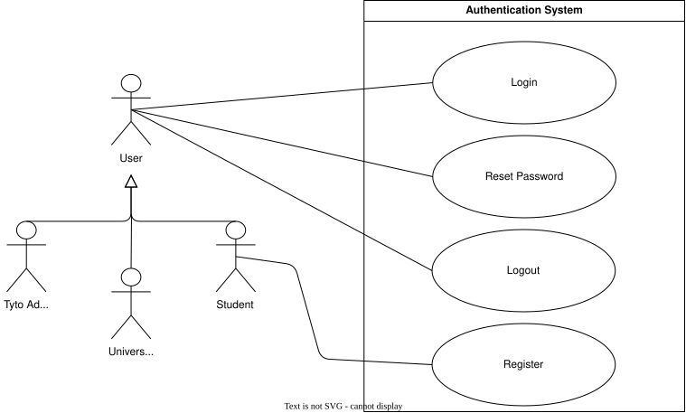
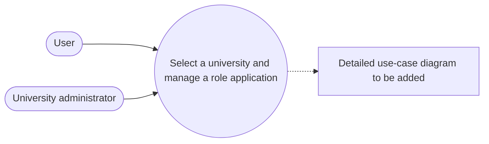
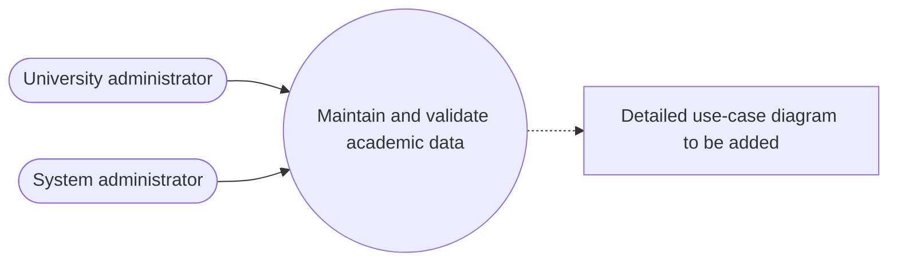
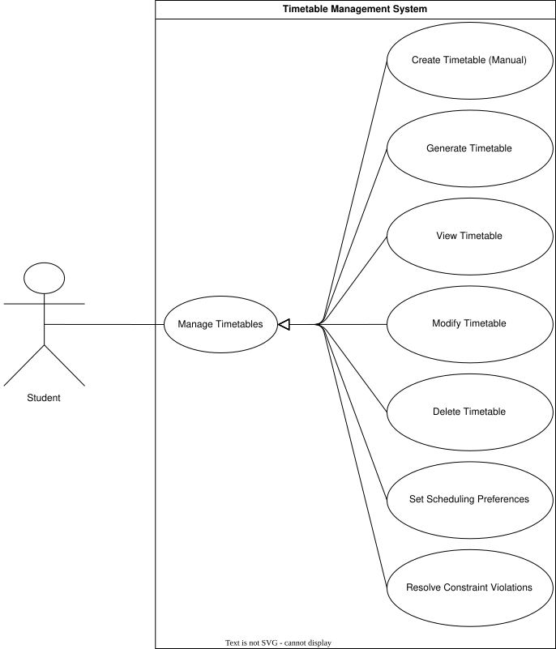
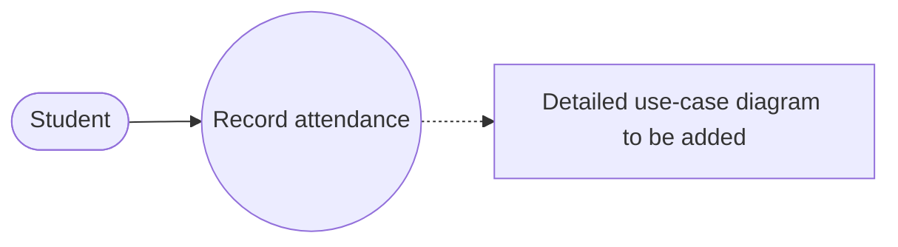
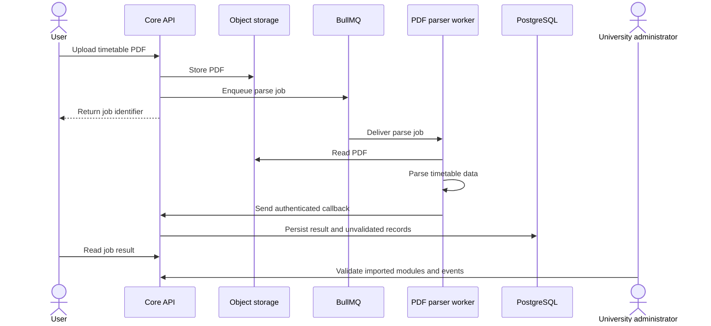
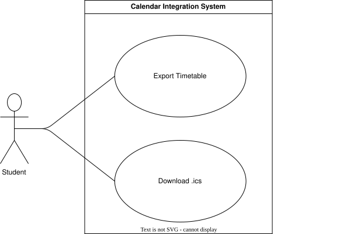

# Use Cases

## Overview

| **ID** | **Use case** | **Actor** |
|---|---|---|
| **UC-1** | Access an Account | User |
| **UC-2** | Select a University and Manage a Role Application | User, university administrator |
| **UC-3** | Maintain and Validate Academic Data | University administrator, system administrator |
| **UC-4** | Maintain Personal Module Data | Student |
| **UC-5** | Maintain a Personal Timetable | Student |
| **UC-6** | Record Attendance | Student |
| **UC-7** | Import a University of Pretoria PDF | Student, university administrator |
| **UC-8** | Request a Timetable Solution | Student |
| **UC-9** | Download an iCalendar File | Student |

## UC-1: Access an Account

| **Field** | **Detail** |
|---|---|
| Primary actor | User |
| Preconditions | Registration is available, or the user already has an account. |
| Trigger | The user registers, signs in, signs out, or recovers access. |
| Postcondition | Account and session state reflect the accepted action. |
| Requirements | `FR-1` to `FR-6` |

## UC-2: Select a University and Manage a Role Application

| **Field** | **Detail** |
|---|---|
| Primary actor | User |
| Secondary actor | University administrator |
| Preconditions | The user has an authenticated session. |
| Trigger | The user selects a university or applies for a university role. |
| Postcondition | The university context or application decision is recorded. |
| Requirements | `FR-7` to `FR-11` |

## UC-3: Maintain and Validate Academic Data

| **Field** | **Detail** |
|---|---|
| Primary actor | University administrator |
| Secondary actor | System administrator |
| Preconditions | The actor is authenticated and has the required role. |
| Trigger | The actor creates, changes, deletes, or validates an academic record. |
| Postcondition | The accepted university, course, module, grouping, or event state is stored. |
| Requirements | `FR-12` to `FR-16`, `FR-19`, and `FR-21` to `FR-24` |

## UC-4: Maintain Personal Module Data

| **Field** | **Detail** |
|---|---|
| Primary actor | Student |
| Preconditions | The student is authenticated. |
| Trigger | The student creates, views, changes, styles, or deletes personal module data. |
| Postcondition | The student's accepted module data is stored. |
| Requirements | `FR-17` and `FR-18` |

## UC-5: Maintain a Personal Timetable

| **Field** | **Detail** |
|---|---|
| Primary actor | Student |
| Preconditions | The student is authenticated. |
| Trigger | The student creates, views, changes, or deletes a timetable. |
| Postcondition | The timetable name and event membership reflect the accepted change. |
| Requirements | `FR-20`, `FR-22`, and `FR-25` to `FR-27` |

## UC-6: Record Attendance

| **Field** | **Detail** |
|---|---|
| Primary actor | Student |
| Preconditions | The student is authenticated and the event exists. |
| Trigger | The student records an attendance state for an event date. |
| Postcondition | The attendance record reflects the accepted action. |
| Requirements | `FR-28` and `FR-29` |

## UC-7: Import a University of Pretoria PDF

| **Field** | **Detail** |
|---|---|
| Primary actor | Student |
| Secondary actor | University administrator |
| Preconditions | The student is authenticated and has selected a university. |
| Trigger | The student uploads a supported PDF. |
| Postcondition | The job fails with details or unvalidated academic records and a module grouping are stored. |
| Requirements | `FR-19`, `FR-24`, and `FR-30` to `FR-37` |

## UC-8: Request a Timetable Solution

| **Field** | **Detail** |
|---|---|
| Primary actor | Student |
| Preconditions | The solver profile resolves to module events. |
| Trigger | The student submits a solver request. |
| Postcondition | A conflict-free, infeasible, best-effort, or failed result is stored. |
| Requirements | `FR-38` to `FR-45` |

## UC-9: Download an iCalendar File

| **Field** | **Detail** |
|---|---|
| Primary actor | Student |
| Preconditions | The student is viewing schedule events. |
| Trigger | The student selects iCalendar download. |
| Postcondition | The browser downloads an iCalendar file generated from the displayed events. |
| Requirements | `FR-46` |

