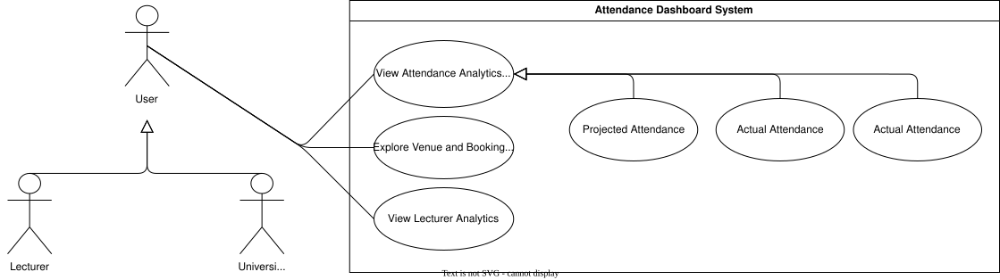
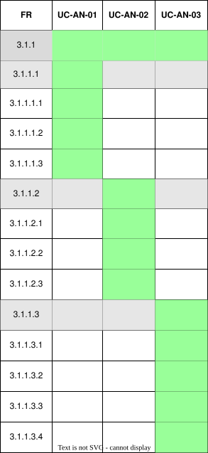

??? "**Analytics Dashboard Use Cases**"
    <a id="analytics-dashboard-id"></a>
    <div align="center">

    ### **Use Case Table**
    | **Use Case ID** | **Use Case Name** | **Actor** |
    |:---:|:---:|:---:|
    | **UC-AN-01** | [View University Statistics](#uc-an-01) | Admin / Lecturer |
    | **UC-AN-02** | [View Course Statistics](#uc-an-02) | Admin / Lecturer |
    | **UC-AN-03** | [View Module Statistics](#uc-an-03) | Admin / Lecturer |
    | **UC-AN-04** | [View Event Statistics](#uc-an-04) | Admin / Lecturer |

    </div>

    ??? tip "**Use Case Diagram**"
        

    ??? warning "**Traceability Matrix**"
        <div align="center">
        
        </div>

    ---
    ??? "UC-AN-01: View University Statistics"
        <a id="uc-an-01"></a>
        ##### High Level
        ```
        View University Statistics (Actor: University Admin / Lecturer, System: Analytics Engine)
            TUCBW the user opens the analytics page for their currently selected University.
            TUCEW the system displays counts of Courses, Modules, Events and Students within the user's authorised scope.
        ```
        ##### Expanded
        | Field | Detail |
        | :--- | :--- |
        | **Actor** | Admin / Lecturer |
        | **Precondition** | User is authenticated and has a University selected |
        | **Trigger** | User opens the analytics page |
        | **Basic Flow** | 1. System identifies the University-level scope for the user (full University for an Admin, associated Courses only for a Lecturer).<br>2. System counts Courses, Modules, Events and Students within that scope.<br>3. System displays the counts. |
        | **Alternate Flow** | **A1: No data available**<br>System displays an empty state (e.g. Lecturer with no associated Courses). |
        | **Postcondition** | University-level statistics are displayed for the user's scope |
        | **Requirements Covered** | R3.1.1 \| R3.1.1.1 |

    ---
    ??? "UC-AN-02: View Course Statistics"
        <a id="uc-an-02"></a>
        ##### High Level
        ```
        View Course Statistics (Actor: University Admin / Lecturer, System: Analytics Engine)
            TUCBW the user opens the Course analytics view.
            TUCEW the system displays total Courses, the Courses with the most Events, the Courses with the most Modules, and the average student count per Course, within the user's authorised scope.
        ```
        ##### Expanded
        | Field | Detail |
        | :--- | :--- |
        | **Actor** | Admin / Lecturer |
        | **Precondition** | User is authenticated and has a University selected |
        | **Trigger** | User selects the Course analytics view |
        | **Basic Flow** | 1. System identifies the Courses within the user's authorised scope.<br>2. System computes the total Course count, the Courses ranked by Event count, the Courses ranked by Module count, and the average student count per Course.<br>3. System displays the resulting statistics. |
        | **Alternate Flow** | **A1: No Courses available**<br>System displays an empty state. |
        | **Postcondition** | Course statistics are displayed for the user's scope |
        | **Requirements Covered** | R3.1.2 \| R3.1.2.1 \| R3.1.2.2 \| R3.1.2.3 \| R3.1.2.4 |

    ---
    ??? "UC-AN-03: View Module Statistics"
        <a id="uc-an-03"></a>
        ##### High Level
        ```
        View Module Statistics (Actor: University Admin / Lecturer, System: Analytics Engine)
            TUCBW the user opens the Module analytics view.
            TUCEW the system displays total Modules, the Modules with the most students, and the Modules with the most Events, within the user's authorised scope.
        ```
        ##### Expanded
        | Field | Detail |
        | :--- | :--- |
        | **Actor** | Admin / Lecturer |
        | **Precondition** | User is authenticated and has a University selected |
        | **Trigger** | User selects the Module analytics view |
        | **Basic Flow** | 1. System identifies the Modules within the user's authorised scope.<br>2. System computes the total Module count, the Modules ranked by student count, and the Modules ranked by Event count.<br>3. System displays the resulting statistics. |
        | **Alternate Flow** | **A1: No Modules available**<br>System displays an empty state. |
        | **Postcondition** | Module statistics are displayed for the user's scope |
        | **Requirements Covered** | R3.1.3 \| R3.1.3.1 \| R3.1.3.2 \| R3.1.3.3 |

    ---
    ??? "UC-AN-04: View Event Statistics"
        <a id="uc-an-04"></a>
        ##### High Level
        ```
        View Event Statistics (Actor: University Admin / Lecturer, System: Analytics Engine)
            TUCBW the user opens the Event analytics view.
            TUCEW the system displays total Events this week, the busiest day of the week, the Venues with the most Events, and the Venues with the highest attendance, within the user's authorised scope.
        ```
        ##### Expanded
        | Field | Detail |
        | :--- | :--- |
        | **Actor** | Admin / Lecturer |
        | **Precondition** | User is authenticated and has a University selected |
        | **Trigger** | User selects the Event analytics view |
        | **Basic Flow** | 1. System identifies the Events within the user's authorised scope.<br>2. System computes the total Event count for the current week, the busiest day of the week, the Venues ranked by Event count, and the Venues ranked by attendance.<br>3. System displays the resulting statistics. |
        | **Alternate Flow** | **A1: No data available**<br>System displays an empty state indicating no Events exist for the selection. |
        | **Postcondition** | Event statistics are displayed for the user's scope |
        | **Requirements Covered** | R3.1.4 \| R3.1.4.1 \| R3.1.4.2 \| R3.1.4.3 \| R3.1.4.4 |