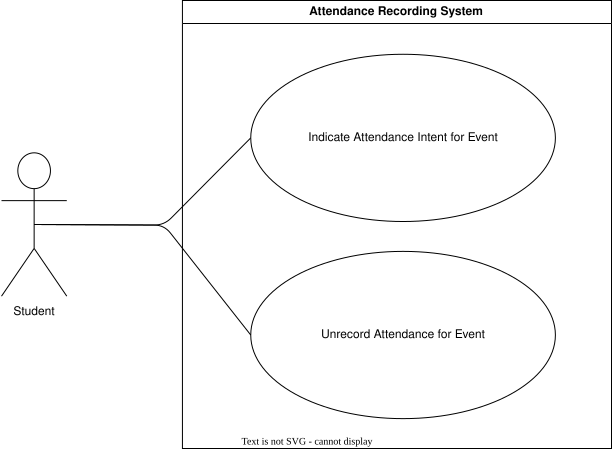
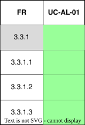

??? "**Attendance Recording Use Cases**"
    <a id="attendance-recording-id"></a>
    <div align="center">

    ### **Use Case Table**
    | **Use Case ID** | **Use Case Name** | **Actor** |
    |:---:|:---:|:---:|
    | **UC-AR-01** | [Indicate Attendance Intent for Event](#uc-ar-01) | Student |
    | **UC-AR-02** | [Unrecord Attendance for Event](#uc-ar-02) | Student |

    </div>


    ??? tip "**Use Case Diagram**"
        

    ??? warning "**Traceability Matrix**"
        <div align="center">
        
        </div>

    ---  
    ??? "UC-AR-01: Indicate Attendance Intent for Event"
        <a id="uc-ar-01"></a>
        ##### High Level
        ```
        Indicate Attendance Intent for Event (Actor: Student, System: Analytics Engine)
        TUCBW the student views an upcoming event and is prompted to indicate their attendance intent.
        TUCEW the system records the student's response as will attend, will not attend, or not specified, and updates projected attendance analytics accordingly.
        ```
        ##### Expanded
        | Field | Detail |
        | :--- | :--- |
        | **Actor** | Student |
        | **Precondition** | User is authenticated and has access to at least one upcoming event |
        | **Trigger** | Student opens an event and is prompted for attendance intent |
        | **Basic Flow** | 1. Student navigates to an upcoming event.<br>2. System displays attendance intent options (Will Attend, Will Not Attend, Not Specified).<br>3. Student selects an option.<br>4. System records the student's response.<br>5. System updates projected attendance statistics for the event.<br>6. System confirms the recorded response to the student. |
        | **Alternate Flow** | **A1: Student does not select an option**<br>System defaults response to "Not Specified" and proceeds.<br><br>**A2: Event not found or inaccessible**<br>System shows error and returns student to event list.<br><br>**A3: Data submission failure**<br>System displays error and allows retry. |
        | **Postcondition** | Student's attendance intent is recorded and reflected in analytics |
        | **Requirements Covered** | R3.3.1.1 \| R3.3.1.2 \| R3.3.1.5 |

    ---
    ??? "UC-AR-02: Unrecord Attendance for Event"
        <a id="uc-ar-02"></a>
        ##### High Level
        ```
        Unrecord Attendance for Event (Actor: Student, System: Analytics Engine)
        TUCBW the student views a previously submitted attendance response for an event.
        TUCEW the system removes the recorded response and updates the projected attendance analytics accordingly.
        ```
        ##### Expanded
        | Field | Detail |
        | :--- | :--- |
        | **Actor** | Student |
        | **Precondition** | User is authenticated and has previously recorded an attendance response for an event |
        | **Trigger** | Student chooses to unrecord their attendance response |
        | **Basic Flow** | 1. Student navigates to an event with an existing attendance response.<br>2. System displays the student's current recorded response.<br>3. Student selects the option to unrecord their response.<br>4. System prompts student to confirm the action.<br>5. Student confirms.<br>6. System removes the recorded response.<br>7. System updates projected attendance statistics for the event. |
        | **Alternate Flow** | **A1: Student cancels confirmation**<br>System retains the existing recorded response and returns to event view.<br><br>**A2: No existing response found**<br>System displays message indicating there is no response to unrecord.<br><br>**A3: Data update failure**<br>System displays error and allows retry. |
        | **Postcondition** | Student's attendance response is removed and analytics are updated |
        | **Requirements Covered** | R3.3.1.3 \| R3.3.1.4 \| R3.3.1.5 |