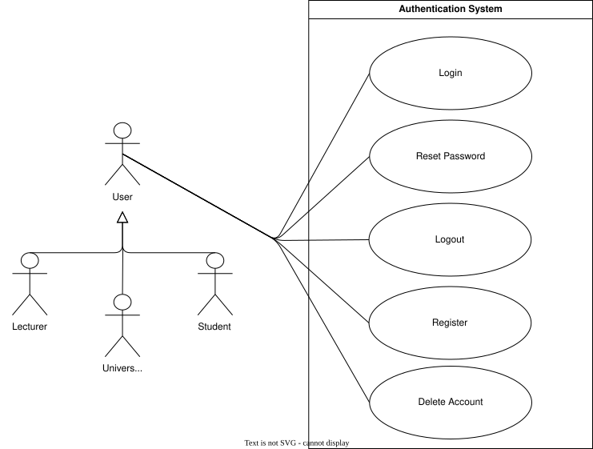

??? "**Authentication Use Cases**"
    <a id="auth-use-cases"></a>

    <div align="center">

    ## **Use Case Table**
    | **ID** | **Use case** | **Actor** |
    |:---:|:---:|:---:|
    | **UC-AU-01** | [Register Account](#uc-au-01) | User |
    | **UC-AU-02** | [Login](#uc-au-02) | User |
    | **UC-AU-03** | [Reset Password](#uc-au-03) | User |
    | **UC-AU-04** | [Logout](#uc-au-04) | User |
    | **UC-AU-05** | [Delete Account](#uc-au-05) | User |
    | **UC-AU-06** | [Verify Email](#uc-au-06) | User |
    | **UC-AU-07** | [OAuth](#uc-au-07) | User |

    </div>

    ??? tip "**Use Case Diagram**"
        

    ---
    ??? "UC-AU-01: Register Account"
        <a id="uc-au-01"></a>
        ##### High Level
        ```
        Register Account (Actor: User, System: Authentication)
        TUCBW the user selects "Register" from the landing page and chooses to sign up via OAuth or with an in-house email and password.
        TUCEW the user's account is created, verified, and activated.
        ```
        ##### Expanded
        | Field | Detail |
        | :--- | :--- |
        | **Actor** | User |
        | **Precondition** | User does not have an existing account |
        | **Trigger** | User selects "Register" from the landing page |
        | **Basic Flow** | 1. User initiates account registration.<br>2. User chooses a registration method.<br>3. System collects the required registration information.<br>4. System validates the submitted information.<br>5. System creates the user account.<br>6. System confirms successful registration.<br>7. User gains access to the system. |
        | **Alternate Flow** | **A1: OAuth Registration**<br>User selects an OAuth provider and successfully authenticates with the provider. The system retrieves the required account information and creates the account.<br><br>**A2: In-House Registration**<br>User provides an email address and password. The system validates the submitted credentials and creates the account.<br><br>**A3: Account Already Exists**<br>System informs the user that an account already exists and suggests logging in or resetting their password. |
        | **Postcondition** | User account has been created and is available for authentication. |
        | **Requirements Covered** | R1.2.2 \| R1.2.2.1 \| R1.2.2.2 |

    ---
    ??? "UC-AU-02: Login Account"
        <a id="uc-au-02"></a>
        ##### High Level
        ```
        Login Account (Actor: User, System: Authentication)
        TUCBW the user submits in-house credentials or selects an OAuth provider.
        TUCEW the user is authenticated and redirected to the dashboard.
        ```
        ##### Expanded
        | Field | Detail |
        | :--- | :--- |
        | **Actor** | User |
        | **Precondition** | User has a registered account |
        | **Trigger** | User submits credentials or selects an OAuth provider |
        | **Basic Flow** | 1. User initiates the login process.<br>2. User chooses an authentication method.<br>3. System validates the user's identity.<br>4. System authenticates the user.<br>5. System creates a user session.<br>6. User is redirected to the dashboard. |
        | **Alternate Flow** | **A1: OAuth Login**<br>User selects an OAuth provider and successfully authenticates through the provider. The system authenticates the user and creates a session.<br><br>**A2: In-House Login**<br>User provides an email address and password. The system validates the credentials and authenticates the user.<br><br>**A3: Invalid Credentials**<br>System displays an authentication error and prompts the user to try again.<br><br>**A4: Account Not Found**<br>System informs the user that no account exists and suggests registration. |
        | **Postcondition** | User is authenticated and an active session exists. |
        | **Requirements Covered** | R1.2.1 \| R1.2.1.1 \| R1.2.1.2 \| R1.2.3 |

    ---
    ??? "UC-AU-03: Reset Password"
        <a id="uc-au-03"></a>
        ##### High Level
        ```
        Reset Password (Actor: User, System: Authentication)
        TUCBW the user selects "Forgot Password" on the login screen.
        TUCEW the user's password is updated.
        ```
        ##### Expanded
        | Field | Detail |
        | :--- | :--- |
        | **Actor** | User |
        | **Precondition** | User has a registered account |
        | **Trigger** | User selects "Forgot Password" on the login screen |
        | **Basic Flow** | 1. User requests password reset.<br>2. User provides registered email or identifier.<br>3. System validates request and generates a password reset token.<br>4. System sends a password reset link or OTP to the user’s email.<br>5. User accesses the reset link or enters the OTP.<br>6. User submits a new password.<br>7. System validates password policy rules.<br>8. System updates the password and confirms success.<br>9. User is redirected to the login screen. |
        | **Alternate Flow** | **A1: Email Not Found**<br>System returns a neutral response and does not reveal whether the account exists.<br><br>**A2: Expired or Invalid Token**<br>System rejects the reset attempt and prompts the user to request a new reset link.<br><br>**A3: Password Policy Violation**<br>System rejects the new password and prompts the user to meet complexity requirements.<br><br>**A4: Multiple Reset Attempts**<br>System throttles requests and temporarily blocks further reset attempts for security. |
        | **Postcondition** | User password is updated and reset token is invalidated |
        | **Requirements Covered** | R1.2.4.2 |

    ---
    ??? "UC-AU-04: Logout Account"
        <a id="uc-au-04"></a>
        ##### High Level
        ```
        Logout Account (Actor: User, System: Authentication)
        TUCBW the user selects "Sign Out".
        TUCEW the user's session is invalidated and they are returned to the landing page.
        ```
        ##### Expanded
        | Field | Detail |
        | :--- | :--- |
        | **Actor** | User |
        | **Precondition** | User is currently authenticated and has an active session |
        | **Trigger** | User selects "Sign Out" |
        | **Basic Flow** | 1. User initiates logout request.<br>2. System receives logout action.<br>3. System invalidates the user’s session token.<br>4. System clears authentication/session cookies and local session state.<br>5. System terminates any server-side session records.<br>6. User is redirected to the landing or login page. |
        | **Alternate Flow** | **A1: Session Already Expired**<br>System detects expired session and simply redirects user to landing/login page.<br><br>**A2: Partial Session Cleanup Failure**<br>System attempts retry of session invalidation and forces client-side session cleanup.<br><br>**A3: Multiple Active Sessions**<br>System invalidates only the current session.<br><br>**A4: Network Failure During Logout**<br>Client clears local session state and redirects user, while server-side session is marked for cleanup on next valid request. |
        | **Postcondition** | User session is fully invalidated and user is no longer authenticated |
        | **Requirements Covered** | R1.2.4.1 \| R1.2.3 |

    ---
    ??? "UC-AU-05: Delete Account"
        <a id="uc-au-05"></a>
        ##### High Level
        ```
        Delete Account (Actor: User, System: Authentication)
        TUCBW the user selects "Delete Account" from their account settings.
        TUCEW the user's account and associated data are permanently removed.
        ```
        ##### Expanded
        | Field | Detail |
        | :--- | :--- |
        | **Actor** | User |
        | **Precondition** | User is currently authenticated |
        | **Trigger** | User selects "Delete Account" from account settings |
        | **Basic Flow** | 1. User initiates account deletion request.<br>2. System prompts user for confirmation and re-authentication (OAuth or password-based).<br>3. User confirms identity and proceeds with deletion.<br>4. System validates authentication and authorization.<br>5. System removes or anonymises user data from primary storage.<br>6. System revokes all active sessions and tokens.<br>7. System deletes or flags related account records across dependent services.<br>8. System confirms permanent deletion to the user.<br>9. User is logged out and redirected to the landing page. |
        | **Alternate Flow** | **A1: Re-authentication Fails**<br>System denies deletion request and returns user to account settings.<br><br>**A2: Active Sessions Exist Elsewhere**<br>System invalidates all sessions except the current one, then completes deletion.<br><br>**A3: Scheduled Deletion (Grace Period)**<br>System schedules account deletion and notifies user via email, allowing cancellation within retention window.<br><br>**A4: Partial Deletion Failure**<br>System retries deletion of dependent data; if unresolved, account is marked for manual cleanup.<br><br>**A5: OAuth User Deletion Constraints**<br>System deletes local account data and revokes sessions; external identity provider account remains unaffected. |
        | **Postcondition** | User account is permanently removed or scheduled for deletion, and no active session remains |
        | **Requirements Covered** | R1.2.4.3 \| R1.2.3 |

    ---
    ??? "UC-AU-06: Verify Email"
        <a id="uc-au-06"></a>
        ##### High Level
        ```
        Verify Email (Actor: User, System: Authentication)
            TUCBW the user requests or is issued an email verification link/OTP after registering with an in-house account.
            TUCEW the user's email address is confirmed and their account is marked as verified.
        ```

        ##### Expanded
        | Field | Detail |
        | :--- | :--- |
        | **Actor** | User |
        | **Precondition** | User has registered an in-house account that is not yet verified |
        | **Trigger** | User selects the verification link or enters the OTP sent to their email |
        | **Basic Flow** | 1. System sends a verification link or OTP to the user's registered email upon registration.<br>2. User accesses the verification link or enters the OTP.<br>3. System validates the verification token or OTP.<br>4. System marks the user's email as verified.<br>5. System confirms successful verification to the user.<br>6. User gains full access to the system. |
        | **Alternate Flow** | **A1: Expired or Invalid Token**<br>System rejects the verification attempt and prompts the user to request a new verification link.<br><br>**A2: Resend Verification**<br>User requests a new verification email. System invalidates any prior token and issues a new one.<br><br>**A3: Already Verified**<br>System informs the user that their email is already verified and redirects to login.<br><br>**A4: Unverified Access Attempt**<br>System restricts access to certain features and prompts the user to verify their email before continuing. |
        | **Postcondition** | User's email is confirmed and account is fully activated |
        | **Requirements Covered** | TBD |

    ---
    ??? "UC-AU-07: OAuth"
        <a id="uc-au-07"></a>
        ##### High Level
        ```
        OAuth (Actor: User, System: Authentication)
            TUCBW the user selects an OAuth provider to authenticate or link to their account.
            TUCEW the user is authenticated or linked via the OAuth provider and gains access to the system.
        ```
        ##### Expanded
        | Field | Detail |
        | :--- | :--- |
        | **Actor** | User |
        | **Precondition** | User has access to a supported OAuth provider account |
        | **Trigger** | User selects an OAuth provider option during registration, login, or account linking |
        | **Basic Flow** | 1. User selects an OAuth provider.<br>2. System redirects the user to the provider's authentication page.<br>3. User authenticates with the provider and grants requested permissions.<br>4. Provider returns an authorisation code or token to the system.<br>5. System exchanges the code/token for the user's identity information.<br>6. System creates a new account or matches the identity to an existing account.<br>7. System creates a user session.<br>8. User is redirected to the dashboard. |
        | **Alternate Flow** | **A1: User Denies Permission**<br>Provider returns a denial response and system informs the user that authentication was cancelled.<br><br>**A2: Account Already Linked**<br>System detects the OAuth identity is already linked to an existing account and authenticates the user directly.<br><br>**A3: Email Already Registered In-House**<br>System detects a matching email on an existing in-house account and prompts the user to link accounts or use an alternate method.<br><br>**A4: Provider Unavailable**<br>System displays an error indicating the OAuth provider is temporarily unavailable and suggests an alternate login method.<br><br>**A5: Token Exchange Failure**<br>System fails to retrieve identity information and prompts the user to retry authentication. |
        | **Postcondition** | User is authenticated and an active session exists, with identity linked via the OAuth provider |
        | **Requirements Covered** | TBD |