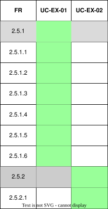

??? "**Calendar Exporting Use Cases**"
    <a id="calendar-exporting-id"></a>
    <div align="center">

    ### **Use Case Table**
    | **Use Case ID** | **Use Case Name** | **Actor** |
    | :---: | :---: | :---: |
    | **UC-EX-01** | [Export Timetable as ICS File](#uc-ex-01) | Student |
    | **UC-EX-02** | [Export Timetable to Google Calendar](#uc-ex-02) | Student |

    </div>

    ??? tip "**Use Case Diagram**"
        

    ??? warning "**Traceability Matrix**"
        <div align="center">
        
        </div>

    ---  
    ??? "UC-EX-01: Export Timetable as ICS File"
        <a id="uc-ex-01">
        ##### High Level
        ```
        Export Timetable as ICS File (Actor: Student, System: Calendar Exporter)  
        TUCBW the student selects the option to export a timetable as an .ics file.  
        TUCEW the system generates an .ics file from the selected timetable, including events with metadata such as name, description, location, time, status, and unique identifiers, and downloads it to the user’s device.
        ```
        ##### Expanded
        | Field | Detail |
        | :--- | :--- |
        | **Actor** | Student |
        | **Precondition** | Student is authenticated and a timetable exists |
        | **Trigger** | Student selects “Export as .ics file” |
        | **Basic Flow** | 1. Student selects timetable to export.<br>2. System retrieves timetable data.<br>3. System prompts user for optional .ics configuration (name, description, status, etc.).<br>4. System generates event entries including metadata (start time, end time, location, status).<br>5. System assigns unique identifiers (UUID) to events to prevent duplication.<br>6. System builds .ics file structure.<br>7. System downloads file to user device. |
        | **Alternate Flow** | **A1: Missing timetable data**<br>System prevents export and notifies user.<br><br>**A2: Invalid event data**<br>System excludes invalid entries and flags them.<br><br>**A3: File generation failure**<br>System displays error and allows retry. |
        | **Postcondition** | Valid .ics file is generated and downloaded |
        | **Requirements Covered** | R2.5.1 \| R2.5.1.1 \| R2.5.1.2 \| R2.5.1.3 \| R2.5.1.4 \| R2.5.1.5 \| R2.5.1.6 |

    ---
    ??? "UC-EX-02: Export Timetable to Google Calendar"
        <a id="uc-ex-02">
        ##### High Level
        ```
        Export Timetable to Google Calendar (Actor: Student, System: Google Calendar Integration)  
        TUCBW the student selects the option to export a timetable to Google Calendar and authorises access if required.  
        TUCEW the system creates a Google Calendar instance and pushes the timetable events to the user's Google Calendar.
        ```
        ##### Expanded
        | Field | Detail |
        | :--- | :--- |
        | **Actor** | Student |
        | **Precondition** | Student is authenticated and a timetable exists |
        | **Trigger** | Student selects "Export to Google Calendar" |
        | **Basic Flow** | 1. Student initiates Google Calendar export.<br>2. System requests Google OAuth authentication (if not already authorised).<br>3. Student grants calendar permissions.<br>4. System retrieves timetable events.<br>5. System creates a Google Calendar instance.<br>6. System maps timetable events to Google Calendar format.<br>7. System pushes events to Google Calendar API.<br>8. System confirms successful export. |
        | **Alternate Flow** | **A1: OAuth not authorised**<br>System prompts user to authenticate before proceeding.<br><br>**A2: API failure**<br>System retries export and then reports failure.<br><br>**A3: Partial export failure**<br>System reports which events failed and which succeeded.<br><br>**A4: Duplicate event detection (UUID conflict)**<br>System skips or overwrites previously exported events instead of duplicating them. |
        | **Postcondition** | Timetable events are exported to Google Calendar |
        | **Requirements Covered** | R2.5.2 \| R2.5.2.1 |


