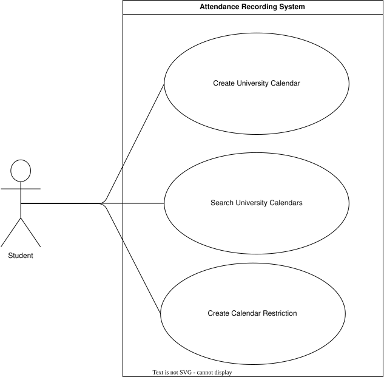
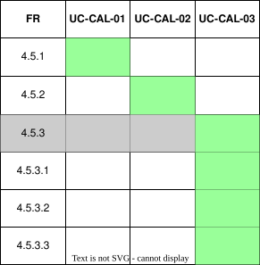

??? "**Calendar Management Use Cases**"
    <a id="calendar-management-id"></a>
    <div align="center">

    ### **Use Case Table**
    | **Use Case ID** | **Use Case Name** | **Actor** |
    | :---: | :---: | :---: |
    | **UC-CAL-01** | [Create University Calendar](#uc-cal-01) | Admin |
    | **UC-CAL-02** | [Search University Calendars](#uc-cal-02) | Admin |
    | **UC-CAL-03** | [Create Calendar Restriction](#uc-cal-03) | Admin |

    </div>

    ??? tip "**Use Case Diagram**"
        

    ??? warning "**Traceability Matrix**"
        <div align="center">
        
        </div>

    ---
    ??? "UC-CAL-01: Create University Calendar"
        <a id="uc-cal-01"></a>
        ##### High Level
        ```
        Create University Calendar (Actor: Admin, System: Calendar Management)
            TUCBW the admin selects a University and specifies a year for which a calendar is required.
            TUCEW the system creates a calendar for that University and year, making it available for restrictions and scheduling.
        ```
        ##### Expanded
        | Field | Detail |
        | :--- | :--- |
        | **Actor** | Admin |
        | **Precondition** | Admin is authenticated and has permission to manage the selected University |
        | **Trigger** | Admin selects "Create Calendar" for a University and year |
        | **Basic Flow** | 1. Admin selects the University and specifies the year.<br>2. System validates that no calendar already exists for that University and year.<br>3. System creates the calendar.<br>4. System confirms successful creation to the admin. |
        | **Alternate Flow** | **A1: Calendar already exists**<br>System notifies the admin that a calendar for the University and year already exists and does not create a duplicate.<br><br>**A2: Creation failure**<br>System displays an error and allows retry. |
        | **Postcondition** | A calendar for the specified University and year is created and available for further configuration |
        | **Requirements Covered** | R4.5.1 |

    ---
    ??? "UC-CAL-02: Search University Calendars"
        <a id="uc-cal-02"></a>
        ##### High Level
        ```
        Search University Calendars (Actor: Admin, System: Calendar Management)
            TUCBW the admin searches for calendars belonging to a University for a specific year.
            TUCEW the system returns the matching calendar(s) for review or further management.
        ```
        ##### Expanded
        | Field | Detail |
        | :--- | :--- |
        | **Actor** | Admin |
        | **Precondition** | Admin is authenticated and has permission to view calendars for the selected University |
        | **Trigger** | Admin searches for a calendar by University and year |
        | **Basic Flow** | 1. Admin specifies the University and year to search for.<br>2. System retrieves calendars matching the search criteria.<br>3. System displays the matching calendar(s) to the admin. |
        | **Alternate Flow** | **A1: No matching calendar found**<br>System displays an empty state indicating no calendar exists for the given University and year. |
        | **Postcondition** | Matching calendar(s) are displayed to the admin |
        | **Requirements Covered** | R4.5.2 |

    ---
    ??? "UC-CAL-03: Create Calendar Restriction"
        <a id="uc-cal-03"></a>
        ##### High Level
        ```
        Create Calendar Restriction (Actor: Admin, System: Calendar Management)
            TUCBW the admin selects a University calendar and chooses to add a restriction.
            TUCEW the system creates a single day, date range, or day swap restriction on the calendar, with a description, for use in scheduling.
        ```
        ##### Expanded
        | Field | Detail |
        | :--- | :--- |
        | **Actor** | Admin |
        | **Precondition** | A calendar exists for the University and year (UC-CAL-01) |
        | **Trigger** | Admin selects "Add Restriction" on a University calendar |
        | **Basic Flow** | 1. Admin selects the calendar to add a restriction to.<br>2. Admin chooses the restriction type: single day, date range, or day swap.<br>3. Admin enters the required details for the chosen type - a date and description for a single day restriction, a start date, end date and description for a date range restriction, or a start date, swapped day and description for a day swap restriction.<br>4. System validates the entered details.<br>5. System creates the restriction on the calendar.<br>6. System confirms successful creation to the admin. |
        | **Alternate Flow** | **A1: Invalid or missing details**<br>System prevents creation until all required fields for the chosen restriction type are completed.<br><br>**A2: Overlapping restriction detected**<br>System warns the admin that the new restriction overlaps with an existing one and requests confirmation.<br><br>**A3: Creation failure**<br>System displays an error and allows retry. |
        | **Postcondition** | A restriction is added to the calendar and available for use in scheduling |
        | **Requirements Covered** | R4.5.3 \| R4.5.3.1 \| R4.5.3.2 \| R4.5.3.3 |