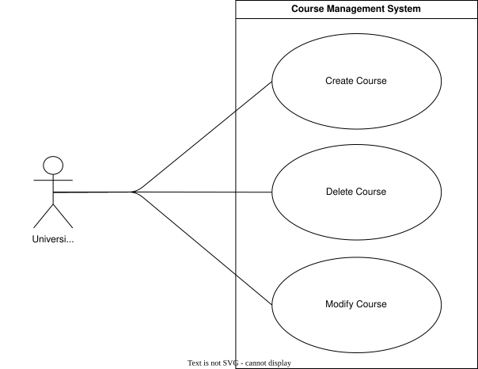
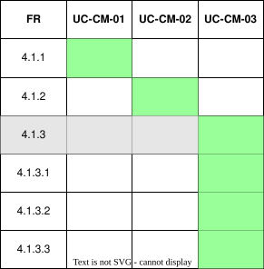

??? "**Course Management Use Cases**"
    <a id="course-mgmt-use-cases"></a>

    <div align="center">

    ## **Use Case Table**
    | **ID** | **Use case** | **Actor** |
    |:---:|:---:|:---:|
    | **UC-CM-01** | [Create Course](#uc-cm-01) | University Admin |
    | **UC-CM-02** | [Delete Course](#uc-cm-02) | University Admin |
    | **UC-CM-03** | [Modify Course](#uc-cm-03) | University Admin |

    </div>

    ??? tip "**Use Case Diagram**"
        

    ??? warning "**Traceability Matrix**"
        <div align="center">
        
        </div>

    ---
    ??? "UC-CM-01: Create Course"
        <a id="uc-cm-01"></a>
        ##### High Level
        ```
        Create Course (Actor: University Admin, System: Course Management)
        TUCBW a uni_admin selects "Create Course" for their university.
        TUCEW a new course is created and available for the university.
        ```
        ##### Expanded
        | Field | Detail |
        | :--- | :--- |
        | **Actor** | University Admin |
        | **Precondition** | Actor is an approved uni_admin for the university |
        | **Trigger** | Uni_admin selects "Create Course" |
        | **Basic Flow** | 1. Uni_admin initiates course creation.<br>2. Uni_admin provides the course name and degree.<br>3. System validates the submitted details.<br>4. System creates the course for the university.<br>5. System confirms successful creation. |
        | **Alternate Flow** | **A1: Duplicate Course**<br>System informs the uni_admin that a course with that name already exists for the university. |
        | **Postcondition** | Course is created and available under the university |
        | **Requirements Covered** | R4.1.1 |

    ---
    ??? "UC-CM-02: Delete Course"
        <a id="uc-cm-02"></a>
        ##### High Level
        ```
        Delete Course (Actor: University Admin, System: Course Management)
        TUCBW a uni_admin selects "Delete" on an existing course.
        TUCEW the course is permanently removed from the university.
        ```
        ##### Expanded
        | Field | Detail |
        | :--- | :--- |
        | **Actor** | University Admin |
        | **Precondition** | Actor is an approved uni_admin for the university and the course exists |
        | **Trigger** | Uni_admin selects "Delete" on a course |
        | **Basic Flow** | 1. Uni_admin selects a course to delete.<br>2. System prompts for confirmation.<br>3. Uni_admin confirms deletion.<br>4. System removes the course from the university.<br>5. System confirms successful deletion. |
        | **Alternate Flow** | **A1: Course Has Dependent Data**<br>System warns the uni_admin that modules or enrolments are linked to the course before allowing deletion to proceed. |
        | **Postcondition** | Course is permanently removed from the university |
        | **Requirements Covered** | R4.1.2 |

    ---
    ??? "UC-CM-03: Modify Course"
        <a id="uc-cm-03"></a>
        ##### High Level
        ```
        Modify Course (Actor: University Admin, System: Course Management)
        TUCBW a uni_admin selects "Edit" on an existing course.
        TUCEW the course's name, degree, or modules are updated.
        ```
        ##### Expanded
        | Field | Detail |
        | :--- | :--- |
        | **Actor** | University Admin |
        | **Precondition** | Actor is an approved uni_admin for the university and the course exists |
        | **Trigger** | Uni_admin selects "Edit" on a course |
        | **Basic Flow** | 1. Uni_admin selects a course to modify.<br>2. Uni_admin updates the course name, degree, and/or adds modules.<br>3. System validates the submitted changes.<br>4. System updates the course record.<br>5. System confirms successful update. |
        | **Alternate Flow** | **A1: Invalid Module**<br>System rejects the module addition if it does not exist or is already linked to the course. |
        | **Postcondition** | Course details are updated to reflect the new name, degree, and/or modules |
        | **Requirements Covered** | R4.1.3 \| R4.1.3.1 \| R4.1.3.2 \| R4.1.3.3 |