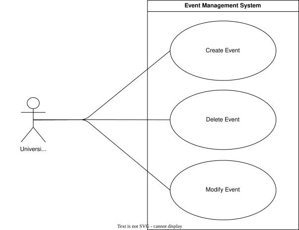
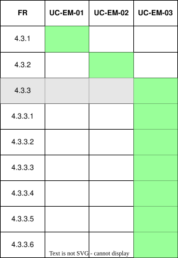

??? "**Event Management Use Cases**"
    <a id="event-mgmt-use-cases"></a>

    <div align="center">

    ## **Use Case Table**
    | **ID** | **Use case** | **Actor** |
    |:---:|:---:|:---:|
    | **UC-EM-01** | [Create Event](#uc-em-01) | University Admin |
    | **UC-EM-02** | [Delete Event](#uc-em-02) | University Admin |
    | **UC-EM-03** | [Modify Event](#uc-em-03) | University Admin |

    </div>

    ??? tip "**Use Case Diagram**"
        

    ??? warning "**Traceability Matrix**"
        <div align="center">
        
        </div>

    ---
    ??? "UC-EM-01: Create Event"
        <a id="uc-em-01"></a>
        ##### High Level
        ```
        Create Event (Actor: University Admin, System: Event Management)
            TUCBW a uni_admin creates an event via the API, PDF upload, or interface.
            TUCEW a new event is created and available for the module.
        ```
        ##### Expanded
        | Field | Detail |
        | :--- | :--- |
        | **Actor** | University Admin |
        | **Precondition** | Actor is an approved uni_admin for the university |
        | **Trigger** | Uni_admin initiates event creation via API, PDF, or builder |
        | **Basic Flow** | 1. Uni_admin selects an event creation method (API, PDF, or builder).<br>2. Uni_admin provides or uploads the event name, code, type, date, day of week, and times.<br>3. System validates the submitted details.<br>4. System creates the event for the module.<br>5. System confirms successful creation. |
        | **Alternate Flow** | **A1: Duplicate Event**<br>System informs the uni_admin that an event with that code already exists for the module.<br><br>**A2: Invalid PDF/API Data**<br>System rejects the submission and reports which fields failed validation. |
        | **Postcondition** | Event is created and available under the module |
        | **Requirements Covered** | R4.3.1 |

    ---
    ??? "UC-EM-02: Delete Event"
        <a id="uc-em-02"></a>
        ##### High Level
        ```
        Delete Event (Actor: University Admin, System: Event Management)
            TUCBW a uni_admin selects "Delete" on an existing event.
            TUCEW the event is permanently removed from the module.
        ```
        ##### Expanded
        | Field | Detail |
        | :--- | :--- |
        | **Actor** | University Admin |
        | **Precondition** | Actor is an approved uni_admin for the university and the event exists |
        | **Trigger** | Uni_admin selects "Delete" on an event |
        | **Basic Flow** | 1. Uni_admin selects an event to delete.<br>2. System prompts for confirmation.<br>3. Uni_admin confirms deletion.<br>4. System removes the event from the module.<br>5. System confirms successful deletion. |
        | **Alternate Flow** | **A1: Event Has Dependent Data**<br>System warns the uni_admin that attendance or scheduling records are linked to the event before allowing deletion to proceed. |
        | **Postcondition** | Event is permanently removed from the module |
        | **Requirements Covered** | R4.3.2 |

    ---
    ??? "UC-EM-03: Modify Event"
        <a id="uc-em-03"></a>
        ##### High Level
        ```
        Modify Event (Actor: University Admin, System: Event Management)
        TUCBW a uni_admin selects "Edit" on an existing event.
        TUCEW the event's name, code, type, date, day of week, or times are updated.
        ```
        ##### Expanded
        | Field | Detail |
        | :--- | :--- |
        | **Actor** | University Admin |
        | **Precondition** | Actor is an approved uni_admin for the university and the event exists |
        | **Trigger** | Uni_admin selects "Edit" on an event |
        | **Basic Flow** | 1. Uni_admin selects an event to modify.<br>2. Uni_admin updates the event name, code, type, date, day of week, and/or times.<br>3. System validates the submitted changes.<br>4. System updates the event record.<br>5. System confirms successful update. |
        | **Alternate Flow** | **A1: Conflicting Schedule**<br>System warns the uni_admin if the updated date, day of week, or times conflict with an existing event. |
        | **Postcondition** | Event details are updated to reflect the new name, code, type, date, day of week, and/or times |
        | **Requirements Covered** | R4.3.3 \| R4.3.3.1 \| R4.3.3.2 \| R4.3.3.3 \| R4.3.3.4 \| R4.3.3.5 \| R4.3.3.6 |