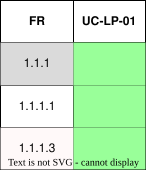

??? "**Landing Page Use Cases**"
    <a id="landing-page-use-cases"></a>

    <div align="center">

    ### **Use Case Table**
    | **ID** | **Use case** | **Actor** |
    |:---:|:---:|:---:|
    | **UC-LP-01** | [Visit Landing Page](#uc-lp-01) | Visitor |

    </div>

    ??? tip "**Use Case Diagram**"
        

    ??? warning "**Traceability Matrix**"
        <div align="center">
        
        </div>

    ---
    ??? "UC-LP-01: Visit Landing Page"
        <a id="uc-lp-01"></a>
        ##### High Level
        ```
        Visit Landing Page (Actor: Visitor, System: Public Website)
            TUCBW an unauthenticated visitor navigates to the Umtas website.
            TUCEW the visitor is shown the landing page and can navigate to the main site, login, or registration.
        ```
        ##### Expanded
        | Field | Detail |
        | :--- | :--- |
        | **Actor** | Visitor |
        | **Precondition** | Visitor is not authenticated |
        | **Trigger** | Visitor navigates to the Umtas root URL |
        | **Basic Flow** | 1. Visitor navigates to the site.<br>2. System displays the landing page.<br>3. System presents navigation options to the main site, login, and registration.<br>4. Visitor selects an option or continues browsing the landing page. |
        | **Alternate Flow** | **A1: Visitor is already authenticated**<br>System redirects the visitor to their dashboard instead of the landing page. |
        | **Postcondition** | Visitor has access to the landing page and its navigation options |
        | **Requirements Covered** | R1.1.1 \| R1.1.1.1 |
