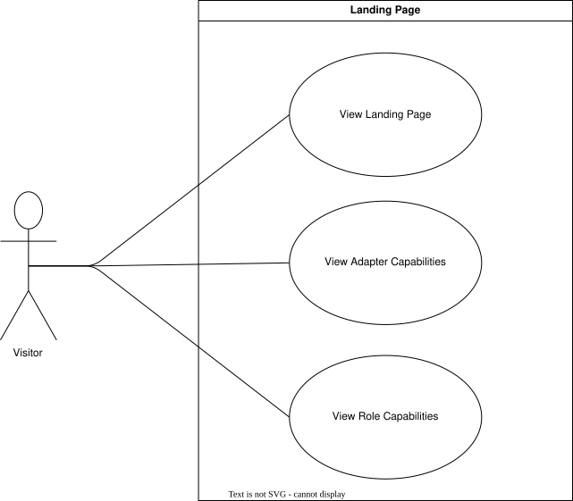

??? "**Landing Page Use Cases**"
    <a id="landing-page-use-cases"></a>

    <div align="center">

    ### **Use Case Table**
    | **ID** | **Use case** | **Actor** |
    |:---:|:---:|:---:|
    | **UC-LP-01** | [Visit Landing Page](#uc-lp-01) | Visitor |
    | **UC-LP-02** | [View Adapter Capabilities](#uc-lp-02) | Visitor |
    | **UC-LP-03** | [View Role Capabilities](#uc-lp-03) | Visitor |

    </div>

    ??? tip "**Use Case Diagram**"
        

    ---
    ??? "UC-LP-01: Visit Landing Page"
        <a id="uc-lp-01"></a>
        ##### High Level
        ```
        Visit Landing Page (Actor: Visitor, System: Public Website)
            TUCBW an unauthenticated visitor navigates to the Umtas website.
            TUCEW the visitor is shown the landing page and can navigate to the main site, login, or registration.
        ```
        ##### Expanded
        | Field | Detail |
        | :--- | :--- |
        | **Actor** | Visitor |
        | **Precondition** | Visitor is not authenticated |
        | **Trigger** | Visitor navigates to the Umtas root URL |
        | **Basic Flow** | 1. Visitor navigates to the site.<br>2. System displays the landing page.<br>3. System presents navigation options to the main site, login, and registration.<br>4. Visitor selects an option or continues browsing the landing page. |
        | **Alternate Flow** | **A1: Visitor is already authenticated**<br>System redirects the visitor to their dashboard instead of the landing page. |
        | **Postcondition** | Visitor has access to the landing page and its navigation options |
        | **Requirements Covered** | R1.1.1 \| R1.1.1.1 |

    ---
    ??? "UC-LP-02: View Adapter Capabilities"
        <a id="uc-lp-02"></a>
        ##### High Level
        ```
        View Adapter Capabilities (Actor: Visitor, System: Public Website)
            TUCBW the visitor views the section of the landing page describing timetable creation methods.
            TUCEW the visitor understands the purpose of the Builder, PDF upload, and University API adapters.
        ```
        ##### Expanded
        | Field | Detail |
        | :--- | :--- |
        | **Actor** | Visitor |
        | **Precondition** | Visitor is on the landing page |
        | **Trigger** | Visitor views or scrolls to the adapters section |
        | **Basic Flow** | 1. System displays the three adapter options (Builder, PDF Upload, University API).<br>2. System explains the functionality of each adapter.<br>3. Visitor reviews the descriptions. |
        | **Alternate Flow** | **A1: Visitor selects an adapter for more detail**<br>System expands or links to further information about the selected adapter. |
        | **Postcondition** | Visitor understands the available timetable creation adapters |
        | **Requirements Covered** | R1.1.2 \| R1.1.2.1 \| R1.1.2.1.1 \| R1.1.2.1.2 \| R1.1.2.1.3 |

    ---
    ??? "UC-LP-03: View Role Capabilities"
        <a id="uc-lp-03"></a>
        ##### High Level
        ```
        View Role Capabilities (Actor: Visitor, System: Public Website)
            TUCBW the visitor views the section of the landing page describing what each user role can do.
            TUCEW the visitor understands the functionality extended to Students, Admins, Lecturers, and Tyto simulation admins.
        ```
        ##### Expanded
        | Field | Detail |
        | :--- | :--- |
        | **Actor** | Visitor |
        | **Precondition** | Visitor is on the landing page |
        | **Trigger** | Visitor views or scrolls to the roles section |
        | **Basic Flow** | 1. System displays the four supported roles.<br>2. System explains the functionality extended to each role.<br>3. Visitor reviews the descriptions. |
        | **Alternate Flow** | **A1: Visitor selects a role for more detail**<br>System expands or links to further information about the selected role. |
        | **Postcondition** | Visitor understands the functionality available to each role |
        | **Requirements Covered** \| R1.1.2.2 \| R1.1.2.2.1 \| R1.1.2.2.2 \| R1.1.2.2.3 \| R1.1.2.2.4 |