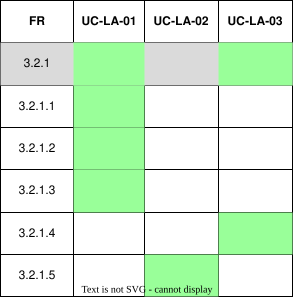

??? "**Lecturer Adjustment System Use Cases**"
    <a id="lecturer-adjustment-id"></a>
    <div align="center">

    ### **Use Case Table**
    | **Use Case ID** | **Use Case Name** | **Actor** |
    | :---: | :---: | :---: |
    | **UC-LA-01** | [Manage Event Details](#uc-la-01) | Lecturer/Admin |
    | **UC-LA-02** | [Manage Module Details](#uc-la-02) | Lecturer/Admin |

    </div>

    ??? tip "**Use Case Diagram**"
        

    ??? warning "**Traceability Matrix**"
        <div align="center">
        
        </div>

    ---
    ??? "UC-LA-01: Manage Event Details"
        <a id="uc-la-01"></a>
        ##### High Level
        ```
        Manage Event Details (Actor: Lecturer, System: Scheduling System)  
            TUCBW the lecturer selects one or more events to modify.  
            TUCEW the system allows the lecturer to update event details such as venue location and time, and persists the changes in the timetable system while updating affected schedules.
        ```
        ##### Expanded
        | Field | Detail |
        | :--- | :--- |
        | **Actor** | Lecturer |
        | **Precondition** | Lecturer is authenticated and has permission to modify the selected event(s) |
        | **Trigger** | Lecturer selects an event and chooses "Edit Event Details" |
        | **Basic Flow** | 1. System retrieves selected event(s).<br>2. System displays current event details (venue, time).<br>3. Lecturer updates venue and/or time.<br>4. System validates changes for scheduling conflicts and consistency.<br>5. System applies updates to event(s).<br>6. System propagates updates to affected timetables and analytics datasets.<br>7. System confirms successful update to lecturer. |
        | **Alternate Flow** | **A1: Scheduling conflict detected**<br>System warns lecturer and requests confirmation or adjustment.<br><br>**A2: Update failure**<br>System rejects changes and retains original event state. |
        | **Postcondition** | Event details are updated in the system |
        | **Requirements Covered** | R3.2.1 \| R3.2.1.1 \| R3.2.1.2 |

    ---
    ??? "UC-LA-02: Manage Module Details"
        <a id="uc-la-02"></a>
        ##### High Level
        ```
        Manage Module Details (Actor: Lecturer, System: Scheduling System)  
            TUCBW the lecturer selects a module to modify.  
            TUCEW the system allows the lecturer to update module details such as name, description, or credit value, and persists the changes across the institution's official course catalog and affected timetables.
        ```
        ##### Expanded
        | Field | Detail |
        | :--- | :--- |
        | **Actor** | Lecturer |
        | **Precondition** | Lecturer is authenticated and has permission to modify the selected module |
        | **Trigger** | Lecturer selects a module and chooses "Edit Module Details" |
        | **Basic Flow** | 1. System retrieves selected module.<br>2. System displays current module details (name, description, credit value).<br>3. Lecturer updates one or more fields.<br>4. System validates changes against institutional rules and uniqueness constraints.<br>5. System applies updates to the module.<br>6. System propagates updates to affected timetables and linked events.<br>7. System confirms successful update to lecturer. |
        | **Alternate Flow** | **A1: Duplicate module code detected**<br>System rejects change and prompts lecturer to choose a different code.<br><br>**A2: Missing required fields**<br>System prevents save until required fields are completed.<br><br>**A3: Update failure**<br>System rejects changes and retains original module state. |
        | **Postcondition** | Module details are updated in the system |
        | **Requirements Covered** | R3.2.1 \| R3.2.1.3 |