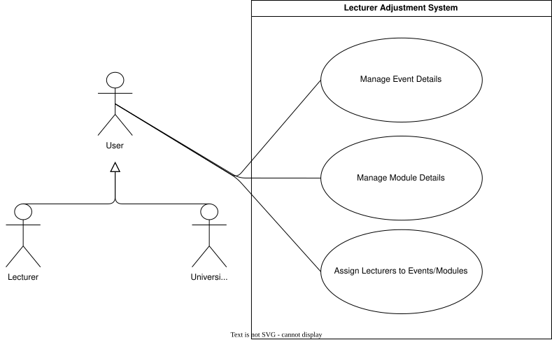

??? "**Lecturer Adjustment System Use Cases**"
    <a id="lecturer-adjustment-id"></a>
    <div align="center">

    ### **Use Case Table**
    | **Use Case ID** | **Use Case Name** | **Actor** |
    | :---: | :---: | :---: |
    | **UC-LA-01** | [Manage Event Details](#uc-la-01) | Lecturer/Admin |
    | **UC-LA-02** | [Manage Module Details](#uc-la-02) | Lecturer/Admin |
    | **UC-LA-03** | [Assign Lecturers to Events/Modules](#uc-la-03) | Lecturer/Admin |

    </div>

    ??? tip "**Use Case Diagram**"
        

    ---
    ??? "UC-LA-01: Manage Event Details"
        <a id="uc-la-01"></a>
        ##### High Level
        ```
        Manage Event Details (Actor: Lecturer, System: Scheduling System)  
            TUCBW the lecturer selects one or more events to modify.  
            TUCEW the system allows the lecturer to update event details such as venue location, time, or cancel the event, and persists the changes in the timetable system while updating affected schedules.
        ```
        ##### Expanded
        | Field | Detail |
        | :--- | :--- |
        | **Actor** | Lecturer |
        | **Precondition** | Lecturer is authenticated and has permission to modify the selected event(s) |
        | **Trigger** | Lecturer selects an event and chooses “Edit Event Details” |
        | **Basic Flow** | 1. System retrieves selected event(s).<br>2. System displays current event details (venue, time, status).<br>3. Lecturer updates venue and/or time or selects cancel event.<br>4. System validates changes for scheduling conflicts and consistency.<br>5. System applies updates to event(s).<br>6. System propagates updates to affected timetables and analytics datasets.<br>7. System confirms successful update to lecturer. |
        | **Alternate Flow** | **A1: Scheduling conflict detected**<br>System warns lecturer and requests confirmation or adjustment.<br><br>**A2: Event cancellation selected**<br>System marks event as cancelled and removes it from active schedules.<br><br>**A3: Update failure**<br>System rejects changes and retains original event state. |
        | **Postcondition** | Event details are updated or event is cancelled in the system |
        | **Requirements Covered** | R3.2.1.1 \| R3.2.1.2 \| R3.2.1.3 |

    ---
    ??? "UC-LA-02: Manage Module Details"
        <a id="uc-la-02"></a>
        ##### High Level
        ```
        Manage Module Details (Actor: Lecturer, System: Scheduling System)  
            TUCBW the lecturer selects a module to modify.  
            TUCEW the system allows the lecturer to update module details such as name, description, or credit value, and persists the changes across the institution's official course catalog and affected timetables.
        ```
        ##### Expanded
        | Field | Detail |
        | :--- | :--- |
        | **Actor** | Lecturer |
        | **Precondition** | Lecturer is authenticated and has permission to modify the selected module |
        | **Trigger** | Lecturer selects a module and chooses “Edit Module Details” |
        | **Basic Flow** | 1. System retrieves selected module.<br>2. System displays current module details (name, code, description, credits).<br>3. Lecturer updates one or more fields.<br>4. System validates changes against institutional rules and uniqueness constraints.<br>5. System applies updates to the module.<br>6. System propagates updates to affected timetables and linked events.<br>7. System confirms successful update to lecturer. |
        | **Alternate Flow** | **A1: Duplicate module code detected**<br>System rejects change and prompts lecturer to choose a different code.<br><br>**A2: Missing required fields**<br>System prevents save until required fields are completed.<br><br>**A3: Update failure**<br>System rejects changes and retains original module state. |
        | **Postcondition** | Module details are updated in the system |
        | **Requirements Covered** | R3.2.1.5 |

    ---
    ??? "UC-LA-03: Assign Lecturers to Events/Modules"
        <a id="uc-la-03"></a>
        ##### High Level
        ```
        Assign Lecturers to Events/Modules (Actor: Lecturer/Admin, System: Academic Scheduling System)  
            TUCBW the lecturer selects an event or module and chooses to assign additional lecturers.  
            TUCEW the system updates the event/module with the assigned lecturers and ensures the changes are reflected across the scheduling and visibility systems.
        ```
        ##### Expanded
        | Field | Detail |
        | :--- | :--- |
        | **Actor** | Lecturer/Admin |
        | **Precondition** | User is authenticated and has access to the relevant event/module |
        | **Trigger** | User selects “Assign Lecturers” for an event or module |
        | **Basic Flow** | 1. System retrieves event or module details.<br>2. System displays current lecturer assignments.<br>3. User searches for and selects additional lecturers.<br>4. System validates lecturer eligibility and existence.<br>5. System updates event/module with new lecturer assignments.<br>6. System confirms successful update and notifies affected lecturers. |
        | **Alternate Flow** | **A1: Lecturer not found**<br>System displays error and prompts for valid lecturer selection.<br><br>**A2: Duplicate assignment detected**<br>System ignores duplicate entries and continues.<br><br>**A3: Permission denied**<br>System prevents assignment and notifies lecturer. |
        | **Postcondition** | Lecturer assignments are updated for the selected event/module |
        | **Requirements Covered** | R3.2.1.4 |
