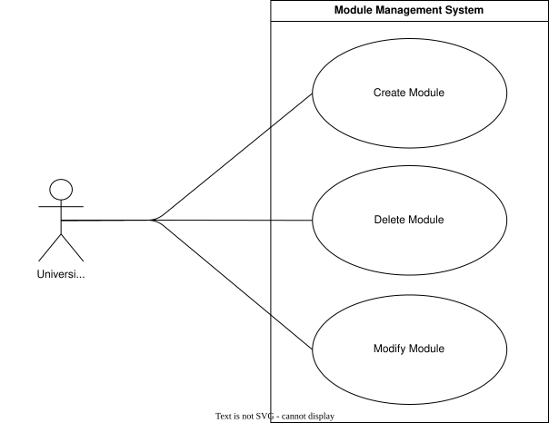
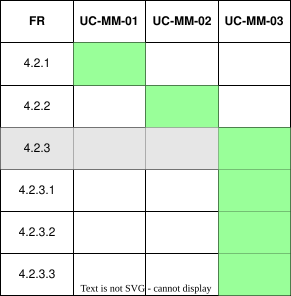

??? "**Module Management Use Cases**"
    <a id="module-mgmt-use-cases"></a>

    <div align="center">

    ## **Use Case Table**
    | **ID** | **Use case** | **Actor** |
    |:---:|:---:|:---:|
    | **UC-MM-01** | [Create Module](#uc-mm-01) | University Admin |
    | **UC-MM-02** | [Delete Module](#uc-mm-02) | University Admin |
    | **UC-MM-03** | [Modify Module](#uc-mm-03) | University Admin |

    </div>

    ??? tip "**Use Case Diagram**"
        

    ??? warning "**Traceability Matrix**"
        <div align="center">
        
        </div>

    ---
    ??? "UC-MM-01: Create Module"
        <a id="uc-mm-01"></a>
        ##### High Level
        ```
        Create Module (Actor: University Admin, System: Module Management)
            TUCBW a uni_admin creates a module via the API, PDF upload, or interface.
            TUCEW a new module is created and available for the university.
        ```
        ##### Expanded
        | Field | Detail |
        | :--- | :--- |
        | **Actor** | University Admin |
        | **Precondition** | Actor is an approved uni_admin for the university |
        | **Trigger** | Uni_admin initiates module creation via API, PDF, or builder |
        | **Basic Flow** | 1. Uni_admin selects a module creation method (API, PDF, or builder).<br>2. Uni_admin provides or uploads the module name and code.<br>3. System validates the submitted details.<br>4. System creates the module for the university.<br>5. System confirms successful creation. |
        | **Alternate Flow** | **A1: Duplicate Module**<br>System informs the uni_admin that a module with that code already exists for the university.<br><br>**A2: Invalid PDF/API Data**<br>System rejects the submission and reports which fields failed validation. |
        | **Postcondition** | Module is created and available under the university |
        | **Requirements Covered** | R4.2.1 |

    ---
    ??? "UC-MM-02: Delete Module"
        <a id="uc-mm-02"></a>
        ##### High Level
        ```
        Delete Module (Actor: University Admin, System: Module Management)
            TUCBW a uni_admin selects "Delete" on an existing module.
            TUCEW the module is permanently removed from the university.
        ```
        ##### Expanded
        | Field | Detail |
        | :--- | :--- |
        | **Actor** | University Admin |
        | **Precondition** | Actor is an approved uni_admin for the university and the module exists |
        | **Trigger** | Uni_admin selects "Delete" on a module |
        | **Basic Flow** | 1. Uni_admin selects a module to delete.<br>2. System prompts for confirmation.<br>3. Uni_admin confirms deletion.<br>4. System removes the module from the university.<br>5. System confirms successful deletion. |
        | **Alternate Flow** | **A1: Module Has Dependent Data**<br>System warns the uni_admin that events or course links are attached to the module before allowing deletion to proceed. |
        | **Postcondition** | Module is permanently removed from the university |
        | **Requirements Covered** | R4.2.2 |

    ---
    ??? "UC-MM-03: Modify Module"
        <a id="uc-mm-03"></a>
        ##### High Level
        ```
        Modify Module (Actor: University Admin, System: Module Management)
            TUCBW a uni_admin selects "Edit" on an existing module.
            TUCEW the module's name, code, or events are updated.
        ```
        ##### Expanded
        | Field | Detail |
        | :--- | :--- |
        | **Actor** | University Admin |
        | **Precondition** | Actor is an approved uni_admin for the university and the module exists |
        | **Trigger** | Uni_admin selects "Edit" on a module |
        | **Basic Flow** | 1. Uni_admin selects a module to modify.<br>2. Uni_admin updates the module name, code, and/or adds events.<br>3. System validates the submitted changes.<br>4. System updates the module record.<br>5. System confirms successful update. |
        | **Alternate Flow** | **A1: Invalid Event**<br>System rejects the event addition if it does not exist or is already linked to the module. |
        | **Postcondition** | Module details are updated to reflect the new name, code, and/or events |
        | **Requirements Covered** | R4.2.3 \| R4.2.3.1 \| R4.2.3.2 \| R4.2.3.3 |