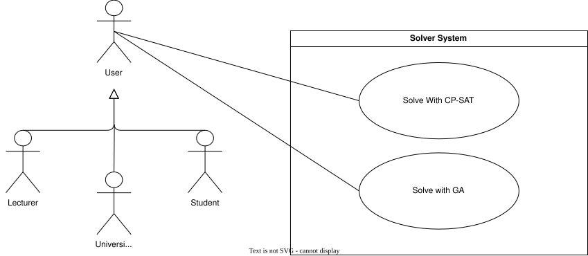
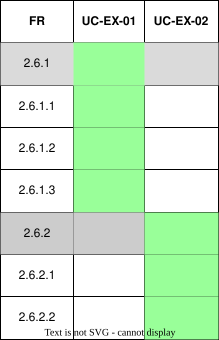

??? "**Solver System Use Cases**"
    <a id="solver-system-id"></a>
    <div align="center">

    ### **Use Case Table**
    | **Use Case ID** | **Use Case Name** | **Actor** |
    | :---: | :---: | :---: |
    | **UC-SV-01** | [Solve with CP-SAT](#uc-sv-01) | User |
    | **UC-SV-02** | [Solve with GA](#uc-sv-02) | User |

    </div>

    ??? tip "**Use Case Diagram**"
        

    ??? warning "**Traceability Matrix**"
        <div align="center">
        
        </div>

    ---
    ??? "UC-SV-01: Solve with CP-SAT"
        <a id="uc-sv-01"></a>
        ##### High Level
        ```
        Solve with CP-SAT (Actor: User, Solver Service)  
            TUCBW a finalised set of events (with venue, time, lecturer, student group, and required occurrence constraints) is received from an input adapter.  
            TUCEW the system models the events as a constraint satisfaction problem and invokes the CP-SAT solver to generate a conflict-free schedule where every event occurs its required number of times, notifying the User once a valid timetable exists.
        ```

        ##### Expanded
        | Field | Detail |
        | :--- | :--- |
        | **Actor** | User |
        | **Precondition** | A finalised set of events exists (received via the Builder, PDF Upload, or University API adapter) |
        | **Trigger** | Event parsing/creation completes and events are ready to be scheduled |
        | **Basic Flow** | 1. System receives the finalised set of events and their hard constraints (venue, time, lecturer, student group, required occurrences).<br>2. System formulates the scheduling problem as a constraint satisfaction model for the CP-SAT solver.<br>3. System invokes the CP-SAT solver.<br>4. System checks the solver's result status.<br>5. System generates a conflict-free schedule in which each event occurs its required number of times.<br>6. System stores the generated schedule.<br>7. System notifies the User that a valid timetable has been created. |
        | **Alternate Flow** | **A1: No feasible solution found**<br>System automatically triggers [Solve with GA](#uc-sv-02) to generate a best-effort schedule using soft preferences.<br><br>**A2: Solver error or timeout**<br>System logs the failure and notifies the User that scheduling could not be completed. |
        | **Postcondition** | A conflict-free schedule is generated and available for the User to view, edit, or delete, or the GA solver has been triggered |
        | **Requirements Covered** | R2.6.1, R2.6.1.1, R2.6.1.2, R2.6.1.3 |

    ---
    ??? "UC-SV-02: Solve with GA"
        <a id="uc-sv-02"></a>
        ##### High Level
        ```
        Solve with GA (Actor: User, Solver Service)  
            TUCBW the CP-SAT solver is unable to find a conflict-free schedule for the finalised set of events.  
            TUCEW the system uses a Genetic Algorithm, guided by soft preferences, to generate the best-available schedule and notifies the User of the result along with any remaining conflicts.
        ```
        ##### Expanded
        | Field | Detail |
        | :--- | :--- |
        | **Actor** | User |
        | **Precondition** | The CP-SAT solver has determined that no conflict-free schedule exists for the finalised set of events |
        | **Trigger** | [Solve with CP-SAT](#uc-sv-01) returns an infeasible result |
        | **Basic Flow** | 1. System receives the finalised set of events and associated soft preferences.<br>2. System initialises a population of candidate schedules.<br>3. System evaluates each candidate's fitness based on soft-constraint violations and preferences.<br>4. System applies selection, crossover, and mutation across successive generations.<br>5. System converges on the candidate schedule with the lowest violation score, once a maximum generation count or convergence threshold is reached.<br>6. System stores the generated schedule.<br>7. System notifies the User that a best-effort schedule has been created, including any remaining soft-constraint conflicts. |
        | **Alternate Flow** | **A1: No improvement across generations**<br>System returns the best schedule found and flags it as best-effort with unresolved conflicts. |
        | **Postcondition** | A best-effort schedule, with conflicts minimised according to soft preferences, is generated and available for the User to view, edit, or delete |
        | **Requirements Covered** | R2.6.2, R2.6.2.1, R2.6.2.2 |