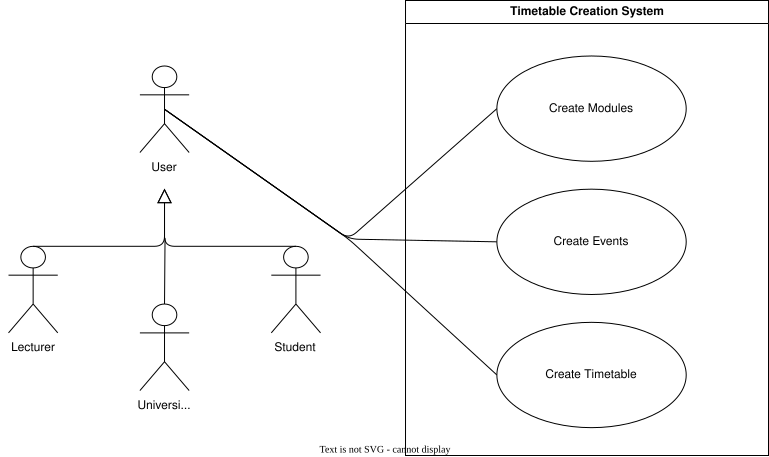

??? "**Timetable Creation Use Cases**"
    <a id="timetable-creation-id"></a>

    <div align="center">

    ### **Use Case Table**
    | **Use Case ID** | **Use Case Name** | **Actor** |
    | :---: | :---: | :---: |
    | **UC-TC-01** | [Create Modules](#uc-tc-01) | User |
    | **UC-TC-02** | [Create Events](#uc-tc-02) | User |
    | **UC-TC-03** | [Create Timetable](#uc-tc-03) | User |

    </div>

    ??? tip "**Use Case Diagram**"
        

    ---
    ??? "UC-TC-01: Create Modules"
        <a id="uc-tc-01"></a>
        ##### High Level
        ```
        Create Modules (Actor: User, System: Timetable Builder or Internal Module Management)  
        TUCBW the actor selects "Create Module".  
        TUCEW the system creates and stores the module, linked either to the student’s personalized course or the institution’s official course catalog.

        ```
        ##### Expanded
        | Field | Detail |
        | :--- | :--- |
        | **Actor** | User |
        | **Precondition** | User is authenticated: for students, a personalized timetable is open; for lecturers/admin, access to internal module management is granted |
        | **Trigger** | User selects “Create Module” |
        | **Basic Flow (Student)** | 1. System opens module creation form.<br>2. Student enters module name and module code.<br>3. System validates uniqueness of module details within the student’s personalized course.<br>4. System confirms module creation.<br>5. Module is linked to the student’s personalized course. |
        | **Basic Flow (Lecturer/Admin)** | 1. System opens institutional module creation form.<br>2. User enters module details (name, code, description, credits, etc.).<br>3. System validates details against institutional rules.<br>4. User selects the appropriate course to link the module.<br>5. System confirms module creation.<br>6. Module is linked to the official course catalog.|
        | **Alternate Flow** | **A1: Duplicate Module Code (Student)**<br>System warns student and prevents duplicate entry.<br><br>**A2: Duplicate Module Code (Lecturer/Admin)**<br>System enforces institutional uniqueness and prevents duplicate entry.<br><br>**A3: Missing Required Fields**<br>System highlights incomplete module data.|
        | **Postcondition** | Module is created and linked either to the student’s personalized course or the institution’s official course catalog. |
        | **Requirements Covered** | R2.2.1.1 |

    ---
    ??? "UC-TC-02: Create Events"
        <a id="uc-tc-02"></a>
        ##### High Level
        ```
        Create Events (Actor: User, System: Timetable Builder)  
        TUCBW the user adds an event linked to a module and provides event details.  
        TUCEW the system creates and stores the event within the timetable under the relevant module.
        ```
        ##### Expanded
        | Field | Detail |
        | :--- | :--- |
        | **Actor** | User |
        | **Precondition** | User is authenticated, a module is selected |
        | **Trigger** | User selects "Create Event” |
        | **Basic Flow** | 1. System opens event creation form.<br>2. User selects module for event.<br>3. User enters event details (day, time, venue).<br>4. System validates event against existing schedule.<br>5. System attaches event to module within timetable.<br>6. System confirms event creation. |
        | **Alternate Flow** | **A1: Time conflict detected**<br>System warns user of overlap and requests adjustment.<br><br>**A2: Missing event details**<br>System prevents save until required fields are completed. |
        | **Postcondition** | Event is created and stored within selected module |
        | **Requirements Covered** | R2.2.1.2 |

    ---
    ??? "UC-TC-03: Create Timetable"
        <a id="uc-tc-03"></a>
        ##### High Level
        ```
        Create Timetable (Actor: User, System: Timetable Builder)  
        TUCBW the user starts a new timetable creation process and selects or defines required components.  
        TUCEW the system creates a new timetable containing the selected modules and events and stores it under the user’s account.
        ```
        ##### Expanded
        | Field | Detail |
        | :--- | :--- |
        | **Actor** | User |
        | **Precondition** | User is authenticated |
        | **Trigger** | User selects “Create Timetable” |
        | **Basic Flow** | 1. System opens timetable builder interface.<br>2. User initiates new timetable creation.<br>3. User adds modules and/or events (or leaves empty initially).<br>4. System validates structure of timetable.<br>5. User assigns a timetable name.<br>6. System creates and stores the timetable under the user account.<br>7. System confirms creation and opens the new timetable. |
        | **Alternate Flow** | **A1: Missing required timetable name**<br>System prompts user to enter a valid name before saving.<br><br>**A2: No modules/events added**<br>System allows creation but marks timetable as empty draft.<br><br>**A3: Save failure**<br>System notifies user and retains unsaved draft. |
        | **Postcondition** | New timetable is created and stored |
        | **Requirements Covered** | R2.2.1 \| R2.2.1.3 |
