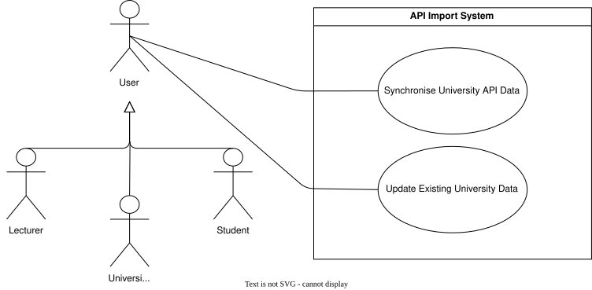
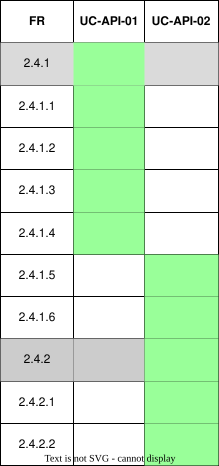

??? "**Timetable Creation (API System) Use Cases**"
    <a id="api-system"></a>
    <div align="center">
    ### **Use Case Table**
    | **Use Case ID** | **Use Case Name** | **Actor** |
    | :---: | :---: | :---: |
    | **UC-API-01** | [Synchronise University API Data](#uc-api-01) | User |
    | **UC-API-02** | [Update Existing University Data](#uc-api-02) | User |

    </div>

    ??? tip "**Use Case Diagram**"
        

    ??? warning "**Traceability Matrix**"
        <div align="center">
        
        </div>

    ---
    ??? "UC-API-01: Import Timetable from API"
        <a id="uc-api-01"></a>
        ##### High Level

        ```
        Synchronise University API Data (Actor: User, System: University API Adapter)

        TUCBW the user requests synchronisation of university data.

        TUCEW the system retrieves courses, modules, and events from the university API, maps them to core-system entities, and creates entities that do not already exist.
        ```

        ##### Expanded

        | Field | Detail |
        | :--- | :--- |
        | **Actor** | User |
        | **Precondition** | User is authenticated and a supported university API is available |
        | **Trigger** | User requests synchronisation of university data |
        | **Basic Flow** | 1. User initiates synchronisation.<br>2. System requests course, module, and event data from the university API.<br>3. System maps the retrieved API objects to core-system entities.<br>4. System checks whether corresponding entities already exist.<br>5. System creates entities that do not exist.<br>6. System retains existing entities for further synchronisation. |
        | **Alternate Flow** | **A1: API unavailable**<br>System reports that synchronisation could not be completed.<br><br>**A2: Invalid or unsupported API data**<br>System rejects the affected data and reports the synchronisation error. |
        | **Postcondition** | Retrieved university data is represented by corresponding entities in the core system |
        | **Requirements Covered** | R2.4.1 \| R2.4.1.1 \| R2.4.1.2 \| R2.4.1.5 |

    ---
    ??? "UC-API-02: Review API Retrieved Data"
        <a id="uc-api-02"></a>

        ##### High Level

        ```
        Update Existing University Data (Actor: User, System: University API Adapter)

        TUCBW the user requests a subsequent synchronisation of university data.

        TUCEW the system compares retrieved API data with existing core-system entities and updates relevant fields where differences are detected.
        ```

        ##### Expanded
        | Field | Detail |
        | :--- | :--- |
        | **Actor** | User |
        | **Precondition** | Corresponding university data has previously been imported into the core system |
        | **Trigger** | User requests synchronisation of university data |
        | **Basic Flow** | 1. User initiates synchronisation.<br>2. System retrieves the latest course, module, and event data from the university API.<br>3. System identifies the corresponding existing core-system entities.<br>4. System compares the relevant API fields with the existing entity fields.<br>5. System updates fields where differences are detected.<br>6. System leaves unchanged fields unmodified.<br>7. System preserves the identity of the existing entities. |
        | **Alternate Flow** | **A1: No changes detected**<br>System leaves the existing entities unchanged.<br><br>**A2: API unavailable**<br>System reports that synchronisation could not be completed. |
        | **Postcondition** | Existing core-system entities reflect the latest available university API data |
        | **Requirements Covered** | R2.4.1.2 \| R2.4.1.3 \| R2.4.1.4 |