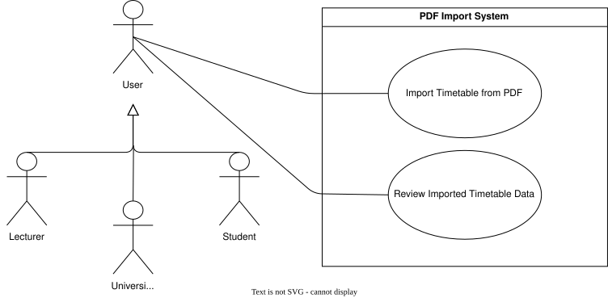
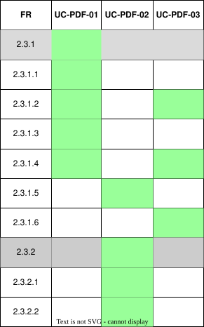

??? "**Timetable Creation (PDF System) Use Cases**"
    <a id="pdf-system"></a>
    <div align="center">

    ### **Use Case Table**
    | **Use Case ID** | **Use Case Name** | **Actor** |
    | :---: | :---: | :---: |
    | **UC-PDF-01** | [Import Timetable from PDF](#uc-pdf-01) | User |
    | **UC-PDF-02** | [Review Imported Timetable Data](#uc-pdf-02) | User |
    | **UC-PDF-03** | [Verify Imported Data](#uc-pdf-03) | University Admin |

    </div>

    ??? tip "**Use Case Diagram**"
        

    ??? warning "**Traceability Matrix**"
        <div align="center">
        
        </div>

    ---
    ??? "UC-PDF-01: Import Timetable from PDF"
        <a id="uc-pdf-01"></a>
        ##### High Level
        ```
        Import Timetable from PDF (Actor: User, System: PDF Parser)  
            TUCBW the user uploads a university-provided timetable PDF into the system.  
            TUCEW the system parses the PDF, identifies modules and events, and maps them to existing records or creates new ones where required.
        ```
        ##### Expanded
        | Field | Detail |
        | :--- | :--- |
        | **Actor** | User |
        | **Precondition** | User is authenticated |
        | **Trigger** | User selects “Import Timetable” and uploads a PDF |
        | **Basic Flow** | 1. User uploads a university timetable PDF.<br>2. System validates file format.<br>3. System parses PDF content.<br>4. System extracts module and event data.<br>5. System performs lookup against existing modules/events.<br>6. System maps existing entities or prepares new entries.<br>7. System generates an import preview structure.<br>8. System forwards data to review step. |
        | **Alternate Flow** | **A1: Invalid file format**<br>System rejects upload and prompts correct format.<br><br>**A2: Parsing failure**<br>System notifies user and aborts import process.<br><br>**A3: Partial extraction**<br>System imports what is possible and flags missing data for review. |
        | **Postcondition** | Parsed timetable data is staged for review |
        | **Requirements Covered** | R2.3.1 \| R2.3.1.1 \| R2.3.1.2 \| R2.3.1.3 \| R2.3.1.4 |

    ---
    ??? "UC-PDF-02: Review Imported Timetable Data"
        <a id="uc-pdf-02"></a>
        ##### High Level
        ```
        Review Imported Timetable Data (Actor: User, System: Timetable Import)  
            TUCBW the user reviews the extracted timetable data generated from the PDF.  
            TUCEW the system presents the parsed modules and events for selection and confirmation.
        ```
        ##### Expanded
        | Field | Detail |
        | :--- | :--- |
        | **Actor** | User |
        | **Precondition** | A successful PDF import has been completed |
        | **Trigger** | System displays imported timetable preview |
        | **Basic Flow** | 1. System displays extracted modules and events.<br>2. User reviews imported data.<br>3. User selects which modules/events to include.<br>4. System validates selections.<br>5. User confirms import.<br>6. System creates timetable from selected data.<br>7. System stores timetable under user account.<br>8. System confirms successful creation. |
        | **Alternate Flow** | **A1: User deselects all items**<br>System prevents empty timetable creation and prompts selection.<br><br>**A2: Conflicting event data detected**<br>System highlights conflicts for user decision.<br><br>**A3: User cancels import**<br>System discards staged data without saving. |
        | **Postcondition** | Modules/Events and timetable is created and stored in system |
        | **Requirements Covered** | R2.3.1.5 \| R2.3.2 \| R2.3.2.1 \| R2.3.2.2 |

    ---
    ??? "UC-PDF-03: Verify Imported Data"
        <a id="uc-pdf-03"></a>
        ##### High Level
        ```
        Verify Imported Data (Actor: University Admin, System: PDF Parser)  
            TUCBW a university admin reviews module/event data imported from a PDF for their university.  
            TUCEW the admin confirms the imported data is accurate before it is committed to the university's records.
        ```
        ##### Expanded
        | Field | Detail |
        | :--- | :--- |
        | **Actor** | University Admin |
        | **Precondition** | Actor is an approved uni_admin and a PDF import has been staged for the university |
        | **Trigger** | Uni_admin opens the staged import for verification |
        | **Basic Flow** | 1. System displays the staged modules and events imported from the PDF.<br>2. Uni_admin reviews the extracted data against the source document.<br>3. Uni_admin corrects or confirms flagged fields.<br>4. Uni_admin approves the verified data.<br>5. System commits the verified modules/events to the university's records.<br>6. System confirms successful verification. |
        | **Alternate Flow** | **A1: Data Rejected**<br>Uni_admin rejects the staged import and system discards the data without committing it.<br><br>**A2: Partial Verification**<br>Uni_admin approves only a subset of the staged data, and system commits only the approved entries. |
        | **Postcondition** | Verified modules/events are committed to the university's records, or the import is discarded |
        | **Requirements Covered** | R2.3.1.2 \| R2.3.1.4 \| R2.3.1.6 |