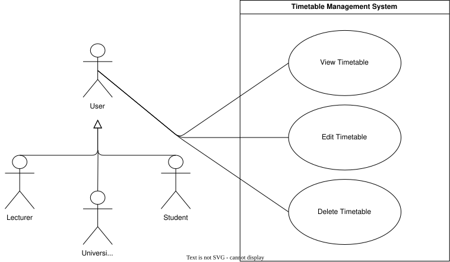

??? "**Timetable Management Use Cases**"
    <a id="timetable-management-id"></a>
    <div align="center">

    ### **Use Case Table**
    | **Use Case ID** | **Use Case Name** | **Actor** |
    | :---: | :---: | :---: |
    | **UC-TM-01** | [View Timetable](#uc-tm-01) | User |
    | **UC-TM-02** | [Edit Timetable](#uc-tm-02) | User |
    | **UC-TM-03** | [Delete Timetable](#uc-tm-03) | User |
    | **UC-TM-04** | [Customise Timetable](#uc-tm-04) | User |

    </div>

    ??? tip "**Use Case Diagram**"
        

    ---
    ??? "UC-TM-01: View Timetable"
        <a id="uc-tm-01"></a>
        ##### High Level
        ```
        View Timetable (Actor: User, System: Timetable Management)
            TUCBW the user opens the timetable section and selects a saved timetable.
            TUCEW the system displays the selected timetable, including modules and events, and supports calendar, weekly, and summary views.
        ```
        ##### Expanded
        | Field | Detail |
        | :--- | :--- |
        | **Actor** | User |
        | **Precondition** | User is authenticated and has at least one saved timetable |
        | **Trigger** | User opens the timetable section and selects a timetable |
        | **Basic Flow** | 1. User navigates to timetable section.<br>2. System displays list of saved timetables.<br>3. User selects a timetable.<br>4. System retrieves timetable data.<br>5. System displays timetable with modules and events.<br>6. User switches between calendar / weekly / summary views as needed. |
        | **Alternate Flow** | **A1: No Timetables Exist**<br>System informs user and prompts creation or generation of a timetable.<br><br>**A2: Retrieval Failure**<br>System displays an error message and allows retry. |
        | **Postcondition** | Selected timetable is displayed |
        | **Requirements Covered** | R2.1.1 \| R2.1.1.1 \| R2.1.1.2 \| R2.1.1.2.1 \| R2.1.1.2.2 \| R2.1.1.3 |

    ---
    ??? "UC-TM-02: Edit Timetable"
        <a id="uc-tm-02"></a>
        ##### High Level
        ```
        Edit Timetable (Actor: User, System: Timetable Management)
            TUCBW the user selects a timetable and enters edit mode.
            TUCEW the system allows modification of modules and events, including names, codes, times, venues, and days, and saves the updated timetable.
        ```
        ##### Expanded
        | Field | Detail |
        | :--- | :--- |
        | **Actor** | User |
        | **Precondition** | User is authenticated and a timetable exists |
        | **Trigger** | User selects “Edit Timetable” |
        | **Basic Flow** | 1. System loads selected timetable into edit mode.<br>2. User modifies module or event details.<br>3. System validates changes in real time.<br>4. User saves changes.<br>5. System persists updated timetable. |
        | **Alternate Flow** | **A1: Invalid or conflicting update**<br>System highlights conflict and prevents save until resolved.<br><br>**A2: Save failure**<br>System notifies user and retains unsaved changes.<br><br>**A3: Insufficient permissions**<br>System does not allow user to modify component directly rather to let them create their own unique copy of the timetable/module/event |
        | **Postcondition** | Timetable is updated and stored |
        | **Requirements Covered** | R2.1.2 \| R2.1.2.1 \| R2.1.2.1.1 \| R2.1.2.1.2 \| R2.1.2.2 \| R2.1.2.2.1 \| R2.1.2.2.2 \| R2.1.2.2.3 |

    ---
    ??? "UC-TM-03: Delete Timetable"
        <a id="uc-tm-03"></a>
        ##### High Level
        ```
        Delete Timetable (Actor: User, System: Timetable Management)
            TUCBW the user selects a timetable and confirms deletion.
            TUCEW the system removes the timetable without affecting related modules or events.
        ```
        ##### Expanded
        | Field | Detail |
        | :--- | :--- |
        | **Actor** | User |
        | **Precondition** | User is authenticated and a timetable exists |
        | **Trigger** | User selects “Delete Timetable” |
        | **Basic Flow** | 1. System prompts user for confirmation.<br>2. User confirms deletion.<br>3. System removes timetable from storage.<br>4. System confirms deletion to user. |
        | **Alternate Flow** | **A1: Deletion cancelled**<br>No changes are made.<br><br>**A2: Deletion failure**<br>System shows error and retains timetable.<br><br>**A3: Insufficient Permissions**<br>User will not have the option to delete the timetable. |
        | **Postcondition** | Timetable is removed from system |
        | **Requirements Covered** | R2.1.3 |

---
    ??? "UC-TM-04: Customise Timetable"
        <a id="uc-tm-04"></a>
        ##### High Level
        ```
        Customise Timetable (Actor: User, System: Timetable Management)
            TUCBW the user selects a timetable and opens customisation options.
            TUCEW the system updates the timetable's name and/or colour according to the user's preferences.
        ```
        ##### Expanded
        | Field | Detail |
        | :--- | :--- |
        | **Actor** | User |
        | **Precondition** | User is authenticated and a timetable exists |
        | **Trigger** | User selects “Customise Timetable” |
        | **Basic Flow** | 1. User selects a timetable to customise.<br>2. User updates the timetable name and/or colour.<br>3. System validates the submitted changes.<br>4. System saves the customised timetable.<br>5. System confirms successful update. |
        | **Alternate Flow** | **A1: Invalid Name**<br>System rejects the name change and prompts the user for a valid name.<br><br>**A2: Save Failure**<br>System notifies user and retains unsaved changes. |
        | **Postcondition** | Timetable's name and/or colour is updated and stored |
        | **Requirements Covered** | R2.1.4 \| R2.1.4.1 \| R2.1.4.2 |