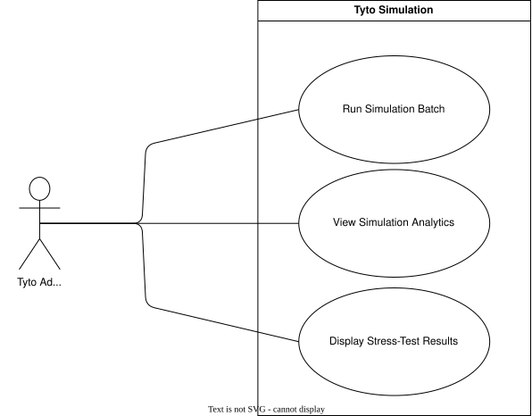

??? "**Tyto Simulation System Use Cases**"
    <a id="tyto-simulation-id"></a>

    <div align="center">

    ## **Use Case Table**
    | **Use Case ID** | **Use Case Name** | **Actor** |
    |:---:|:---:|:---:|
    | **UC-TY-01** | [Launch Simulation Batch](#uc-ty-01) | Tyto Administrator |
    | **UC-TY-02** | [Generate Synthetic Population](#uc-ty-02) | Tyto Administrator |
    | **UC-TY-03** | [View Simulation Analytics](#uc-ty-03) | Tyto Administrator |
    | **UC-TY-04** | [Bootstrap Adapter from OpenAPI Spec](#uc-ty-04) | Tyto Administrator |
    | **UC-TY-05** | [Simulate UMTAS User Behaviours](#uc-ty-05) | Tyto Administrator |

    </div>

    ??? tip "**Use Case Diagram**"
        

    ---
    ??? "UC-TY-01: Launch Simulation Batch"
        <a id="uc-ty-01"></a>
        ##### High Level
        ```
        Launch Simulation Batch (Actor: Tyto Administrator, System: Simulation Engine)
            TUCBW the administrator invokes the central runner script with a target adapter and population size.
            TUCEW the system launches the configured Docker container and begins executing the simulation with live metrics exposed.
        ```
        ##### Expanded
        | Field | Detail |
        | :--- | :--- |
        | **Actor** | Tyto Administrator |
        | **Precondition** | The simulation service and its Docker container are available. The target adapter exists. |
        | **Trigger** | Administrator runs the central script with adapter and population arguments. |
        | **Basic Flow** | 1. Administrator supplies the target adapter and population size to the runner script.<br>2. System launches the simulation as a Docker container with the given configuration.<br>3. System exposes live metrics ports for the running container.<br>4. Simulation batch executes until completion or manual stop. |
        | **Alternate Flow** | **A1: Adapter configuration missing**<br>System halts execution and logs an error that the specified adapter files were not found.<br><br>**A2: Container fails to start**<br>System reports the Docker startup failure and aborts the run. |
        | **Postcondition** | Simulation container is running with live metrics exposed. |

    ---
    ??? "UC-TY-02: Generate Synthetic Population"
        <a id="uc-ty-02"></a>
        ##### High Level
        ```
        Generate Synthetic Population (Actor: Tyto Administrator, System: Simulation Engine)
            TUCBW a simulation batch requires a synthetic student population.
            TUCEW the system generates profiles from a declarative YAML schema and domain CSV samples, and exports them as structured JSON.
        ```
        ##### Expanded
        | Field | Detail |
        | :--- | :--- |
        | **Actor** | Tyto Administrator |
        | **Precondition** | A YAML schema and any required domain CSV files are present for the target adapter. |
        | **Trigger** | Simulation batch is launched (UC-TY-01) and requires a synthetic population. |
        | **Basic Flow** | 1. System reads the declarative YAML schema defining the population's fields.<br>2. System generates profile values using Faker, sampling domain-specific fields from external CSV files where defined.<br>3. System exports the generated population to a structured JSON file for use by the simulation. |
        | **Alternate Flow** | **A1: Schema invalid or missing**<br>System halts generation and logs a schema error.<br><br>**A2: CSV sample file missing**<br>System halts generation and logs which domain CSV file could not be found. |
        | **Postcondition** | A structured JSON file of synthetic student profiles is available for the simulation run. |

    ---
    ??? "UC-TY-03: View Simulation Analytics"
        <a id="uc-ty-03"></a>
        ##### High Level
        ```
        View Simulation Analytics (Actor: Tyto Administrator, System: Simulation Engine)
            TUCBW the administrator accesses the live dashboard or a generated report.
            TUCEW the system presents aggregated latency, throughput, and failure metrics per endpoint, with temporary metric files cleaned up afterwards.
        ```
        ##### Expanded
        | Field | Detail |
        | :--- | :--- |
        | **Actor** | Tyto Administrator |
        | **Precondition** | A simulation batch is running, or a batch has completed and raw CSV metrics exist. |
        | **Trigger** | Administrator opens the live web UI or requests report generation. |
        | **Basic Flow** | 1. Administrator navigates to the live web UI, or triggers parsing of the raw CSV metrics.<br>2. System parses the CSV data into a single timestamped JSON report.<br>3. System aggregates and displays overall requests, RPS, and failure counts, plus per-endpoint latency (min, max, avg, median, p95, p99).<br>4. System removes the temporary CSV files once the report is produced.<br>5. Administrator reviews the results to identify bottlenecks or confirm the system withstood the applied load. |
        | **Alternate Flow** | **A1: No simulation data available**<br>System displays an idle state or an empty report directory.<br><br>**A2: Cleanup failed**<br>Report is generated successfully but temporary CSV files are not removed; administrator is notified residual files remain. |
        | **Postcondition** | A timestamped JSON report with aggregated performance metrics is available for review. |

    ---
    ??? "UC-TY-04: Bootstrap Adapter from OpenAPI Spec"
        <a id="uc-ty-04"></a>
        ##### High Level
        ```
        Bootstrap Adapter from OpenAPI Spec (Actor: Tyto Administrator, System: Simulation Engine)
            TUCBW the administrator supplies an OpenAPI specification for a new target system.
            TUCEW the system scaffolds a new adapter, generating endpoint configuration, synthetic data schemas, and executable simulation scripts mapped to the discovered API methods.
        ```
        ##### Expanded
        | Field | Detail |
        | :--- | :--- |
        | **Actor** | Tyto Administrator |
        | **Precondition** | A valid OpenAPI specification file for the target system is available. |
        | **Trigger** | Administrator runs the adapter scaffolding tool against the OpenAPI spec. |
        | **Basic Flow** | 1. Administrator provides the OpenAPI specification file to the scaffolding tool.<br>2. System parses the specification to discover available API methods.<br>3. System generates endpoint configuration files, synthetic data schemas, and executable Python simulation scripts mapped to each discovered method.<br>4. System places the generated adapter alongside existing adapters, ready for use in a simulation batch. |
        | **Alternate Flow** | **A1: Specification invalid**<br>System halts scaffolding and logs the parsing error.<br><br>**A2: Unsupported method type discovered**<br>System skips the unsupported method, logs a warning, and continues scaffolding the remaining methods. |
        | **Postcondition** | A new adapter is available for use in simulation batches. |

    ---
    ??? "UC-TY-05: Simulate UMTAS User Behaviours"
        <a id="uc-ty-05"></a>
        ##### High Level
        ```
        Simulate UMTAS User Behaviours (Actor: Tyto Administrator, System: Simulation Engine)
            TUCBW a simulation batch is executing against the UMTAS adapter.
            TUCEW the system drives simulated users through account creation, timetable upload and parsing, browsing, and custom scheduling requests.
        ```
        ##### Expanded
        | Field | Detail |
        | :--- | :--- |
        | **Actor** | Tyto Administrator |
        | **Precondition** | A simulation batch (UC-TY-01) is running against the UMTAS adapter with a generated population (UC-TY-02). |
        | **Trigger** | Simulated users are spawned and begin executing UMTAS domain tasks. |
        | **Basic Flow** | 1. System simulates mock account creation, secure login, and session token management for each user.<br>2. System simulates uploading timetable PDF files, polling for parser job status, and retrieving results.<br>3. System simulates users browsing their enrolled Modules, available Events, and existing timetables.<br>4. System simulates submitting custom scheduling jobs to the solver and polling for execution status. |
        | **Alternate Flow** | **A1: Authentication failure**<br>Simulated users fail to retrieve valid bearer tokens; the engine logs the failure and halts further spawning to prevent spamming.<br><br>**A2: Core API overload**<br>The target API drops requests; the engine records the endpoint failure rate and continues or gracefully stops based on configuration. |
        | **Postcondition** | Simulated users have exercised the full range of UMTAS domain behaviours, with results captured for reporting. |