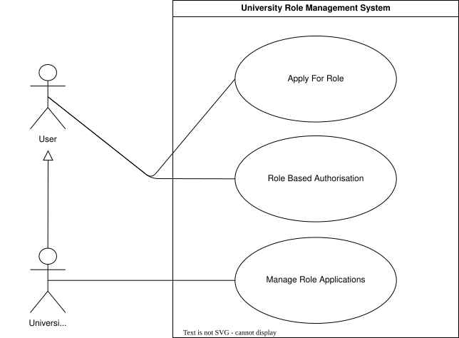
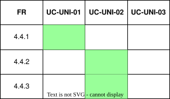

??? "**University Role Management Use Cases**"
    <a id="uni-role-use-cases"></a>

    <div align="center">

    ## **Use Case Table**
    | **ID** | **Use case** | **Actor** |
    |:---:|:---:|:---:|
    | **UC-UNI-01** | [Apply for Role](#uc-uni-01) | User |
    | **UC-UNI-02** | [Manage Role Applications](#uc-uni-02) | University Admin |
    | **UC-UNI-03** | [Role Based Authorisation](#uc-uni-03) | User |

    </div>

    ??? tip "**Use Case Diagram**"
        

    ??? warning "**Traceability Matrix**"
        <div align="center">
        
        </div>

    ---
    ??? "UC-UNI-01: Apply for Role"
        <a id="uc-uni-01"></a>
        ##### High Level
        ```
        Apply for Role (Actor: User, System: University Roles)
            TUCBW the user selects a university and applies for a role.
            TUCEW the user's role application is recorded as pending for that university.
        ```
        ##### Expanded
        | Field | Detail |
        | :--- | :--- |
        | **Actor** | User |
        | **Precondition** | User is authenticated |
        | **Trigger** | User selects a university and applies for a role |
        | **Basic Flow** | 1. User selects a university.<br>2. User selects a role to apply for (student, lecturer, or uni_admin).<br>3. System records the application as pending, defaulting to student if none selected.<br>4. System notifies the relevant university admins of the pending application. |
        | **Alternate Flow** | **A1: Existing Application Pending**<br>System informs the user that an application for that university already exists and is pending review. |
        | **Postcondition** | A pending role application exists for the user at the selected university |
        | **Requirements Covered** | R4.4.1 |

    ---
    ??? "UC-UNI-02: Manage Role Applications"
        <a id="uc-uni-02"></a>
        ##### High Level
        ```
        Manage Role Applications (Actor: University Admin, System: University Roles)
            TUCBW an approved uni_admin views pending role applications for their university.
            TUCEW the applications are approved, rejected, or existing privileges are revoked.
        ```
        ##### Expanded
        | Field | Detail |
        | :--- | :--- |
        | **Actor** | University Admin |
        | **Precondition** | Actor is an approved uni_admin for the university |
        | **Trigger** | Uni_admin opens the role management screen |
        | **Basic Flow** | 1. System displays all users and their role applications/status for the university.<br>2. Uni_admin selects a user's application.<br>3. Uni_admin approves or rejects the application.<br>4. System updates the user's role status accordingly.<br>5. System notifies the user of the outcome. |
        | **Alternate Flow** | **A1: Revoke Privileges**<br>Uni_admin selects an already-approved user and revokes their role, and the system removes the user's access for that university. |
        | **Postcondition** | The user's role application or existing role is approved, rejected, or revoked |
        | **Requirements Covered** | R4.4.2 \| R4.4.3 |

    ---
    ??? "UC-UNI-03: Role Based Authorisation"
        <a id="uc-uni-03"></a>
        ##### High Level
        ```
        Role Based Authorisation (Actor: User, System: University Roles)
            TUCBW an authenticated user hits an endpoint that requires a university role.
            TUCEW the system grants or denies access based on the user's approved role at their selected university.
        ```
        ##### Expanded
        | Field | Detail |
        | :--- | :--- |
        | **Actor** | User |
        | **Precondition** | User is authenticated |
        | **Trigger** | User requests an endpoint requiring a university role |
        | **Basic Flow** | 1. User requests an endpoint requiring a university role.<br>2. System checks the user has selected a university.<br>3. System retrieves the user's approved role for that university.<br>4. System compares the user's role against the endpoint's required role.<br>5. System grants access if the role satisfies the requirement. |
        | **Alternate Flow** | **A1: No University Selected**<br>System denies access and prompts the user to select a university.<br><br>**A2: No Approved Role**<br>System denies access and informs the user their application is pending or not approved. |
        | **Postcondition** | User is granted or denied access to the requested endpoint based on their university role |
        | **Requirements Covered** | TBD |